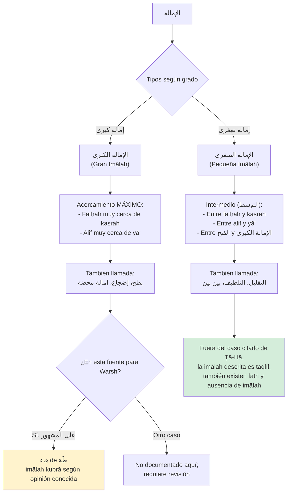
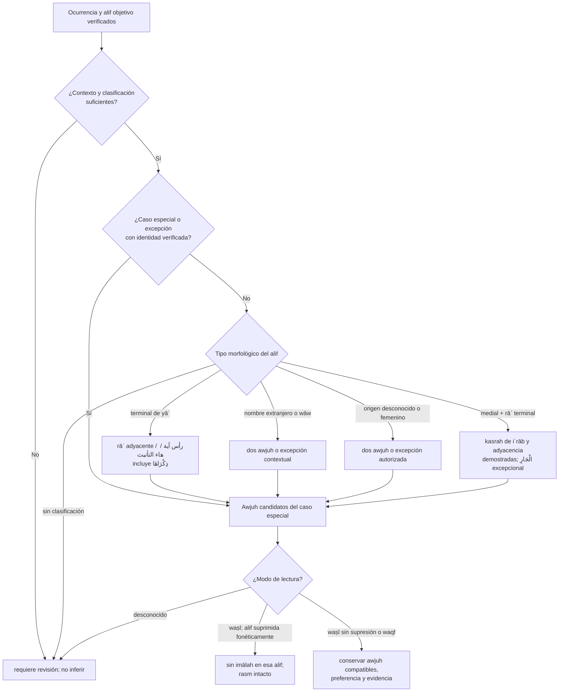

# LÓGICA DE DECISIÓN: الفتح والإمالة
## Diagrama de Condiciones, Excepciones e Intersecciones

> **Comentario de revisión e-tajweed (Parte 10, pp. 97–101):** Este archivo se copió íntegro del legado antes de corregirse. Describe decisiones de detección para Warsh ʿan Nāfiʿ por ṭarīq al-Azraq; no evalúa la pronunciación de una persona. Los ejemplos del libro no sustituyen un inventario de ocurrencias del muṣḥaf certificado. Toda decisión conserva su fuente, sus awjuh y el estado de revisión. La comprobación manual del usuario contra el muṣḥaf de Warsh certificado es necesaria durante el desarrollo; la validación final de un especialista queda pendiente, no es un requisito para empezar.
>
> **Comentario de revisión e-tajweed (alcance visual):** La `PALETA_COLORES_WARSH.md` aceptada **no asigna color propio a fatḥ, taqlīl ni imālah kubrā**. Esta lógica debe detectar y explicar esos estados, pero no inventar un color ni reutilizar sin autorización el de otra regla. La asignación visual específica queda `requiere_decisión`; el texto coránico permanece inalterado.

---

## 📋 DEFINICIONES TÉCNICAS

### الفتح (Fatḥ):
- **Definición (p.97):** "هو فتح القارئ فاه بالحرف"
- **Significado:** El lector abre su boca con la letra
- **Ejemplos:** أَكَلَ، فَرَضَ، ضَرَبَ

### الإمالة (Imālah):
- **Definición lingüística (p.97):** "أمال الشيء يميله ميلا: أي صيره مائلا"
- **Significado:** Hacer que algo se incline/desvíe
- **Definición técnica (p.97):** "هي أن ينحو القارىء بالفتحة نحو الكسرة، وبالألف نحو الياء من غير قلب خالص"
- **Significado:** El lector inclina la fatḥah hacia kasrah, y el alif hacia yā', sin convertirlo completamente

---

## 🎯 CLASIFICACIÓN DE الإمالة



---

## 📊 DIAGRAMA PRINCIPAL: ÁRBOL DE DECISIÓN

> **Comentario de revisión e-tajweed:** El diagrama heredado decidía primero por forma del alif y podía saltarse `ذِكْرَاهَا`, los casos especiales y la supresión fonética en waṣl. Se sustituye por un flujo de precedencia; cada nodo de clasificación exige metadatos de ocurrencia verificados y el resultado no se hace definitivo hasta resolver waṣl/waqf (Parte 10, pp. 98–101).



---

## 📊 TABLA 1: الألف المتطرفة المنقلبة عن الياء

> **Comentario de revisión e-tajweed (p. 98):** «Antes» significa rāʾ **inmediatamente anterior al alif objetivo** en la categoría aquí definida, no mera presencia de ر en el token. `ذِكْرَاهَا` se comprueba antes de aplicar la salida general de hāʾ de femenino. La pertenencia a رأس آية y la función de esa hāʾ deben constar como metadatos revisados; las once suras no convierten automáticamente todos sus finales en positivos.

### Caso 1: Con راء antes

| Condición | Regla | Ejemplos |
|-----------|-------|----------|
| **راء antes de ألف متطرفة** | التقليل وجها واحدا | الْقُرَىٰ، اشْتَرَىٰ |

### Caso 2: Sin راء antes

| Subcaso | Condición | Regla | Ejemplos |
|---------|-----------|-------|----------|
| **رأس آية (11 suras)** | Sin هاء التأنيث | التقليل فقط | - |
| **رأس آية (11 suras)** | Con هاء التأنيث | وجهان | - |
| **رأس آية (11 suras)** | ذِكْرَاهَا (especial) | التقليل فقط | Por ser de ذوات الراء |
| **NO es رأس آية** | - | وجهان | الْهُدَىٰ، رَمَىٰ، سَعَىٰ، أَتَىٰ |

**⚠️ 11 Suras con رؤوس الآي (p.98, nota 1):**
طه، النجم، المعارج، القيامة، النازعات، عبس، الأعلى، الشمس، الليل، الضحى، العلق

**Intersecciones:** Con رؤوس الآي, con هاء التأنيث, con ذوات الراء y con waṣl/waqf cuando se suprime fonéticamente el alif.
**Excepciones:** ذِكْرَاهَا siempre التقليل (por راء)
**Dependencias:** Identificar alif objetivo y su origen en un catálogo morfológico citado; verificar posición de rāʾ, ocurrencia de رأس آية y هاء التأنيث. La grafía sola no basta.

---

## 📊 TABLA 2: الألف المتطرفة المرسومة ياء (أسماء أعجمية)

| Tipo | Descripción | Regla | Ejemplos |
|------|-------------|-------|----------|
| **Nombres extranjeros** | Alif escrita como ياء, aunque origen no sea ياء | وجهان | مُوسَىٰ، عِيسَىٰ، يَحْيَىٰ |

**Intersecciones:** Waṣl/waqf e iltiqāʾ al-sākinayn (por ejemplo `مُوسَى الْكِتَابَ`, p. 101).
**Excepciones:** Ninguna
**Dependencias:** Reconocer los nombres mediante identidad de ocurrencia y clasificación citada, no por coincidencia de string vocalizado.

---

## 📊 TABLA 3: الألف المتطرفة المنقلبة عن واو المرسومة ياء

| Caso | Condición | Regla | Ejemplos |
|------|-----------|-------|----------|
| **General** | - | وجهان | ضُحَىٰ، الْعُلَىٰ |
| **Excepción 1** | زَكَا (النور) | الفتح فقط | زَكَا |
| **رأس آية** | Sin هاء التأنيث | التقليل فقط | الْعُلَىٰ، اسْتَغْنَىٰ |
| **رأس آية** | Con هاء التأنيث | وجهان | - |

**Intersecciones:** Con رؤوس الآي, هاء التأنيث y waṣl/waqf.
**Excepciones:** زَكَا (النور) solo الفتح
**Dependencias:** Verificar origen wāw, alif objetivo y posición de رأس آية para la ocurrencia concreta. `الْعُلَىٰ` puede tener distinto resultado según su ocurrencia.

---

## 📊 TABLA 4: ألف مجهول الأصل

| Palabra | Regla | Razón |
|---------|-------|-------|
| **حَتَّىٰ** | الفتح اتفاقا | 4 palabras excepcionales |
| **عَلَىٰ** | الفتح اتفاقا | 4 palabras excepcionales |
| **إِلَىٰ** | الفتح اتفاقا | 4 palabras excepcionales |
| **لَدَىٰ** | الفتح اتفاقا | 4 palabras excepcionales |
| **مَتَىٰ** | وجهان | Regla general |
| **بَلَىٰ** | وجهان | Regla general |
| **أَنَّىٰ** | وجهان | Regla general |

**Intersecciones:** Waṣl/waqf e iltiqāʾ al-sākinayn si el alif objetivo deja de realizarse fonéticamente.
**Excepciones:** 4 palabras con الفتح اتفاقا
**Dependencias:** Clasificación de origen desconocido y catálogo de las cuatro excepciones citado en p. 99; no extrapolar a otras palabras.

---

## 📊 TABLA 5: الألف المتطرفة الزائدة للتأنيث

> **Comentario de revisión e-tajweed (p. 99):** La categoría `ذوات الراء` ha de ser una clasificación morfológica revisada del alif objetivo, no una búsqueda de cualquier ر. Los cinco patrones son condiciones de entrada; no garantizan por sí solos un resultado para una ocurrencia no catalogada.

### 5 Patrones (أوزان):

| وزن | Ejemplo |
|-----|---------|
| **فَعْلَى** | السَّلْوَىٰ |
| **فُعْلَى** | الدُّنْيَا |
| **فِعْلَى** | الشِّعْرَىٰ |
| **فَعَالَى** | الْيَتَامَىٰ |
| **فُعَالَى** | كُسَالَىٰ |

### Regla:

| Condición | Regla | Ejemplos |
|-----------|-------|----------|
| **Con راء (ذوات الراء)** | التقليل فقط | الشِّعْرَىٰ |
| **Sin راء** | وجهان | الدُّنْيَا، الْيَتَامَىٰ، كُسَالَىٰ، السَّلْوَىٰ |

**Intersecciones:** Clasificación ذوات الراء y waṣl/waqf.
**Excepciones:** Ninguna
**Dependencias:** Identificar el وزن y clasificación ذوات الراء mediante datos citados y revisados.

---

## 📊 TABLA 6: الألف المتوسطة + راء متطرفة مكسورة

> **Comentario de revisión e-tajweed (pp. 99–100):** La fuente exige **kasrah de iʿrāb demostrada** y adyacencia efectiva de alif–rāʾ; no autoriza el fallback «si no aparece en cuatro negativos, entonces taqlīl». El pie de página `نَمَارِقَ، بَارِئِكُمْ` sólo ilustra kasrah original, no declara que estas palabras reciban taqlīl por esta regla. Sin prueba positiva se devuelve `requiere_revisión`.

### Condiciones para الإمالة:

1. **ألف متوسطة** (no متطرفة)
2. **Seguida por راء متطرفة** (final del lexema; la fuente permite que después se una un pronombre o mīm de plural)
3. **راء conectada con ألف** (sin separador)
4. **راء con كسر إعراب** (kasrah de iʿrāb)

### Tabla de casos:

| Tipo de كسر | Regla | Ejemplos |
|-------------|-------|----------|
| **كسر إعراب** | التقليل وجها واحدا | النَّهَارِ، دِيَارِهِمْ، أَبْصَارِهِمْ، هَارٍ، أَقْطَارِهِمْ |
| **كسر إعراب (excepción)** | وجهان (التقليل مقدم) | الْجَارِ (النساء: 36 - dos veces) |
| **كسر أصلي** | Esta regla no concede taqlīl; evaluar otra regla si está documentada | نَمَارِقَ، بَارِئِكُمْ (ejemplos gramaticales del pie de p. 99) |

### Casos SIN إمالة (p.99-100):

| Palabra | Razón | Detalles |
|---------|-------|----------|
| **تُمَارِ** | Lām del فعل es ياء (حذفت للجازم) | لا الناهية |
| **الْجَوَارِ** | Sin إمالة | - |
| **أَنصَارِي** | كسر NO es إعراب | Por مناسبة الياء (ضمير متكلم) |
| **مُضَارٍّ** | Separación entre راء y ألف | Origen: مُضَارِرٌ → راء أولى سكون + إدغام |

**Intersecciones:** Sufijos de pronombre/mīm de plural, waṣl/waqf, excepción `الْجَارِ`.
**Excepciones:** الْجَارِ tiene وجهان (التقليل مقدم)
**Dependencias:**
- Demostrar positivamente كسر إعراب; distinguirla de كسر أصلي y otras kasrah.
- Verificar conexión directa entre ألف y راء

---

## 📊 TABLA 7: CASOS ESPECIALES

> **Comentario de revisión e-tajweed (p. 100):** Estas decisiones preceden a la regla genérica por origen del alif. Los nombres vocalizados son ejemplos legibles, **no claves exactas del corpus**. Cada positivo necesita identificador de ocurrencia, alif/letra objetivo y evidencia de la Parte 10.

### 7.1 جَبَّارِينَ

| Palabra | Lugar | Regla | مقدم |
|---------|-------|-------|------|
| **جَبَّارِينَ** | الشعراء | وجهان | التقليل |

### 7.2 الْكَافِرِينَ

| Condición | Regla | Nota |
|-----------|-------|------|
| **المنصوب** (con ياء) | التقليل وجها واحدا | بلا خلاف |
| **المجرور** (con ياء) | التقليل وجها واحدا | بلا خلاف |

### 7.3 حروف فواتح السور

| Letra | Regla | Notas |
|-------|-------|-------|
| **ح** | التقليل وجها واحدا | - |
| **ر** | التقليل وجها واحدا | - |
| **ي** | التقليل وجها واحدا | Excepto la yāʾ de يس: لا إمالة |
| **هـ** | التقليل وجها واحدا (excepto طَهَ) | - |
| **هـ de طَهَ** | الإمالة الكبرى | Según el libro, `على المشهور`; conservar esa calificación |

> Las letras de fawātiḥ son **unidades recitadas** identificadas por sura y posición, no caracteres árabes sueltos hallados en el verso. Las grafías de ejemplo no definen por sí solas el tramo exacto a anotar.

### 7.4 التَّوْرَاةَ

| Palabra | Regla | Nota |
|---------|-------|------|
| **التَّوْرَاةَ** | التقليل وجها واحدا | بلا خلاف |

### 7.5 رَأَىٰ (Casos complejos)

| Contexto | Regla | Ejemplos |
|----------|-------|----------|
| **مفردة** | تقليل راء+همزة, con los tres awjuh de badal vinculados | رَأَىٰ |
| **Con ضمير نصب** | تقليل راء+همزة, con los tres awjuh de badal vinculados | رَآكَ، رَآهُ، رَآهَا |
| **Con ضمير رفع** | لا تقليل | رَأَوْا، رَأَيْتَ |
| **Con تاء تأنيث** | لا تقليل | رَأَتْ |
| **Antes de ساكن** | تقليل en وقف فقط | رَأَى الشَّمْسَ، رَأَى الْقَمَرَ |

> **Comentario de revisión e-tajweed:** «Tres badal» no es una cadena libre ni tres combinaciones independientes de cada letra. El resultado debe referirse al conjunto de awjuh permitido por la regla de badal, con sus correlaciones; las duraciones y compatibilidades se validarán al revisar `DECISION_LOGIC_MUDUD.md` y el muṣḥaf de referencia. Con ضمير رفع o تاء تأنيث no se aplica esta rama de taqlīl, pero eso no equivale a prohibir otra regla independiente que afecte la misma ocurrencia.

### 7.6 أَرَاكَهُم

| Palabra | Lugar | Regla | مقدم |
|---------|-------|-------|------|
| **أَرَاكَهُم** | الأنفال: 43 | وجهان | التقليل |

**Intersecciones:**
- رَأَىٰ intersecta con بدل (tres awjuh correlacionados).
- Los casos con alif objetivo intersectan con waṣl/waqf e iltiqāʾ al-sākinayn.
- Cada caso especial prevalece sobre la categoría general de alif cuando ambas se refieren al mismo objetivo.

**Excepciones:** Muchas variaciones según contexto de رَأَىٰ
**Dependencias:**
- Para رَأَىٰ: tipo de ضمير, وقف/وصل, ساكن siguiente

---

## 📊 TABLA 8: الإمالة مع التقاء الساكنين

> **Comentario de revisión e-tajweed (pp. 100–101):** «Se elimina el alif» significa **únicamente en la realización fonética de waṣl**, y sólo si se verifica que **ese alif objetivo** se ha suprimido por iltiqāʾ. El alif sigue idéntico en el rasm y en el corpus. La regla se aplica después de formar los awjuh candidatos pero **antes de devolver** el resultado final; en waqf se conservan los awjuh propios de la palabra.

### Regla general (p.100-101):

**Si ألف ممالة se suprime fonéticamente por التقاء الساكنين en الوصل:**
→ الإمالة de ese alif tampoco se realiza en waṣl

**Si hay وقف sobre ألف:**
→ Se aplica الإمالة según la regla de la palabra

### Casos con تنوين:

| Ejemplo | الوصل | الوقف |
|---------|-------|-------|
| **هُدًى لِّلْمُتَّقِينَ** (البقرة: 3) | لا إمالة (alif suprimido sólo fonéticamente) | وجهان |
| **وَأَجَلٌ مُّسَمًّى** (الأنعام: 2) | لا إمالة | وجهان |
| **مَوْلًى** (الدخان: 41) | لا إمالة | وجهان |
| **قُرًى مُّحَصَّنَةٍ** (الحشر: 14) | لا إمالة | وجهان |
| **ضُحًى** (الأعراف: 98) | لا إمالة | وجهان |

### Casos sin تنوين:

| Ejemplo | الوصل | الوقف |
|---------|-------|-------|
| **مُوسَى الْكِتَابَ** (فصلت: 45) | لا إمالة | وجهان |
| **نَرَى اللَّهَ** (البقرة: 55) | لا إمالة por supresión fonética | Resolver los awjuh de `نَرَىٰ` en waqf con su clasificación verificada; el libro no fija una salida en esta tabla |
| **هُدَى اللَّهِ** (البقرة: 120) | لا إمالة | وجهان |
| **الْقُرَى الَّتِي** (سبأ: 18) | لا إمالة | التقليل (ذوات الراء) |
| **رَأَى الْقَمَرَ** (الأنعام: 77) | لا إمالة | تقليل (según regla رَأَىٰ) |

**Intersecciones:** Con وقف/وصل, تنوين y cualquier regla candidata de imālah cuyo alif objetivo se suprima fonéticamente.
**Excepciones:** Ninguna (regla sistemática)
**Dependencias:**
- Identificar la supresión fonética del **alif objetivo** por التقاء الساكنين, no sólo la presencia de dos signos de sukūn.
- Verificar وقف vs وصل
- Aplicar regla original de la palabra en وقف

---

## 🔗 MATRIZ DE INTERSECCIONES

> **Comentario de revisión e-tajweed:** Se reemplaza «TODAS las palabras → no imālah en waṣl» porque la fuente condiciona la supresión a un **alif māmāl efectivamente suprimido**. La tabla registra precedencias, no afirma que cada intersección tenga una solución automática (pp. 98–101).

| Regla candidata | Intersección | Precedencia / resultado |
|-----------------|--------------|-------------------------|
| Alif terminal de yāʾ | Rāʾ inmediatamente antes del alif | Taqlīl único antes de la rama general de dos awjuh. |
| Alif terminal de yāʾ o wāw | رأس آية pertinente de las once suras y هاء التأنيث | Verificar ambas propiedades de la ocurrencia; hāʾ de femenino devuelve dos awjuh salvo excepción documentada. |
| `ذِكْرَاهَا` | رأس آية + هاء التأنيث + ذوات الراء | Taqlīl único antes de la rama general de hāʾ. |
| Alif medial + rāʾ terminal | Kasrah de iʿrāb, adyacencia y `الْجَارِ` | Excepción de los dos lugares de al-Nisāʾ 4:36 antes de taqlīl único. |
| `رَأَىٰ` | Tipo de pronombre, tāʾ de femenino, badal | Resolver caso morfológico primero y conservar los tres awjuh de badal vinculados cuando correspondan. |
| Fawātiḥ | Hāʾ de Ṭā-Hā / yāʾ de Yā-Sīn | Excepciones antes del inventario general ح، ر، ي، هـ. |
| Cualquier candidato con alif objetivo | Waṣl + supresión fonética por iltiqāʾ | Quitar imālah sólo de ese alif en el resultado de waṣl; en waqf aplicar awjuh originales; rasm intacto. |

---

## 🎯 ALGORITMO DE DECISIÓN: الإمالة

> **Comentario de revisión e-tajweed (pp. 98–101):** Se sustituyen las tres funciones heredadas porque retornaban antes de evaluar excepciones e iltiqāʾ, dependían de variables implícitas y permitían resultados sin justificación. El pseudocódigo siguiente es un **contrato de decisiones**, no una implementación ni prueba de cobertura del Corán.

**Entrada mínima:** `occurrence_id` (sura, āyah, índice del token, edición del corpus), `target_id` (alif o unidad de fawātiḥ y rango de grafemas), `mode` (`wasl`/`waqf`), siguiente unidad pronunciada para waṣl, estado verificado de supresión fonética del alif objetivo (`sí`/`no`/`no_aplica`/`desconocido`), clasificación morfológica/etimológica versionada del alif, relación con rāʾ, patrón de femenino, tipo de hāʾ/sufijo, caso gramatical y tipo de kasrah cuando proceda, indicador verificado de رأس آية, inventario versionado de excepciones y referencia de fuente. Cada campo puede ser `desconocido`; nunca se sustituye por una suposición a partir del glifo.

**Salida:** `not_applicable`, `requires_review(motivo)` o `resolved {target_id, awjuh: [...], preferred?: wajh_id, interactions: [...], evidence: [libro, página, ocurrencia], rasm_unchanged: true}`. Cada wajh contiene `fath | taqlil | imalah_kubra | no_imalah_for_this_rule`; los awjuh de badal van vinculados mediante identificadores de compatibilidad y no se combinan libremente. `no_imalah_for_this_rule` no impide que otra regla actúe sobre otro objetivo de la misma palabra.

```text
FUNCIÓN detectar_fath_imalah(entrada):
    SI occurrence_id, target_id, mode o fuente de clasificación son desconocidos:
        RETORNAR requires_review("identidad o contexto insuficientes")

    SI el objetivo no es un alif ni una unidad de fawātiḥ pertinente:
        RETORNAR not_applicable

    # Precedencia: identidad de ocurrencia y excepción específica antes de clase general.
    candidato = resolver_caso_especial_verificado(entrada)
    SI candidato == sin_coincidencia:
        candidato = resolver_categoria_alif_verificada(entrada)
    SI candidato == datos_insuficientes:
        RETORNAR requires_review("no inferir origen, iʿrāb o función de sufijo")
    SI candidato == sin_regla_documentada:
        RETORNAR not_applicable

    # Ningún retorno de fatḥ/taqlīl/kubrā precede esta resolución final.
    SI mode == wasl:
        SI estado_de_supresión_fonética_del_target == desconocido:
            RETORNAR requires_review("iltiqāʾ del alif objetivo no determinado")
        SI estado_de_supresión_fonética_del_target == verdadero:
            candidato = sin_imalah_en_ese_alif_en_wasl(candidato)
            # Anotar el hecho fonético; NO eliminar ni sustituir alif del corpus.
        # no_aplica es válido para una unidad sin alif objetivo suprimible.
    SI mode == waqf:
        candidato = awjuh_propios_de_la_palabra_en_waqf(candidato)

    RETORNAR resolved(candidato, evidencia, target_id, rasm_unchanged=true)
FIN FUNCIÓN

FUNCIÓN resolver_categoria_alif_verificada(e):
    SEGÚN e.tipo_alif:
        terminal_de_yaa:
            SI e.raa_inmediatamente_anterior_al_alif == desconocido: RETORNAR datos_insuficientes
            SI e.raa_inmediatamente_anterior_al_alif_verificado:
                RETORNAR {taqlil}
            SI e.ras_al_ayah_pertinente == desconocido: RETORNAR datos_insuficientes
            SI e.ras_al_ayah_pertinente_verificado:
                SI e.haa_taanith_unida == desconocido O e.es_dhikraha == desconocido:
                    RETORNAR datos_insuficientes
                SI e.es_dhikraha_verificada: RETORNAR {taqlil}
                SI e.haa_taanith_unida_verificada: RETORNAR {fath, taqlil}
                RETORNAR {taqlil}
            RETORNAR {fath, taqlil}
        nombre_extranjero_con_alif_escrita_yaa:
            RETORNAR {fath, taqlil}
        terminal_de_waw_escrita_yaa:
            SI e.es_zaka_de_al_nur == desconocido: RETORNAR datos_insuficientes
            SI e.es_zaka_de_al_nur_verificada: RETORNAR {fath}
            SI e.ras_al_ayah_pertinente == desconocido: RETORNAR datos_insuficientes
            SI e.ras_al_ayah_pertinente_verificado:
                SI e.haa_taanith_unida == desconocido: RETORNAR datos_insuficientes
                SI e.haa_taanith_unida_verificada: RETORNAR {fath, taqlil}
                RETORNAR {taqlil}
            RETORNAR {fath, taqlil}
        origen_desconocido_clasificado:
            SI e.es_una_de_las_cuatro_excepciones == desconocido: RETORNAR datos_insuficientes
            SI e.es_una_de_las_cuatro_excepciones_verificadas: RETORNAR {fath}
            RETORNAR {fath, taqlil}
        terminal_anadida_para_femenino:
            SI e.patron_no_es_uno_de_los_cinco_documentados: RETORNAR datos_insuficientes
            SI e.es_dhawat_al_raa_verificado: RETORNAR {taqlil}
            SI e.no_es_dhawat_al_raa_verificado: RETORNAR {fath, taqlil}
            RETORNAR datos_insuficientes
        medial_seguida_de_raa_terminal:
            SI e.identidad_de_excepciones == desconocido: RETORNAR datos_insuficientes
            SI e.es_uno_de_los_dos_al_jar_de_4_36_verificado:
                RETORNAR {fath, taqlil; preferido=taqlil}
            SI e.es_caso_negativo_documentado_verificado:
                RETORNAR {no_imalah_for_this_rule}
            SI e.kasrah == desconocido O e.adyacencia == desconocido:
                RETORNAR datos_insuficientes
            SI e.alif_adyacente_a_raa_verificado Y e.kasrah_de_iraab_verificada:
                RETORNAR {taqlil}
            RETORNAR datos_insuficientes
        otro_o_sin_clasificar:
            RETORNAR datos_insuficientes
FIN FUNCIÓN

FUNCIÓN resolver_caso_especial_verificado(e):
    SI e.identidad_de_casos_especiales == desconocido: RETORNAR datos_insuficientes
    SI e.es_fawatiḥ:
        SI e.es_haa_de_taha: RETORNAR {imalah_kubra; calificación="على المشهور"}
        SI e.es_yaa_de_yasin: RETORNAR {no_imalah_for_this_rule}
        SI e.unidad_recitada ∈ {ḥāʾ, rāʾ, yāʾ, hāʾ} Y e.identidad_verificada:
            RETORNAR {taqlil}
        RETORNAR datos_insuficientes
    SI e.es_jabbarina_de_al_shuara: RETORNAR {fath, taqlil; preferido=taqlil}
    SI e.es_al_kafirina Y e.caso ∈ {acusativo, genitivo} Y e.terminacion_yaa_verificada:
        RETORNAR {taqlil}
    SI e.es_al_tawrah_verificada: RETORNAR {taqlil}
    SI e.es_araa_kahum_de_8_43: RETORNAR {fath, taqlil; preferido=taqlil}
    SI e.es_familia_raa_a_verificada:
        SI e.sufijo ∈ {pronombre_nominativo, taa_femenino}:
            RETORNAR {no_imalah_for_this_rule}
        SI e.forma ∈ {aislada, pronombre_acusativo}:
            RETORNAR {taqlil_raa_y_hamza; badal_awjuh=referencia_correlacionada}
        RETORNAR datos_insuficientes
    RETORNAR sin_coincidencia
FIN FUNCIÓN
```

> **Comentario de revisión e-tajweed:** `ذِكْرَاهَا` se evalúa expresamente antes del retorno de hāʾ; `الْجَارِ` antes del caso medial; hāʾ de Ṭā-Hā y yāʾ de Yā-Sīn antes de las demás fawātiḥ. El modo waṣl/waqf se resuelve al final **sobre todos los candidatos**, por lo que un especial tampoco se salta la supresión fonética. Si el dato requerido es desconocido se devuelve `requires_review`, nunca una lectura inventada.

---

## 📋 INVENTARIO DE EJEMPLOS Y EXCEPCIONES CITADOS EN LA PARTE 10

> **Comentario de revisión e-tajweed:** «Lista completa» implicaba una exhaustividad que no se ha demostrado. Las entradas siguientes son ejemplos o excepciones **citados por el libro**, no un diccionario de todas las ocurrencias del Corán. Cada entrada de producción necesitará su propia identidad y contraste visual.

### الفتح فقط (dos grupos distintos):

1. **حَتَّىٰ** - مجهول الأصل
2. **عَلَىٰ** - مجهول الأصل
3. **إِلَىٰ** - مجهول الأصل
4. **لَدَىٰ** - مجهول الأصل

Además: **زَكَا** (النور) - excepción de alif procedente de wāw, p. 98. Son cuatro excepciones de origen desconocido **más** esta excepción de otra categoría, no «cuatro palabras» en total.

### التقليل فقط (sin وجهان):

1. **الْقُرَىٰ، اشْتَرَىٰ** - ذوات الراء + متطرفة منقلبة عن ياء
2. **الشِّعْرَىٰ** - ذوات الراء + زائدة للتأنيث
3. **ذِكْرَاهَا** - رأس آية pero ذوات الراء
4. **النَّهَارِ، دِيَارِهِمْ، أَبْصَارِهِمْ، هَارٍ، أَقْطَارِهِمْ** - ألف متوسطة + راء مكسورة
5. **الْكَافِرِينَ** (منصوب/مجرور con yāʾ)
6. **ح، ر، ي، هـ** (fawātiḥ, salvo yāʾ de يس y hāʾ de طَهَ)
7. **التَّوْرَاةَ**

`نَمَارِقَ، بَارِئِكُمْ` no forman parte de esta lista: el libro sólo los ofrece como ejemplos de **kasrah original** en el pie de p. 99. No se les asigna taqlīl por la regla de alif medial.

### لا إمالة:

1. **ياء** de يس
2. **تُمَارِ** - lām es ياء محذوفة
3. **الْجَوَارِ**
4. **أَنصَارِي** - كسر por مناسبة الياء
5. **مُضَارٍّ** - separación entre راء y ألف

### وجهان (con مقدم especificado):

1. **الْجَارِ** (النساء: 36) - التقليل مقدم
2. **جَبَّارِينَ** (الشعراء) - التقليل مقدم
3. **أَرَاكَهُم** (الأنفال: 43) - التقليل مقدم

### الإمالة الكبرى según `على المشهور`:

1. **هـ** de **طَهَ** - el libro la presenta así `على المشهور` (p. 97); no borrar este matiz.

---

## 🧮 RECUENTOS DE CONDICIONES DEL LIBRO, NO VERIFICACIÓN DE COBERTURA

> **Comentario de revisión e-tajweed:** Contar suras o patrones no demuestra que se hayan anotado bien sus ocurrencias. La lista de once suras delimita dónde se examinan los **finales pertinentes** de āyah; no ordena aplicar imālah a cualquier palabra final.

### 11 suras citadas para la condición de رؤوس الآي:

1. **طه**
2. **النجم**
3. **المعارج**
4. **القيامة**
5. **النازعات**
6. **عبس**
7. **الأعلى**
8. **الشمس**
9. **الليل**
10. **الضحى**
11. **العلق**

**Recuento de la nota de p. 98:** 11 suras; la elegibilidad de cada token se verifica por separado.

### 5 أوزان للألف الزائدة للتأنيث:

1. **فَعْلَى** (السَّلْوَىٰ)
2. **فُعْلَى** (الدُّنْيَا)
3. **فِعْلَى** (الشِّعْرَىٰ)
4. **فَعَالَى** (الْيَتَامَىٰ)
5. **فُعَالَى** (كُسَالَىٰ)

**Recuento de p. 99:** 5 patrones; la clasificación morfológica de cada token se verifica por separado.

---

## 🔍 RESUMEN: TIPOS DE الإمالة EN WARSH

> **Comentario de revisión e-tajweed:** «Taqlīl para todo el resto» era falso si se leía literalmente. Fuera de la hāʾ de Ṭā-Hā, **cuando la fuente concede imālah**, la describe como ṣughrā/taqlīl. También existen fatḥ exclusivo, dos awjuh y casos sin taqlīl de esta regla. El estado cambia por ocurrencia y por waṣl/waqf.

| Resultado documentado | Significado para la detección |
|------------------------|-------------------------------|
| **Imālah kubrā** | Hāʾ de طَهَ según la calificación `على المشهور` de p. 97. |
| **Taqlīl único** | Sólo cuando todas las condiciones y excepciones de la ocurrencia están acreditadas. |
| **Fatḥ y taqlīl** | Dos awjuh alternativos, con preferencia sólo si el libro la especifica. |
| **Fatḥ único / no taqlīl de esta regla** | No se crea una anotación de imālah; no equivale a ignorar otras reglas. |
| **Requiere revisión** | Datos de origen, iʿrāb, hāʾ, رأس آية, identidad o modo insuficientes. |

---

## 🔍 FUENTES

- **Libro Parte 10** (Páginas 97-101)
- Definiciones: Página 97
- الإمالة الكبرى y الصغرى: Páginas 97-98
- الألف المتطرفة المنقلبة عن الياء: Página 98
- الألف المتطرفة المرسومة ياء: Página 98
- الألف المتطرفة المنقلبة عن واو: Página 98
- ألف مجهول الأصل: Página 99
- الألف الزائدة للتأنيث: Página 99
- الألف المتوسطة + راء: Páginas 99-100
- Casos especiales: Página 100
- التقاء الساكنين: Páginas 100-101

La fuente textual local es `docs/libro/parte10.md`, conservada sin modificar. La paleta de referencia es `PALETA_COLORES_WARSH.md`; no contiene mapeo específico para esta detección. Antes de implementar una salida visual deben verificarse ocurrencias contra el muṣḥaf certificado de Warsh y decidir su tratamiento sin ampliar tácitamente las nueve categorías visuales acordadas.
