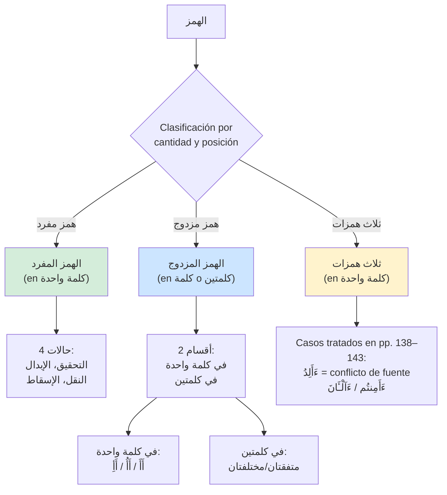

# LÓGICA DE DECISIÓN: الهمز (Hamz) - Parte 12
## Diagrama de Condiciones, Excepciones e Intersecciones

> **Comentario de revisión e-tajweed (Partes 12-A, pp. 117–136, y 12-B, pp. 137–154):** Este archivo se copió íntegro del legado antes de corregirse. La aplicación detecta y anota reglas de Warsh ʿan Nāfiʿ por ṭarīq al-Azraq; **no** evalúa cómo pronuncia una persona. Hamzah, yāʾ y todo el rasm coránico permanecen idénticos: tashīl, ibdāl, naql, isqāṭ, waṣl y waqf son alternativas de **realización**, nunca instrucciones de modificar letras o marcas. Los ejemplos vocalizados del libro son ayudas pedagógicas, no texto alternativo para guardar ni golden text.
>
> **Comentario de revisión e-tajweed (límite de fuente):** La transcripción local de la Parte 12-B incluye correcciones y ejemplos dudosos en pp. 138 y 151. Se conservan sin editar como evidencia, pero sus recuentos y listas no pasan automáticamente a un catálogo normativo. Durante el desarrollo el usuario contrastará las ocurrencias con su muṣḥaf certificado de Warsh; el aval final de un qāriʾ o especialista y la validación **oral** de tashīl siguen pendientes.

---

## 📋 DEFINICIONES TÉCNICAS

### أنواع الهمز:
1. **همز القطع:** Se mantiene en الابتداء, الوصل, والخط (esta es la همز analizada en este capítulo)
2. **همز الوصل:** Se realiza en الابتداء y no en الوصل; su grafía **nunca** se elimina del corpus.

### أقسام تغيير الهمزة (4 tipos):

1. **التسهيل:** Pronunciar همز entre ella y la letra homogénea a su harakat
   - مفتوحة: entre همز y ألف
   - مضمومة: entre همز y واو
   - مكسورة: entre همز y ياء

2. **الإبدال:** En la realización recitada, hamzah toma una letra homogénea a la vocal precedente según el caso; el code point original permanece.

3. **النقل:** Transferir en la realización la vocal de hamzah al sākin ṣaḥīḥ anterior, normalmente en otra palabra; `رِدْءًا` es la excepción interna citada (p. 122).

4. **الإسقاط:** No realizar la hamzah en las ocurrencias transmitidas; nunca borrarla del texto almacenado.

> **Comentario de revisión e-tajweed (pp. 117–118):** Las grafías con ه en ejemplos de tashīl son **aproximaciones** y la fuente exige aprendizaje oral de un shaykh autorizado. Una detección textual sólo puede indicar `tashil` y su evidencia; no afirmar que una sustitución gráfica reproduce la pronunciación correcta. La paleta aprobada **sí** reserva gris `#A9A9A9` para hamzat al-waṣl interna no pronunciada en waṣl; **no** asigna un color general a todo tashīl/ibdāl/naql/isqāṭ. No ampliar el gris a esas decisiones sin aprobación.

---

## 🎯 CLASIFICACIÓN GENERAL DE الهمز



---

## 📊 TABLA 1: الهمز المفرد - الإبدال

> **Comentario de revisión e-tajweed (pp. 119–122):** Las columnas «se convierte» y «transformación» describen **realización**, no reescritura del muṣḥaf. Fāʾ y ʿayn de palabra son funciones morfológicas verificadas, no posiciones UTF-16 ni el primer/segundo glifo visible. Las siete expresiones de `الإيواء` son ejemplos de una **familia morfológica** excepcional: sin identidad de ocurrencia revisada se devuelve `requires_review`.

### 1.1 همز ساكنة فاء الكلمة

| Harakat anterior | همز se convierte en | Ejemplos |
|------------------|---------------------|----------|
| **فتح** | ألف | يَأْتِنَا → يَاتِنَا<br/>تَأْلَمُونَ → تَالَمُونَ<br/>تَأْخُذُهُ → تَاخُذُهُ |
| **ضم** | واو | الْمُؤْتَفِكَةَ → الْمُوتَفِكَةَ<br/>الْمُؤْتُونَ → الْمُوتُونَ<br/>مُؤْخَذٌ → مُوخَذٌ |
| **كسر** | Sin caso citado en esta categoría por el libro | No inferir automáticamente taḥqīq ni extender la regla |

**⚠️ EXCEPCIÓN - 7 palabras de raíz الإيواء (همز محققة):**

| # | Palabra | Sura:Aya |
|---|---------|----------|
| 1 | **الْمَأْوَىٰ** | النازعات: 39 |
| 2 | **مَأْوَاهُ** | المائدة: 72 |
| 3 | **مَأْوَاهُمُ** | التوبة: 73 |
| 4 | **مَأْوَاكُمْ** | الحديد: 15 |
| 5 | **فَأْوُوا** | الكهف: 16 |
| 6 | **تُؤْوِيهِ** | المعارج: 13 |
| 7 | **تُؤْوِي** | الأحزاب: 51 |

### 1.2 همز مفتوحة فاء الكلمة (después de ضم)

| Condición | Regla | Ejemplos |
|-----------|-------|----------|
| **ضم + همز مفتوحة** | Convertir en واو مفتوحة | تُؤَاخِذْنَا → تُوَاخِذْنَا<br/>يُؤَيِّدُ → يُوَيِّدُ<br/>مُؤَخَّرٌ → مُوَخَّرٌ<br/>يُؤَلِّفُ → يُوَلِّفُ<br/>مُؤَذِّنٌ → مُوَذِّنٌ |

### 1.3 همز ساكنة عين الكلمة (después de كسر)

| # | Palabra | Transformación | Sura |
|---|---------|---------------|------|
| 1 | **بِئْسَ** / **بِئْسَمَا** | بِيسَ / بِيسَمَا | Multiple |
| 2 | **بِئِيسٍ** | بِيِيسٍ | الأعراف: 165 |
| 3 | **الذِّئْبُ** | الذِّيبُ | يوسف: 13, 14, 17 |
| 4 | **وَبِئْرٍ** | وَبِيرٍ | الحج: 45 |

### 1.4 Palabras especiales con إبدال

| # | Palabra | Original | Transformación | Sura |
|---|---------|----------|----------------|------|
| 1 | **سَأَلَ** | سَأَلَ | سَالَ | المعارج: 1 |
| 2 | **النَّسِيءُ** | النَّسِيءُ | النَّسِيُّ (تشديد) | التوبة: 37 |
| 3 | **لِئَلَّا** | لِئَلَّا | لِيَلَّا | البقرة: 150, النساء: 165, الحديد: 29 |
| 4 | **لِأَهَبَ** | لِأَهَبَ | لِيَهَبَ | مريم: 19 |

### 1.5 اللَّائِي - CASO COMPLEJO

| Ocurrencias citadas | الوصل | الوقف بالروم | الوقف بالسكون |
|--------------------|-------|---------------|----------------|
| الأحزاب: 4; المجادلة: 2; الطلاق: 4 | Tashīl con **dos awjuh de longitud** del alif (madd/qaṣr) | Los mismos dos awjuh de tashīl | Ibdāl de hamzah a yāʾ sākinah con madd mushbaʿ |

> **Comentario de revisión e-tajweed (p. 121):** El legado perdió la alternativa madd/qaṣr en waṣl y rawm y llamó «hāʾ» a una aproximación de tashīl. La yāʾ y hamzah escritas no se borran ni sustituyen en el corpus; los awjuh y el modo se registran como anotaciones.

### 1.6 أَرَأَيْتَ (con همز استفهام)

| Palabra | وجهان | Ejemplos |
|---------|-------|----------|
| **أَرَأَيْتَ** | 1. إبدال ألفا + مد: أَرَآيْتَ<br/>2. تسهيل: أَرَهَيْتَ | الماعون: 1 |
| **أَرَأَيْتُم** | Mismo | الأحقاف: 10 |
| **أَرَأَيْتَكَ** | Mismo | الإسراء: 62 |

**⚠️ الوقف sobre `أَرَأَيْتَ`:** La nota de p. 122 dice tashīl único en esa palabra; no extender sin evidencia esa restricción a toda variante de la familia.

### 1.7 هَا أَنتُمْ

| Palabra | وجهان | Suras |
|---------|-------|-------|
| **هَا أَنتُمْ** (dos tokens; alif tras hāʾ no realizado según p. 122) | 1. Ibdāl de hamzah a alif + madd<br/>2. Tashīl | آل عمران: 66, 119, النساء: 109 |

### 1.8 Otras palabras con إبدال

| Palabra | Transformación | Sura |
|---------|---------------|------|
| **مِنسَأَتَهُۥ** | مِنسَاتَهُۥ | سبأ: 14 |

---

## 📊 TABLA 2: الهمز المفرد - النقل

> **Comentario de revisión e-tajweed (pp. 122–124):** Primero se comprueba la **identidad de ocurrencia y las excepciones**, después la regla general entre palabras. `رِدْءًا` está en **una palabra**, por lo que era inalcanzable dentro del `if` heredado que exigía dos. Naql se anota sobre los spans de sākin y hamzah sin cambiar ninguno de sus code points.

### Regla general:
- No realizar oralmente la hamzah según esta regla; la hamzah **escrita permanece**.
- Realizar su vocal en el sākin ṣaḥīḥ precedente verificado.
- La regla general requiere frontera entre palabras; la excepción interna se resuelve aparte.

### Excepción - رِدْءًا (كلمة واحدة):

| Palabra | Transformación | Sura |
|---------|---------------|------|
| **رِدْءًا** | رِدًا | القصص: 34 |

### Caso controvertido - كِتَابِيَهْ إِنِّي (الحاقة):

> Los awjuh no son decisiones locales independientes: elegir **naql** aquí obliga a **idghām** en `مَالِيَهْ هَلَكَ`; dejar naql obliga a **iẓhār con sakt** allí. El segundo perfil es el preferido según p. 123–124. Ambos requieren un identificador de perfil que atraviese los dos lugares.

| Contexto | وجهان | مقدم |
|----------|-------|------|
| **كِتَابِيَهْ \* إِنِّي** (الحاقة: 19-20) | 1. النقل: كِتَابِيَهِنِّي<br/>2. عدم النقل: كِتَابِيَهْ \* إِنِّي | عدم النقل |

### Intersección con إدغام - مَالِيَهْ هَلَكَ:

| Contexto | وجهان | Dependencia |
|----------|-------|-------------|
| **مَالِيَهْ \* هَلَكَ** (الحاقة: 28-29) | 1. إدغام: مَالِيَهَّلَكَ<br/>2. إظهار: مَالِيَهْ \* هَلَكَ | Si كِتَابِيَهْ tiene النقل → إدغام<br/>Si كِتَابِيَهْ sin نقل → إظهار (مقدم) |

### النقل مع الابتداء (لام التعريف):

> **Comentario de revisión e-tajweed (p. 124):** Las dos formas de ibtidāʾ son awjuh alternativos. Con hamzah inicial preservada en la realización, el badal pertinente admite 2/4/6; comenzando por lām sin realizar esa hamzah, admite sólo qaṣr. No convertir las grafías pedagógicas en texto de salida ni seleccionar badal independientemente.

| Contexto | وجهان al comenzar |
|----------|-------------------|
| **الْآخِرَةُ، الْإِنسَانُ** | 1. أَلَاخِرَةُ، أَلِنسَانُ (con همز + بدل 2/4/6)<br/>2. لَاخِرَةُ، لِنسَانُ (sin همز, solo قصر) |

---

## 📊 TABLA 3: الهمز المفرد - الإسقاط

> **Comentario de revisión e-tajweed (p. 124):** Estas tres formas citadas son excepciones de realización atribuida en el libro a Nāfiʿ. La detección debe identificar cada ocurrencia Warsh y conservar la hamzah del corpus; las flechas siguientes son lectura pedagógica, no operaciones de borrado.

| # | Palabra Original | Transformación | Sura |
|---|------------------|----------------|------|
| 1 | **الصَّابِئِينَ** | الصَّابِينَ | البقرة: 62, الحج: 17 |
| 2 | **الصَّابِئُونَ** | الصَّابُونَ (ضم الباء) | المائدة: 69 |
| 3 | **يُضَاهِئُونَ** | يُضَاهُونَ (ضم الهاء) | التوبة: 30 |

---

## 📊 TABLA 4: الهمز المزدوج في كلمة واحدة

> **Comentario de revisión e-tajweed (pp. 125–127):** Antes de clasificar por vocales se distingue si la segunda hamzah es **qaṭʿ o waṣl** y si el token pertenece a un caso específico. La hamzah de istifhām + waṣl de pp. 126–127 tiene prioridad sobre `أَأَ` genérico. La lista de palabras sólo orienta la búsqueda: cada sura/āyah/token debe identificarse en el corpus.

### 4.1 مفتوحتان (13 palabras, 21 lugares)

| Palabra | Suras | وجهان | مقدم |
|---------|-------|-------|------|
| **ءَأَنذَرْتَهُمْ** | البقرة: 6, يس: 10 | إبدال / تسهيل | إبدال |
| **ءَأَنتُمْ** | 7 lugares | إبدال / تسهيل | إبدال |
| **ءَأَسْلَمْتُمْ** | آل عمران: 20 | إبدال / تسهيل | إبدال |
| **ءَأَقْرَرْتُمْ** | آل عمران: 81 | إبدال / تسهيل | إبدال |
| **ءَأَنتَ** | المائدة: 116, الأنبياء: 62 | إبدال / تسهيل | إبدال |
| **ءَأَلِدُ** | هود: 72 | **requiere revisión de fuente:** pp. 125–126 la incluyen aquí con dos awjuh, pero la transcripción de p. 138 la vuelve a presentar como triple con tashīl único | No fijar |
| **ءَأَرْبَابٌ** | يوسف: 39 | إبدال / تسهيل | إبدال |
| **ءَأَسْجُدُ** | الإسراء: 61 | إبدال / تسهيل | إبدال |
| **ءَأَشْكُرُ** | النمل: 40 | إبدال / تسهيل | إبدال |
| **ءَأَتَّخِذُ** | يس: 23 | إبدال / تسهيل | إبدال |
| **ءَأَشْفَقْتُمْ** | المجادلة: 13 | إبدال / تسهيل | إبدال |
| **ءَأَمِنتُم** | الملك: 16 | إبدال / تسهيل | إبدال |
| **ءَا۬عْجَمِيٌّ** | فصلت: 44 | إبدال / تسهيل | إبدال |

### 4.2 مفتوحة فمضمومة (4 palabras)

| Palabra | Sura | Regla |
|---------|------|-------|
| **ءَأُنَبِّئُكُم** | آل عمران: 15 | تحقيق أولى + تسهيل ثانية |
| **ءَأُنزِلَ** | ص: 8 | تحقيق أولى + تسهيل ثانية |
| **ءَأُشْهِدُوا** | الزخرف: 19 | تحقيق أولى + تسهيل ثانية |
| **ءَأُلْقِيَ** | القمر: 25 | تحقيق أولى + تسهيل ثانية |

### 4.3 مفتوحة فمكسورة (9 palabras, 30 lugares)

| Palabra | Lugares | Regla |
|---------|---------|-------|
| **ءَإِنَّكُمْ** | 4 lugares | تحقيق أولى + تسهيل ثانية |
| **ءَإِنَّ لَنَا** | الشعراء: 41 | تحقيق أولى + تسهيل ثانية |
| **ءَإِنَّكَ** | يوسف: 90, الصافات: 52 | تحقيق أولى + تسهيل ثانية |
| **ءَإِذَا** | 8 lugares | تحقيق أولى + تسهيل ثانية |
| **ءَإِلَٰهٌ** | 5 lugares (النمل) | تحقيق أولى + تسهيل ثانية |
| **أَئِمَّةً** | 5 lugares | تحقيق أولى + تسهيل ثانية |
| **ءَإِن ذُكِّرْتُم** | يس: 19 | تحقيق أولى + تسهيل ثانية |
| **ءَإِفْكًا** | الصافات: 86 | تحقيق أولى + تسهيل ثانية |
| **ءَإِنَّا** | 3 lugares | تحقيق أولى + تسهيل ثانية |

### 4.4 همز استفهام + همز وصل

> **Comentario de revisión e-tajweed:** La función de la segunda hamzah **se determina antes** de la rama abierta/abierta. Si la waṣl es abierta en lām al-taʿrīf, se conservan ibdāl+madd (preferido) y tashīl sin madd; si es kasrada, no se realiza en waṣl en los ejemplos citados. Nada se elimina de la escritura.

#### مفتوحة (لام التعريف):

| Palabra | وجهان | مقدم |
|---------|-------|------|
| **ءَآلذَّكَرَيْنِ** | 1. إبدال + مد (ءَآلذَّ)<br/>2. تسهيل (sin مد) | إبدال |
| **ءَآللَّهُ** | 1. إبدال + مد (ءَآللَّ)<br/>2. تسهيل (sin مد) | إبدال |

#### مكسورة:

| Palabra | Regla | Ejemplos |
|---------|-------|----------|
| **أَطَّلَعَ، أَصْطَفَىٰ، أَسْتَغْفَرْتَ** | حذف همز وصل | Sin همز وصل |

---

## 📊 TABLA 5: الهمز المزدوج في كلمتين - متفقتان

> **Comentario de revisión e-tajweed (pp. 129–133):** Dos hamzāt en dos palabras sólo forman este caso cuando la **frontera se recita en waṣl**. Waqf entre ellas rompe la pareja. Las formas con `جَاءَ آلَ` y las tres ocurrencias especiales de kasrah preceden a la regla general; la preferencia se conserva sin descartar el otro wajh.

### 5.1 مفتوحتان (17 ألفاظ, 29 موضع)

| Palabra | Lugares | وجهان | مقدم |
|---------|---------|-------|------|
| **السُّفَهَاءُ أَمْوَالَكُم** | النساء: 5 | إبدال / تسهيل | إبدال |
| **جَاءَ أَحَدٌ** | النساء: 43, المائدة: 6 | إبدال / تسهيل | إبدال |
| **جَاءَ أَحَدَكُمُ** | الأنعام: 61 | إبدال / تسهيل | إبدال |
| **جَاءَ أَجَلُهُمْ** | 4 lugares | إبدال / تسهيل | إبدال |
| **جَاءَ أَمْرُنَا** | 10 lugares | إبدال / تسهيل | إبدال |
| **جَاءَ أَمْرُ رَبِّكَ** | هود: 76, 101 | إبدال / تسهيل | إبدال |
| **جَاءَ آلَ** | الحجر: 61, القمر: 41 | إبدال / تسهيل | تسهيل (مقدم) |
| (Otros 10) | Multiple | إبدال / تسهيل | إبدال |

**⚠️ EXCEPCIÓN - جَاءَ آلَ:**
- **Regla especial:** تسهيل مقدم (no إبدال)
- **Con تسهيل:** 3 وجوه بدل (2/4/6)
- **Con إبدال:** قصر o طول en همز

> **Comentario de revisión e-tajweed (p. 130):** Son configuraciones **correlacionadas**: `tashīl × badal {2,4,6}` o `ibdāl × {qaṣr,madd}`. Devolver sólo «tashīl/ibdāl» perdería la duración; el perfil de recitación debe validar las combinaciones.

### 5.2 مضمومتان (1 palabra única)

| Palabra | Sura | وجهان | مقدم |
|---------|------|-------|------|
| **أَوْلِيَاءُ أُولَٰئِكَ** | الأحقاف: 32 | 1. إبدال واو ساكنة<br/>2. تسهيل | إبدال |

### 5.3 مكسورتان (15 ألفاظ, 17 موضع)

| Palabra | Lugares | وجهان | مقدم |
|---------|---------|-------|------|
| **هَٰؤُلَاءِ إِن كُنتُمْ** | البقرة: 31 | Ver casos especiales | - |
| **مِنَ النِّسَاءِ إِلَّا** | النساء: 22, 24 | 1. إبدال ياء ساكنة<br/>2. تسهيل | إبدال |
| **الْبِغَاءِ إِنْ أَرَدْنَ** | النور: 33 | Ver casos especiales | - |
| (Otros 12) | Multiple | 1. إبدال ياء ساكنة<br/>2. تسهيل | إبدال |

#### Casos especiales مكسورتان:

> **Comentario de revisión e-tajweed (pp. 131–133):** Los tres/cuatro/tres awjuh de estas ocurrencias **no** pueden reducirse a la fila general ni a una función sin definir. En `الْبِغَاءِ إِنْ أَرَدْنَ`, dos grafías pedagógicas similares corresponden a **awjuh distintos** (madd corto frente a yāʾ de kasrah ligera); deben tener identificadores y causas diferentes, no compararse como cadenas.


**1. هَٰؤُلَاءِ إِن كُنتُمْ (البقرة: 31) - 3 وجوه:**
1. إبدال ياء ساكنة + مد 6: هَؤُلَاءِ يٓن كُنتُمْ
2. إبدال ياء مكسورة: هَؤُلَاءِ يِن كُنتُمْ
3. تسهيل: هَؤُلَاءِ هِن كُنتُمْ

**2. الْبِغَاءِ إِنْ أَرَدْنَ (النور: 33) - 4 وجوه:**
1. إبدال ياء مدية + مد 6: الْبِغَاءِ يٓنَ رَدْنَ (نظر للأصل)
2. إبدال ياء مدية + قصر 2: الْبِغَاءِ يِنَ رَدْنَ (اعتداد بالنقل)
3. إبدال ياء خفيفة الكسر: الْبِغَاءِ يِنَ رَدْنَ
4. تسهيل: الْبِغَاءِ هِنَ رَدْنَ

**3. النِّسَاءِ إِنِ اتَّقَيْتُنَّ (الأحزاب: 32) - 3 وجوه:**
1. إبدال + مد 6: النِّسَاءِ يٓنِ تَّقَيْتُنَّ
2. إبدال + قصر 2: النِّسَاءِ يِنِ تَّقَيْتُنَّ
3. تسهيل: النِّسَاءِ هِنِ تَّقَيْتُنَّ

---

## 📊 TABLA 6: الهمز المزدوج في كلمتين - مختلفتان

> **Comentario de revisión e-tajweed (pp. 133–136):** Las cinco combinaciones se aplican sólo a **ocurrencias en waṣl** y con vocales/identidad de hamzah verificadas. Los ejemplos y recuentos de la transcripción no prueban cobertura; hay incluso una corrección editorial incrustada junto a una cita de p. 134. Ante conflicto de cita se devuelve `requires_review`, no una coincidencia por string.

### 6.1 مفتوحة فمكسورة (14 ألفاظ, 19 موضع)

| Ejemplos | Regla |
|----------|-------|
| **شُهَدَاءَ إِذْ** | تسهيل ثانية فقط |
| **الْبَغْضَاءَ إِلَى** | تسهيل ثانية فقط |
| **أَشْيَاءَ إِن** | تسهيل ثانية فقط |

### 6.2 مفتوحة فمضمومة (1 موضع único)

| Palabra | Sura | Regla |
|---------|------|-------|
| **جَاءَ أُمَّةً** | المؤمنون: 44 | تسهيل ثانية فقط |

### 6.3 مضمومة فمفتوحة (12 ألفاظ, 14 موضع)

| Ejemplos | Regla |
|----------|-------|
| **السُّفَهَاءُ أَلَا** | إبدال واو مفتوحة فقط |
| **نَشَاءُ أَصَبْنَاهُم** | إبدال واو مفتوحة فقط |
| **يَا سَمَاءُ أَقْلِعِي** | إبدال واو مفتوحة فقط |

### 6.4 مكسورة فمفتوحة (15 ألفاظ, 28 موضع)

| Ejemplos | Regla |
|----------|-------|
| **هَٰؤُلَاءِ أَهْدَىٰ** | إبدال ياء مفتوحة فقط |
| **الشُّهَدَاءِ أَن تَضِلَّ** | إبدال ياء مفتوحة فقط |
| **وِعَاءِ أَخِيهِ** | إبدال ياء مفتوحة فقط |

### 6.5 مضمومة فمكسورة (19 ألفاظ, 28 موضع)

| Ejemplos | وجهان | مقدم |
|----------|-------|------|
| **يَشَاءُ إِلَىٰ** | 1. إبدال واو مكسورة<br/>2. تسهيل | إبدال |
| **الشُّهَدَاءُ إِذَا** | 1. إبدال واو مكسورة<br/>2. تسهيل | إبدال |

---

## 📊 TABLA 7: ثلاث همزات - CASOS ESPECIALES

> **Comentario de revisión e-tajweed (pp. 138–144):** La transcripción de p. 138 contiene una corrección editorial explícita sobre `ءَأَلِدُ` y una explicación que entra en tensión con la lista de pp. 125–126. Se conserva el material como evidencia, pero **no** se genera una salida normativa para Hūd 11:72 hasta contrastar la edición física y el muṣḥaf certificado. No tratar «tres palabras» como un detector completo.

### 7.1 ءَأَلِدُ / ءَأَمِنتُم

| Palabra | Origen | Suras | Regla |
|---------|--------|-------|-------|
| **ءَأَلِدُ** | La derivación de p. 138 contiene corrección editorial; no validada | هود: 72 | `requires_review` por contradicción con pp. 125–126; `أَهَالِدُ` es sólo aproximación pedagógica |
| **ءَأَمِنتُم** | أَأْأَمِنتُم → ءَأَامِنتُم | الأعراف: 123, طه: 71, الشعراء: 49 | تحقيق أولى + تسهيل ثانية (أَهَامِنتُم) |

**Nota:** Para `ءَأَمِنتُم` de al-Aʿrāf/Ṭā-Hā/al-Shuʿarāʾ, p. 138 explica una tercera hamzah originaria sustituida en la **realización** por alif antes de decidir sobre las dos primeras. Esto **no** autoriza a modificar el rasm ni a equiparar esas ocurrencias con al-Mulk 67:16 de la Tabla 4.

### 7.2 ءَآلْـَٔانَ - CASO ULTRA-COMPLEJO

> **Comentario de revisión e-tajweed (pp. 138–144):** Las cinco situaciones son **relaciones entre ocurrencia, ibtidāʾ, waṣl/waqf, badal anterior/posterior y tratamiento de hamzat al-waṣl**. Los números 7/9/13/27/13 sólo describen las matrices pedagógicas citadas; p. 144 avisa expresamente que no incorporó la interacción con madd ʿāriḍ. Por tanto no se afirma exhaustividad del conjunto total de lecturas ni se genera un producto cartesiano libre.

**Origen:** أَ (استفهام) + ا (وصل) + لْ (تعريف) + ءَ (قطع) + ا (مد) + نَ

#### Estructura de 5 حالات:

| حالة | Contexto | الوصل/الوقف | Número de وجوه |
|------|----------|--------------|----------------|
| **1** | Sin بدل antes/después + وصل | الوصل | 7 |
| **2** | Sin بدل antes/después + وقف | الوقف | 9 |
| **3** | Con بدل antes + وصل | الوصل | 13 |
| **4** | Con بدل antes + وقف | الوقف | 27 |
| **5** | Con بدل después | - | 13 |

> La situación 5 requiere identificar también el alcance de `ءَايَةً` en Yūnus 91–92 y el perfil de badal. La situación 4 no equivale a «cualquier 3×3×3» fuera del contexto preciso de Yūnus 10:51.

#### Desglose de componentes:

1. **همز وصل:** 3 opciones
   - إبدال مد (6)
   - إبدال قصر (2)
   - تسهيل

2. **لام البدل:** 3 opciones
   - قصر (2)
   - توسط (4)
   - طول (6)

3. **بدل anterior/posterior:** 3 opciones
   - قصر (2)
   - توسط (4)
   - طول (6)

#### Matriz - حالة 1 (يونس: 91, sin بدل, وصل): 7 وجوه

| همز وصل | لام البدل |
|---------|-----------|
| إبدال مد (6) | 2, 4, 6 |
| تسهيل | 2, 4, 6 |
| إبدال قصر (2) | 2 |

#### Matriz - حالة 2 (يونس: 91, sin بدل, وقف): 9 وجوه

| همز وصل | لام البدل |
|---------|-----------|
| إبدال مد (6) | 2, 4, 6 |
| إبدال قصر (2) | 2, 4, 6 |
| تسهيل | 2, 4, 6 |

#### Matriz - حالة 3 (يونس: 51, con بدل antes, وصل): 13 وجوه

| بدل (ءَامَنتُم) | همز وصل | لام البدل |
|-----------------|---------|-----------|
| قصر (2) | إبدال مد / إبدال قصر / تسهيل | 2 |
| توسط (4) | إبدال مد / تسهيل | 2, 4 |
|  | إبدال قصر | 2 |
| طول (6) | إبدال مد / تسهيل | 2, 6 |
|  | إبدال قصر | 2 |

#### Matriz - حالة 4 (يونس: 51, con بدل antes, وقف): 27 وجوه

| بدل (ءَامَنتُم) | همز وصل | لام البدل |
|-----------------|---------|-----------|
| قصر (2) | إبدال مد / إبدال قصر / تسهيل | 2, 4, 6 |
| توسط (4) | إبدال مد / إبدال قصر / تسهيل | 2, 4, 6 |
| طول (6) | إبدال مد / إبدال قصر / تسهيل | 2, 4, 6 |

#### Matriz - حالة 5 (يونس: 91-92, con بدل después ءَايَةً): 13 وجوه

| همز وصل | لام البدل | بدل (ءَايَةً) |
|---------|-----------|---------------|
| إبدال مد (6) | قصر | 2, 4, 6 |
|  | توسط | 4 |
|  | طول | 6 |
| تسهيل | قصر | 2, 4, 6 |
|  | توسط | 4 |
|  | طول | 6 |
| إبدال قصر (2) | قصر | 2, 4, 6 |

---

## 🔗 MATRIZ RESUMEN: الهمز المزدوج

> **Comentario de revisión e-tajweed:** Esta matriz es un índice de los casos **generales**, no sustituye las excepciones anteriores ni resuelve el conflicto de `ءَأَلِدُ`. Hamzat al-waṣl, identidades de ocurrencia y conjuntos completos de awjuh se comprueban primero. Ninguna salida se fabrica únicamente a partir de dos marcas vocálicas visibles.

### في كلمة واحدة:

| Tipo | Primera همز | Segunda همز | Regla |
|------|-------------|-------------|-------|
| **أَأَ** | تحقيق | إبدال (مقدم) / تسهيل | - |
| **أَأُ** | تحقيق | تسهيل فقط | - |
| **أَأِ** | تحقيق | تسهيل فقط | - |

### في كلمتين - متفقتان:

| Tipo | Primera همز | Segunda همز | مقدم |
|------|-------------|-------------|------|
| **أَ أَ** | تحقيق | إبدال / تسهيل | إبدال (excepto جَاءَ آلَ) |
| **أُ أُ** | تحقيق | إبدال / تسهيل | إبدال |
| **إِ إِ** | تحقيق | إبدال / تسهيل | إبدال |

### في كلمتين - مختلفتان:

| Tipo | Primera همز | Segunda همز | Regla |
|------|-------------|-------------|-------|
| **أَ إِ** | تحقيق | تسهيل فقط | - |
| **أَ أُ** | تحقيق | تسهيل فقط | - |
| **أُ أَ** | تحقيق | إبدال واو مفتوحة فقط | - |
| **إِ أَ** | تحقيق | إبدال ياء مفتوحة فقط | - |
| **أُ إِ** | تحقيق | إبدال واو مكسورة (مقدم) / تسهيل | إبدال |

---

## 🎯 CONTRATO DE DECISIÓN: HAMZ Y YĀʾĀT, SIN CAMBIAR EL RASM

> **Comentario de revisión e-tajweed (pp. 117–154):** Se sustituyen las dos funciones heredadas porque tenían ramas inalcanzables, retornos prematuros, ayudas inexistentes y taḥqīq por defecto. El pseudocódigo siguiente describe **decisiones de detección**, no un generador de grafías recitadas ni una implementación completa. Las yāʾāt constituyen un dominio relacionado, no una subclase de hamzah.

**Entrada por objetivo:** edición y hash del corpus, identificador de ocurrencia (sura, āyah, índices de tokens), span o par de spans de grafemas/código fuente, tipo de objetivo (`hamzah`, `par`, `yāʾ al-iḍāfah`, `yāʾ zāʾidah`), identidad y función de cada hamzah (`qaṭʿ`, `waṣl`, `istifhām`), vocal escrita y realización contextual, morfología fāʾ/ʿayn de raíz, fronteras y vecinos recitados, modo (`ibtidāʾ`, `waṣl`, `waqf_sukūn`, `waqf_rawm`), inventario versionado de excepciones/ocurrencias, perfil de Warsh-al-Azraq y compatibilidades con badal, madd, naql, idghām y sakt. Un dato no verificado vale `desconocido`, no «falso». El motor llama al detector **por cada objetivo**; una decisión de yāʾ no impide detectar por separado la hamzah vecina.

**Salida:** `not_applicable`, `unsupported_input(motivo)`, `requires_review(motivo)`, `source_conflict(detalles)` o `resolved {spans_originales, awjuh:[{id, tratamiento, duración?, dependencias, autoridad}], preferido?, evidencia:[fuente, página, ocurrencia], validación_oral_pendiente?, rasm_unchanged:true}`. Taḥqīq es una salida **positivamente justificada**, no el fallback. Los awjuh de lugares distintos pueden pertenecer al mismo perfil; la interfaz no crea combinaciones cartesianas no transmitidas.

```text
FUNCIÓN detectar_hamz_y_yaat(entrada):
    SI la edición/estructura de entrada no pertenece a los corpus admitidos:
        RETORNAR unsupported_input("corpus o codificación no admitidos")
    SI identidad de corpus, ocurrencia, spans, modo o perfil es desconocida:
        RETORNAR requires_review("entrada incompleta")
    SI entrada pertenece a yāʾ al-iḍāfah o yāʾāt al-zawāʾid:
        RETORNAR resolver_yaat(entrada)  # dominio separado, misma política de rasm
    SI entrada no contiene hamzah pertinente: RETORNAR not_applicable

    # Las excepciones y conflictos de una ocurrencia vencen a patrones genéricos.
    SI entrada.cita_editorial_no_reconciliada:
        RETORNAR source_conflict("ejemplo o localización dudosos en la transcripción")
    SI entrada.es_hud_11_72_alid:
        RETORNAR source_conflict("pp. 125–126 frente a p. 138")
    SI entrada.es_alan_yunus_10_51_o_91:
        RETORNAR resolver_alan_por_situacion(entrada)
    SI entrada.es_istifham_mas_hamzat_wasl:
        RETORNAR resolver_istifham_wasl(entrada)
    SI entrada.es_tres_hamzat_verificadas:
        RETORNAR resolver_tres_hamzat_con_fuente(entrada)
    SI entrada.es_hamz_mufrad:
        RETORNAR resolver_mufrad(entrada)
    SI entrada.es_par_de_hamzat_verificado:
        RETORNAR resolver_par(entrada)
    RETORNAR requires_review("estructura de hamzah no clasificada")
FIN FUNCIÓN

FUNCIÓN resolver_mufrad(e):
    SI e.es_familia_iiwa_verificada: RETORNAR {tahqiq; excepción, pp. 119–120}
    SI e.es_ridan_28_34: RETORNAR {naql_interno; p. 122}
    SI e.es_kitabiyah_inni_o_maliyah_halaka:
        RETORNAR perfil_conjunto {naql + idgham, no_naql + izhar_con_sakt;
                                  preferido=no_naql + izhar_con_sakt}
    SI e.es_inicio_lam_al_taarif_con_naql:
        RETORNAR {hamzah_realizada + badal_2_4_6,
                  inicio_por_lam_sin_hamzah_realizada + badal_2_solo}
    SI e.es_una_de_las_tres_formas_de_isqat_verificada:
        RETORNAR {isqat_fonético; pp. 123–124}
    SI e.es_alla_i_verificada:
        SI e.modo ∈ {wasl, waqf_rawm}:
            RETORNAR {(tashil, alif=qasr), (tashil, alif=madd)}
        SI e.modo == waqf_sukun: RETORNAR {ibdal_yaa_sakinah + madd_mushba}
        RETORNAR requires_review("modo de اللائي no resuelto")
    SI e.es_araayta_familia_verificada:
        SI e.es_araayta_107_1 Y e.modo == waqf_sukun:
            RETORNAR {tashil_solo; nota_de_p_122}
        SI e.modo == wasl: RETORNAR {ibdal_alif_madd, tashil}
        RETORNAR requires_review("no extender la nota de waqf a toda la familia")
    SI e.es_haa_antum_secuencia_de_dos_tokens_verificada:
        SI e.frontera_no_se_recita_unida: RETORNAR not_applicable
        RETORNAR {ibdal_madd, tashil}
    SI e.es_otro_ibdal_especial_verificado:
        RETORNAR tratamiento_y_condiciones_del_catalogo_citado
    SI e.es_naql_general Y e.modo == wasl Y frontera_verificada
       Y hamzah_siguiente == qat Y precedente_sakin_sahih_verificado:
        RETORNAR {naql_fonético}
    SI e.es_faa_sakin_o_faa_fath_tras_damm_o_ayn_sakin_tras_kasr_verificada:
        RETORNAR tratamiento_ibdal_especifico_con_evidencia
    SI analisis_completo_verificado Y ninguna_regla_de_cambio_aplica:
        RETORNAR {tahqiq; evidencia_positiva}
    RETORNAR requires_review("no inferir taḥqīq por ausencia de coincidencia")
FIN FUNCIÓN

FUNCIÓN resolver_par(e):
    SI e.hamzah_1_o_2 == desconocido O e.vocales == desconocidas:
        RETORNAR requires_review("identidad y vocales insuficientes")
    SI e.par_en_dos_tokens Y e.modo != wasl:
        RETORNAR not_applicable("par ausente en esa frontera durante waqf")
    SI e.es_jaa_ala_verificado:
        RETORNAR {(tashil, badal=2), (tashil, badal=4), (tashil, badal=6),
                  (ibdal, hamz=qasr), (ibdal, hamz=madd);
                  preferido=tashil}
    SI e.es_una_de_las_tres_ocurrencias_de_dos_kasrah_especiales:
        RETORNAR resolver_dos_kasrah_especial(e)
    SI e.par_en_un_token:
        SI vocales == (fath,fath): RETORNAR {ibdal_preferido, tashil}
        SI vocales ∈ {(fath,damm),(fath,kasr)}: RETORNAR {tashil_segunda}
    SI e.par_en_dos_tokens:
        SI vocales == (fath,fath): RETORNAR {ibdal_preferido, tashil}
        SI vocales == (damm,damm): RETORNAR {ibdal_waw_preferido, tashil}
        SI vocales == (kasr,kasr): RETORNAR {ibdal_yaa_preferido, tashil}
        SI vocales ∈ {(fath,kasr),(fath,damm)}: RETORNAR {tashil_segunda}
        SI vocales == (damm,fath): RETORNAR {ibdal_waw_fatha}
        SI vocales == (kasr,fath): RETORNAR {ibdal_yaa_fatha}
        SI vocales == (damm,kasr): RETORNAR {ibdal_waw_kasra_preferido, tashil}
    RETORNAR requires_review("par fuera de los patrones documentados")
FIN FUNCIÓN

FUNCIÓN resolver_dos_kasrah_especial(e):
    SI e.es_haula_i_in_kuntum_2_31:
        RETORNAR {segunda_ya_sakinah_madd_6,
                  segunda_ya_maksurah_sin_ese_madd,
                  segunda_tashil}
    SI e.es_al_bigha_i_in_aradna_24_33:
        RETORNAR {segunda_ya_madd_6_por_sukun_original,
                  segunda_ya_madd_2_por_naql,
                  segunda_ya_ligera_maksurah,
                  segunda_tashil}
    SI e.es_al_nisa_i_ini_ttaqaytunna_33_32:
        RETORNAR {segunda_ya_madd_6_por_sukun_original,
                  segunda_ya_madd_2_por_naql,
                  segunda_tashil}
    RETORNAR requires_review("ocurrencia especial no identificada")
FIN FUNCIÓN

FUNCIÓN resolver_tres_hamzat_con_fuente(e):
    SI e.es_amintum_en_7_123_o_20_71_o_26_49:
        RETORNAR {primera=tahqiq, segunda=tashil,
                  tercera=ibdal_alif_en_realización,
                  badal_awjuh=referencia_correlacionada_de_p_138}
    RETORNAR requires_review("no extrapolar a al-Mulk ni a Hūd 11:72")
FIN FUNCIÓN

FUNCIÓN resolver_istifham_wasl(e):
    SI e.wasl_abierta_en_lam_taarif:
        RETORNAR {ibdal_alif_madd_preferido, tashil_sin_madd}
    SI e.wasl_kasrada_verificada:
        RETORNAR {hamzat_wasl_no_realizada_en_lectura; rasm_unchanged=true}
    RETORNAR requires_review("vocal o función de hamzat al-waṣl desconocida")
FIN FUNCIÓN

FUNCIÓN resolver_alan_por_situacion(e):
    SI e.ocurrencia no es Yūnus 10:51 ni 10:91: RETORNAR not_applicable
    SI e.modo, badal_anterior, badal_posterior o límites_de_lectura son desconocidos:
        RETORNAR requires_review("no elegir matriz por grafía sola")
    elegir exactamente una de las cinco situaciones de las Tablas 7.2
    construir awjuh completos: tratamiento_de_wasl × lam_badal × badal_externo
    filtrar con la fila pertinente, no con producto cartesiano general
    SI interaccion_con_arid_es_relevante:
        RETORNAR requires_review("p. 144 omite ʿāriḍ; faltan awjuh completos")
    RETORNAR awjuh_de_la_matriz_con_autoridad_y_fuente
FIN FUNCIÓN

FUNCIÓN resolver_yaat(e):
    SI e.es_idafah:
        exigir análisis morfológico, letra siguiente y ocurrencia de excepción
        SI e.es_mahyaya_6_162: RETORNAR {sukun + madd_6, adopted=true;
                                          fath, transmitted=true, adopted=false}
        SI e.pertenece_a_lista_dudosa_de_p_151:
            RETORNAR source_conflict("citas/editoriales no reconciliadas")
        RETORNAR awjuh_de_idafah_por_clase_modo_y_excepción_verificados
    SI e.es_zawaid:
        exigir identificador de una de las ocurrencias citadas y contraste con rasm
        SI e.modo == wasl: RETORNAR {ya_realizada_fonéticamente}
        SI e.modo == waqf_sukun: RETORNAR {ya_no_realizada_fonéticamente}
        RETORNAR requires_review("modo o alcance no verificado")
    RETORNAR not_applicable
FIN FUNCIÓN
```

> **Comentario de revisión e-tajweed:** `not_applicable("par ausente…")` significa que la **regla de par** no opera porque hay waqf; las hamzāt individuales pueden seguir teniendo otra decisión. El identificador de cada wajh distingue tratamientos que el libro aproxima con la misma grafía. Para tashīl queda `validación_oral_pendiente=true` hasta aprobación experta. La correspondencia Unicode entre hamzah aislada/precompuesta/combinante y signos magrebíes se hace mediante análisis reversible, nunca normalización destructiva.

### Casos mínimos para comprobar durante la implementación

> No son golden tests aprobados; cada ocurrencia se cotejará con el muṣḥaf certificado y su página de fuente, y la realización de tashīl exigirá revisión oral experta.

- `رِدْءًا` (al-Qaṣaṣ 28:34): naql interno alcanzable antes del requisito general de frontera entre palabras (p. 122).
- `الْمَأْوَىٰ` y demás formas de `الإيواء`: taḥqīq excepcional por familia morfológica, no por coincidencia textual aislada (p. 120).
- `كِتَابِيَهْ إِنِّي` / `مَالِيَهْ هَلَكَ`: exactamente los dos perfiles vinculados, con preferencia documentada por no-naql+iẓhār (pp. 122–124).
- `اللَّائِي`: dos awjuh de longitud con tashīl en waṣl/rawm; ibdāl con madd en waqf con sukūn (p. 121).
- Hamzat al-istifhām ante waṣl abierta/kasrada: tratar la identidad de waṣl antes de las vocales genéricas (pp. 126–127).
- `جَاءَ آلَ`: tashīl con tres badal o ibdāl con qaṣr/madd; ninguna selección independiente (p. 130).
- Los tres lugares especiales de dos kasrah: respectivamente 3, 4 y 3 awjuh identificados; dos salidas con grafía pedagógica parecida siguen siendo distintas (pp. 131–133).
- `ءَآلْـَٔانَ` en Yūnus 10:51/91: elegir una de cinco matrices por contexto; no extrapolar los recuentos cuando intervenga ʿāriḍ (pp. 138–144).
- `ءَأَلِدُ` (Hūd 11:72): devolver `source_conflict` y **ningún** wajh decidido hasta resolver pp. 125–126 frente a p. 138.
- `وَمَحْيَايَ` (al-Anʿām 6:162): distinguir khilāf transmitido de la lectura aplicada con sukūn y madd 6 (p. 150).
- `نُذُرِۦ` en al-Qamar: seis identificadores de ocurrencia, no seis lexemas; las yāʾāt no se insertan ni borran en el corpus (pp. 152–154).
- En cada salida: retirar anotaciones debe reproducir exactamente los code points y el orden de grafemas de entrada.

---

## 📋 INVENTARIO DE EXCEPCIONES CITADAS, NO CATÁLOGO COMPLETO

> **Comentario de revisión e-tajweed:** Los siguientes lexemas y expresiones son recordatorios para localizar **ocurrencias** en el corpus. El recuento de formas, tokens y fenómenos no es intercambiable. Las flechas son aproximaciones de recitación y no se aplican al texto fuente.

### الإيواء - siete expresiones citadas con taḥqīq excepcional:
1. الْمَأْوَىٰ (النازعات: 39)
2. مَأْوَاهُ (المائدة: 72)
3. مَأْوَاهُمُ (التوبة: 73)
4. مَأْوَاكُمْ (الحديد: 15)
5. فَأْوُوا (الكهف: 16)
6. تُؤْوِيهِ (المعارج: 13)
7. تُؤْوِي (الأحزاب: 51)

### الإسقاط - 3 palabras:
1. الصَّابِئِينَ → الصَّابِينَ (البقرة: 62, الحج: 17)
2. الصَّابِئُونَ → الصَّابُونَ (المائدة: 69)
3. يُضَاهِئُونَ → يُضَاهُونَ (التوبة: 30)

### النقل - Excepción en كلمة واحدة:
1. رِدْءًا → رِدًا (القصص: 34)

### Controversias:
1. **كِتَابِيَهْ إِنِّي** - وجهان: نقل (no مقدم) / عدم نقل (مقدم)
2. **مَالِيَهْ هَلَكَ** - dependiente de كِتَابِيَهْ

### جَاءَ آلَ - Excepción en المتفقتان:
- تسهيل مقدم (no إبدال como regla general)

### ءَآلْـَٔانَ - Ultra-complejo:
- 5 حالات según contexto (sin بدل, con بدل antes, con بدل después, وصل, وقف)
- Hasta 27 combinaciones **en la matriz pedagógica citada** de una situación; p. 144 advierte que no incluye ʿāriḍ.

### Conflicto de fuente que impide un resultado automático:

- `ءَأَلِدُ` (Hūd 11:72): las pp. 125–126 dan dos awjuh en la lista de dos hamzāt; la p. 138, con corrección editorial incrustada, la trata como triple con tashīl único. Estado `source_conflict` hasta contrastar la página física y el muṣḥaf certificado.

---

## 🧮 RECUENTOS PEDAGÓGICOS, NO VERIFICACIÓN DE COBERTURA

> **Comentario de revisión e-tajweed:** Las sumas del legado no validan ningún detector. Las propias transcripciones contienen correcciones, formas repetidas y clases solapadas. Para afirmar exhaustividad se necesitan identificadores de ocurrencia, cotejo con la edición física y el corpus versionado, positivos/negativos, matrices de awjuh y revisión humana.

### Conteo de casos الهمز المزدوج في كلمة واحدة:

**مفتوحتان:** el libro cita 13 palabras y 21 lugares, sujeto a reconciliar el caso `ءَأَلِدُ`.
**مفتوحة فمضمومة:** el libro cita 4 palabras.
**مفتوحة فمكسورة:** el libro cita 9 palabras y 30 lugares.

**Sin total normativo:** no sumar categorías antes de verificar unidades y ocurrencias.

### Conteo de casos الهمز المزدوج en كلمتين:

**متفقتان:**
- مفتوحتان: 17 ألفاظ en 29 lugares
- مضمومتان: 1 لفظ en 1 lugar
- مكسورتان: 15 ألفاظ en 17 lugares

**مختلفتان:**
- أَ إِ: 14 ألفاظ en 19 lugares
- أَ أُ: 1 لفظ en 1 lugar
- أُ أَ: 12 ألفاظ en 14 lugares
- إِ أَ: 15 ألفاظ en 28 lugares
- أُ إِ: 19 ألفاظ en 28 lugares

**Sin total normativo:** las cifras del libro son índices para revisión, no garantía de 93 lexemas distintos ni 136 positivos verificados.

---

## 📋 ياءات الإضافة والزوائد

> **Comentario de revisión e-tajweed (Parte 12-B, pp. 147–154):** Este capítulo está en el archivo heredado, así que **no se salta**, pero se modela como dominio de yāʾāt separado del detector de hamzah. El interés aquí sigue siendo detección y eventual presentación, no cambiar el texto ni corregir la voz del lector. El sistema de color aprobado no asigna una categoría explícita a estas yāʾāt: `requiere_decisión_visual`.

### ياءات الإضافة (4 حالات):

**Definición:** ياء المتكلم (primera persona) que aparece en nombres (جر), verbos (نصب), o partículas.

> **Comentario de revisión e-tajweed (pp. 147–151):** La función de la yāʾ (del hablante), la letra recitada siguiente y el modo se verifican por ocurrencia; no basta encontrar ي en el token. Las listas de 18, 3 y 11 son **lugares citados**, no necesariamente lexemas distintos. `بُنَيِّ` tiene kasrah en los ejemplos citados y no hereda el fatḥ general de la yāʾ asimilada.

| حالة | Contexto | Regla | Excepciones |
|------|----------|-------|-------------|
| **1. مدغمة** | Precedida por ياء ساكنة | فتح + تشديد | بُنَيِّ (3 lugares: كسر) |
| **2. antes de hamzat al-qaṭʿ** | Seguida de hamzat al-qaṭʿ | Fatḥ ligero según el libro | 18 lugares citados: yāʾ sākinah y madd munfaṣil de 6 en el contexto pertinente |
| **3. antes hamzat al-waṣl** | Seguida de hamzat al-waṣl | Fatḥ ligero según el libro | 3 lugares: yāʾ sākinah en waqf y no realizada fonéticamente en waṣl; rasm intacto |
| **4. antes otras letras** | Seguida de otras letras | Sukūn general | 11 lugares citados con fatḥ; `وَمَحْيَايَ` tiene khilāf y lectura aplicada con sukūn/madd 6; lista adicional tras alif bajo revisión de fuente |

#### Excepciones حالة 2 (18 lugares citados - sukūn + madd 6):

1. ءَاتُونِيٓ أُفْرِغْ (الكهف: 96)
2. فَاذْكُرُونِيٓ أَذْكُرْكُمْ (البقرة: 152)
3. أَرِنِيٓ أَنظُرْ (الأعراف: 143)
4. وَلَا تَفْتِنِّيٓ ۚ أَلَا (التوبة: 49)
5. وَتَرْحَمْنِيٓ أَكُن (هود: 47)
6. فَاتَّبِعْنِيٓ أَهْدِكَ (مريم: 43)
7. ذَرُونِيٓ أَقْتُلْ (غافر: 26)
8. ادْعُونِيٓ أَسْتَجِبْ (غافر: 60)
9. أَنظِرْنِيٓ إِلَىٰ (الأعراف: 14)
10. يَدْعُونَنِيٓ إِلَيْهِ (يوسف: 33)
11. فَأَنظِرْنِيٓ إِلَىٰ (الحجر: 36)
12. يُصَدِّقُنِيٓ إِنِّيٓ (القصص: 34)
13. وَفِي ذُرِّيَّتِيٓ ۖ إِنِّي (الأحقاف: 15)
14. تَدْعُونَنِيٓ إِلَى (غافر: 41)
15. أَخَّرْتَنِيٓ إِلَىٰٓ (المنافقون: 10)
16. فَأَنظِرْنِيٓ إِلَىٰ (ص: 79)
17. تَدْعُونَنِيٓ إِلَيْهِ (غافر: 43)
18. أُوفِ بِعَهْدِيٓ أُوفِ (البقرة: 40)

#### Excepciones حالة 3 (3 lugares - yāʾ no realizada fonéticamente en waṣl):

1. إِنِّي ٱصْطَفَيْتُكَ (الأعراف: 144)
2. أَخِي ٱشْدُدْ (طه: 30-31)
3. لَيْتَنِي ٱتَّخَذْتُ (الفرقان: 27)

#### Lugares citados de حالة 4 (11; revisar la lectura adoptada de `وَمَحْيَايَ`):

1. بَيْتِيَ لِلطَّائِفِينَ (البقرة: 125)
2. وَلْيُؤْمِنُوا بِي (البقرة: 186)
3. أَسْلَمْتُ وَجْهِيَ لِلَّهِ (آل عمران: 20)
4. وَجَّهْتُ وَجْهِيَ لِلَّذِي (الأنعام: 79)
5. وَمَحْيَايَ لِلَّهِ (الأنعام: 162) - khilāf de sukūn/fatḥ; **lectura aplicada en esta fuente: sukūn con madd 6** (p. 150). No etiquetar simplemente «fatḥ».
6. وَلِيَ فِيهَا مَآرِبُ (طه: 18)
7. بَيْتِيَ لِلطَّائِفِينَ (الحج: 26)
8. وَمَن مَّعِيَ مِنَ (الشعراء: 118)
9. مَا لِيَ لَا أَعْبُدُ (يس: 22)
10. فَا تَزِلُونِۦ لِي (الدخان: 21)
11. وَلِيَ دِينِ (الكافرون: 6)

#### Seis lexemas declarados tras alif (fatḥ): inventario pendiente de cotejo

> **Comentario de revisión e-tajweed (p. 151):** La transcripción dice «seis palabras en doce lugares», pero intercala un ejemplo de al-Najm 53:4 con varias **conjeturas editoriales** sobre su sustitución y otro ejemplo que ella misma declara ajeno a la condición de alif precedente. No se corrige el libro silenciosamente ni se aceptan esas doce posiciones como datos normativos. Los seis lemas impresos a continuación son candidatos; **cada lugar** debe cotejarse con la página física y el muṣḥaf certificado antes de activar la regla.

1. هُدَايَ (البقرة: 38، طه: 123)
2. إِيَّايَ (البقرة: 40، الأعراف: 155، العنكبوت: 56)
3. بُشْرَايَ (يوسف: 19)
4. مَثْوَايَ (يوسف: 23)
5. رُؤْيَايَ (يوسف: 43، 100)
6. عَصَايَ (طه: 18)

---

### ياءات الزوائد (47 ocurrencias citadas, no 47 lexemas distintos):

**Definición:** Yāʾ terminal añadida en la **lectura** respecto del rasm de los maṣāḥif ʿUthmāniyyah según p. 152. Algunas ediciones digitales pueden representar señales editoriales; ni presencia ni ausencia de un glifo sustituye una clasificación de ocurrencia.

**Regla general de la fuente:** yāʾ realizada en waṣl y no realizada en waqf, con sukūn sobre la letra anterior en la lectura; todas sākinah salvo la ocurrencia de al-Naml 27:36 que el libro señala como abierta. **No insertar/borrar** yāʾ ni signos del corpus para simular los modos.

| # | Palabra | Sura:Aya |
|---|---------|----------|
| 1 | أُجِيبُ دَعْوَةَ الدَّاعِۦ | البقرة: 186 |
| 2 | إِذَا دَعَانِۦ | البقرة: 186 |
| 3 | وَمَنِ اتَّبَعَنِۦ | آل عمران: 20 |
| 4 | فَلَا تَسْـَٔلْنِۦ | هود: 46 |
| 5 | يَوْمَ يَأْتِۦ | هود: 105 |
| 6 | وَخَافَ وَعِيدِۦ | ابراهيم: 14 |
| 7 | وَتَقَبَّلْ دُعَاءِۦ | ابراهيم: 40 |
| 8 | لَئِنْ أَخَّرْتَنِۦٓ | الإسراء: 62 |
| 9 | فَهُوَ الْمُهْتَدِۦ | الإسراء: 97 |
| 10 | فَهُوَ الْمُهْتَدِۦ | الكهف: 17 |
| 11 | أَن يَهْدِيَنِۦ | الكهف: 24 |
| 12 | أَن يُؤْتِيَنِۦ | الكهف: 40 |
| 13 | مَا كُنَّا نَبْغِۦ | الكهف: 64 |
| 14 | أَن تُعَلِّمَنِۦ | الكهف: 66 |
| 15 | أَلَّا تَتَّبِعَنِۦ | طه: 93 |
| 16 | فَكَيْفَ كَانَ نَكِيرِۦ | الحج: 44 |
| 17 | وَالْبَادِۦ | الحج: 25 |
| 18 | أَتُمِدُّونَنِۦ | النمل: 36 |
| 19 | فَمَا آتَانِۦَ اللَّهُ | النمل: 36 (excepción de yāʾ abierta; confirmar rango exacto en el corpus) |
| 20 | أَن يُكَذِّبُونِۦ | القصص: 34 |
| 21 | كَالْجَوَابِۦ | سبأ: 13 |
| 22 | فَكَيْفَ كَانَ نَكِيرِۦ | سبأ: 45 |
| 23 | فَكَيْفَ كَانَ نَكِيرِۦ | فاطر: 26 |
| 24 | وَلَا يُنقِذُونِۦ | يس: 23 |
| 25 | لَتُرْدِينِۦ | الصافات: 56 |
| 26 | لِيُنذِرَ يَوْمَ التَّلَاقِۦ | غافر: 15 |
| 27 | يَوْمَ التَّنَادِۦ | غافر: 32 |
| 28 | الْجَوَارِۦ | الشورى: 32 |
| 29 | أَن تَرْجُمُونِۦ | الدخان: 20 |
| 30 | فَاعْتَزِلُونِۦ | الدخان: 21 |
| 31 | فَحَقَّ وَعِيدِۦ | ق: 14 |
| 32 | الْمُنَادِۦ | ق: 41 |
| 33 | مَن يَخَافُ وَعِيدِۦ | ق: 45 |
| 34 | يَوْمَ يَدْعُ الدَّاعِۦ | القمر: 6 |
| 35 | مُهْطِعِينَ إِلَى الدَّاعِۦ | القمر: 8 |
| 36-41 | نُذُرِۦ | القمر: 16, 18, 21, 30, 37, 39 (6 lugares) |
| 42 | كَيْفَ نَذِيرِۦ | الملك: 17 |
| 43 | فَكَيْفَ كَانَ نَكِيرِۦ | الملك: 18 |
| 44 | وَاللَّيْلِ إِذَا يَسْرِۦ | الفجر: 4 |
| 45 | جَابُوا الصَّخْرَ بِالْوَادِۦ | الفجر: 9 |
| 46 | أَكْرَمَنِۦ | الفجر: 15 |
| 47 | أَهَانَنِۦ | الفجر: 16 |

### Diferencias entre ياءات الإضافة y الزوائد:

> **Comentario de revisión e-tajweed:** «Presente/ausente en el muṣḥaf» distingue el rasm de referencia de la **realización oral** y no prescribe eliminar code points de una edición digital concreta. Las seis entradas `نُذُرِۦ` de al-Qamar, por ejemplo, son seis **ocurrencias** de un mismo lexema; así se alcanza el recuento de 47 candidatos sin afirmar 47 palabras diferentes.

| Criterio | ياءات الإضافة | ياءات الزوائد |
|----------|---------------|----------------|
| **Ubicación** | اسم، فعل، حرف | اسم، فعل فقط |
| **في المصحف** | Escrita en el rasm según la fuente | No escrita como yāʾ de rasm según la fuente; puede haber señal editorial digital |
| **Análisis** | فتح/سكون | ثبوت/حذف (ساكنة) |
| **Naturaleza** | زائدة siempre | زائدة/أصلية |
| **الوقف** | Realización con sukūn | Yāʾ no realizada fonéticamente; waqf sobre la letra anterior |

---

## 🔍 FUENTES

- **Libro Parte 12-A** (Páginas 117-136)
- **Libro Parte 12-B** (Páginas 137-154)
- Definiciones: Página 117-118
- الهمز المفرد: Páginas 119-124
- الهمز المزدوج en كلمة: Páginas 125-128
- الهمز المزدوج en كلمتين: Páginas 129-136
- ثلاث همزات y ءَآلْـَٔانَ: Páginas 137-144
- ياءات الإضافة والزوائد: Páginas 145-154

Fuentes locales conservadas sin cambios: `docs/libro/parte12-A.md` y `docs/libro/parte12-B.md`. La paleta válida de presentación asigna gris **sólo** al caso expresamente nombrado de hamzat al-waṣl interna no pronunciada en waṣl; no fija color para el conjunto de hamz ni para yāʾāt. El resultado de cualquier caso dudoso —en especial Hūd 11:72 y las citas problemáticas de p. 151— queda `source_conflict`/`requires_review` hasta contrastar edición física, corpus Warsh certificado y lectura experta; no se inventa una salida visual ni religiosa.
