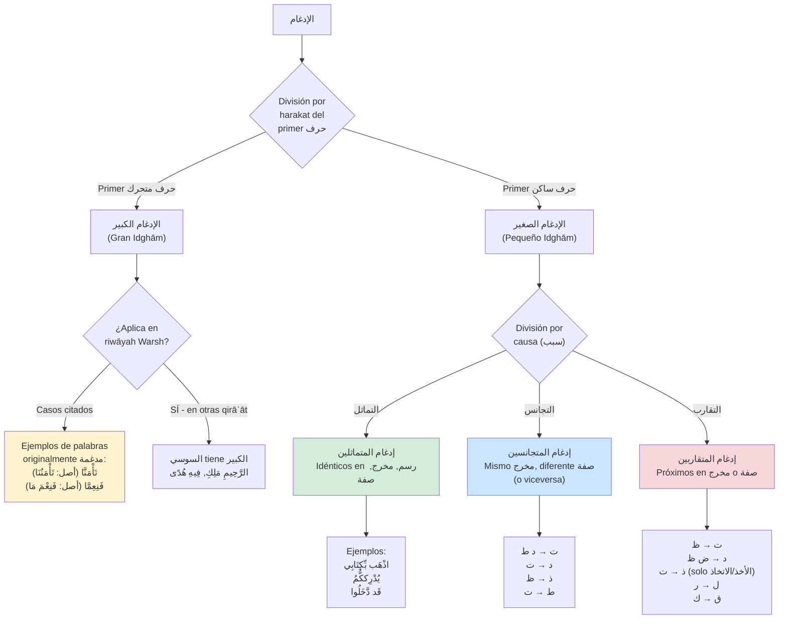
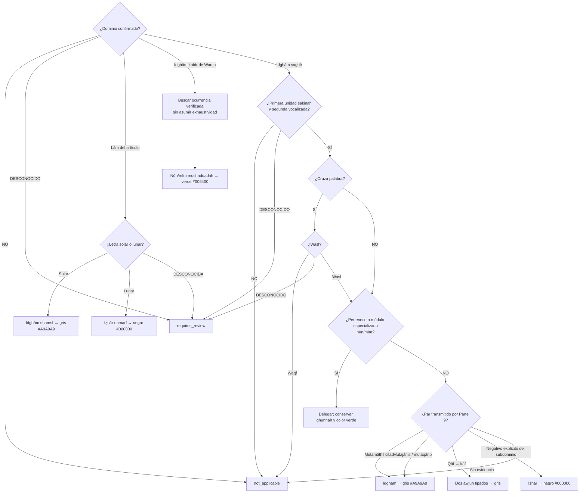

# LÓGICA DE DECISIÓN: الإدغام (Idghām)
## Diagrama de Condiciones, Excepciones e Intersecciones

> **Comentario de revisión e-tajweed (2026-09-22):** este archivo fue copiado íntegramente desde `Mesa de Trabajo3/analisis_tajweed_warsh/DECISION_LOGIC_IDGHAM.md` y se verificó antes de editarlo (`SHA-256 53bd499c5d4e45fe4bc19723751376f08b075bbd88b3b94eab9e745f44f0f055`). Las correcciones se realizan en esta misma copia contra la Parte 9, páginas 91–94.

> **Comentario de alcance e-tajweed:** la aplicación detecta y colorea reglas; no juzga la pronunciación. El estado recitado se modela como anotación y nunca modifica las letras, marcas o el orden Unicode del texto coránico.

---

## 📋 DEFINICIONES TÉCNICAS

### الإدغام (Idghām):
- **Definición lingüística (p.91):** "إدخال شيء في شيء" - Insertar algo en algo
- **Definición técnica (p.91):** "إدخال حرف ساكن في حرف متحرك فيصيران حرفا واحدا مشددا من جنس الثاني"
- **Significado:** Insertar una letra sakinah en una letra con harakat, convirtiéndose en una sola letra mushdadah del tipo de la segunda

---

## 🎯 CLASIFICACIÓN GENERAL DEL إدغام

### Salidas de coloración

| Decisión | Color de la paleta | Observación |
|----------|--------------------|-------------|
| Idghām mutajānis, mutaqārib o completo sin ghunnah | Gris `#A9A9A9` | Se anota el intervalo escrito asimilado |
| Lām shamsiyyah | Gris `#A9A9A9` | La lām del artículo es la unidad asimilada |
| Iẓhār qamariyyah o iẓhār explícito dentro del dominio | Negro `#000000` | Lectura clara |
| Nūn/mīm con ghunnah | Verde `#006400` | Se delega a sus módulos especializados |
| Casos citados de idghām kabīr en nūn/mīm mushaddadah | Verde `#006400` | `تَأْمَنَّا` y `فَنِعِمَّا` |

> **Comentario de revisión e-tajweed:** compartir color no fusiona decisiones distintas. Los pares nūn+nūn y mīm+mīm se resuelven primero en sus reglas especializadas; este documento no puede borrar su ghunnah mediante un resultado genérico de mutamāthilayn.

> **Comentario de intervalo:** en idghām ṣaghīr, el grafema de la primera unidad es el objetivo visual principal y ambas unidades forman el intervalo de evidencia. En una forma ya fusionada de idghām kabīr, el grafema objetivo deberá obtenerse del mapa reversible del corpus, nunca de una reconstrucción del supuesto texto anterior.



> **Comentario de revisión e-tajweed:** la fuente dice «algunas palabras» y presenta `تَأْمَنَّا` y `فَنِعِمَّا` mediante ejemplos; no autoriza convertirlas en una lista exclusiva. Idghām kabīr queda como dominio propio y ya no se fuerza dentro del algoritmo de idghām ṣaghīr.

---

## 📊 DIAGRAMA PRINCIPAL: ÁRBOL DE DECISIÓN



> **Comentario de revisión e-tajweed:** la clasificación ya no infiere una regla normativa sólo por proximidad fonética. Primero valida dominio, estado recitado, frontera y waṣl; después consulta pares transmitidos. Una falta de coincidencia no se convierte en iẓhār global.

---

## 📊 TABLA 1: إدغام المتماثلين (Letras Idénticas)

| Tipo | Descripción | Condiciones | Ejemplos |
|------|-------------|-------------|----------|
| **Definición** | Dos letras idénticas en رسم, مخرج, صفة | 1ª ساكنة + 2ª متحركة | - |
| **إدغام كامل** | La primera se asimila en la segunda | Casos citados dentro del dominio de la Parte 9 | اذْهَب بِّكِتَابِي (ب+ب)<br/>يُدْرِككُّمُ (ك+ك)<br/>قَد دَّخَلُوا (د+د)<br/>يُكْرِههُّنَّ (هـ+هـ) |

**⚠️ Nota:**
- La Parte 9 define la clase y aporta ejemplos; este pasaje no demuestra exhaustividad universal.
- Nūn+nūn y mīm+mīm se delegan a sus módulos especializados para no perder ghunnah.
- Los cruces entre palabras sólo se evalúan en waṣl.

**Intersecciones:** nūn/tanwīn, mīm sākinah, waṣl/waqf y lām shamsiyyah.
**Excepciones:** No se afirma una ausencia universal de excepciones.
**Dependencias:** identidad lingüística de las dos unidades y par/ocurrencia respaldados.
**Coloración:** gris `#A9A9A9` para el caso genérico completo; verde `#006400` cuando el módulo especializado conserva ghunnah.

> **Comentario de revisión e-tajweed:** se eliminan “siempre” y “sin excepciones”. La definición de mutamāthilayn no autoriza a aplicar un fallback universal que ignore los módulos de nūn y mīm.

---

## 📊 TABLA 2: إدغام المتجانسين (Letras Homogéneas)

### 2.1 التاء الساكنة

| Letra siguiente | Regla | Tipo إدغام | Ejemplos |
|-----------------|-------|------------|----------|
| **د** | إدغام | كامل | أَثْقَلَت دَّعَوَا |
| **ط** | إدغام | كامل | هَمَّت طَّائِفَتَانِ |
| **Otras letras** | إظهار | - | - |

### 2.2 الدال الساكنة

| Letra siguiente | Regla | Tipo إدغام | Ejemplos |
|-----------------|-------|------------|----------|
| **ت** | إدغام | كامل | لَقَد تَّقَطَّعَ |
| **Otras letras** | إظهار | - | - |

### 2.3 الذال الساكنة

| Letra siguiente | Regla | Tipo إدغام | Ejemplos |
|-----------------|-------|------------|----------|
| **ظ** | إدغام | كامل | إِذ ظَّلَمْتُمْ |
| **Otras letras** | إظهار | - | - |

### 2.4 الطاء الساكنة

| Letra siguiente | Regla | Tipo إدغام | Ejemplos | Notas |
|-----------------|-------|------------|----------|-------|
| **ت** | إدغام | **ناقص** | بَسَطتَ، أَحَطتُ | ⚠️ Mantiene الإطباق والاستعلاء en la ت |
| **Otras letras** | إظهار | - | - | - |

**⚠️ NOTA ESPECIAL (p.93, nota 1):**
> "أي تدغم الطاء في التاء وتبقى بعض صفات الطاء وهي الاستعلاء والإطباق على حرف التاء"

**Intersecciones:** waṣl/waqf cuando el par cruza palabras; la relación fonética no sustituye la lista transmitida.
**Excepciones:** Ṭāʾ→tāʾ conserva iṭbāq e istiʿlāʾ según la nota de la página 93.
**Dependencias:** primera unidad sākinah, segunda vocalizada y pertenencia al par enumerado.
**Coloración:** idghām gris `#A9A9A9`; el iẓhār explícito dentro de cada subdominio, negro `#000000`.

> **Comentario de revisión e-tajweed:** “otras letras → iẓhār” se conserva sólo dentro del subdominio que la fuente formula para cada primera letra; no es un fallback para cualquier par coránico.

---

## 📊 TABLA 3: إدغام المتقاربين (Letras Cercanas)

### 3.1 التاء الساكنة

| Letra siguiente | Regla | Ejemplos |
|-----------------|-------|----------|
| **ظ** | إدغام | كَانَت ظَّالِمَةً |
| **Otras letras** | إظهار | - |

### 3.2 الدال الساكنة

| Letra siguiente | Regla | Ejemplos |
|-----------------|-------|----------|
| **ض** | إدغام | لَقَد ضَّرَبْنَا، فَقَد ضَّلَّ |
| **ظ** | إدغام | فَقَد ظَّلَمَ |
| **Otras letras** | إظهار | - |

### 3.3 الذال الساكنة ⚠️ CASO ESPECIAL

| Letra siguiente | Condición adicional | Regla | Ejemplos |
|-----------------|---------------------|-------|----------|
| **ت** | ✅ Es raíz الأخذ o الاتخاذ | إدغام | أَخَذتُّم، اتَّخَذتُّم |
| **ت** | ❌ NO es raíz الأخذ/الاتخاذ | إظهار | عُذْتُ، إِذْ تَبَرَّأَ |
| **Otras letras** | - | إظهار | - |

**⚠️ NOTA CRÍTICA (p.93, nota 2):**
> "أما نحو (عُذْتُ) (إِذْ تَبَرَّأَ) فليس فيها إلا الإظهار"

**Esta rama exige análisis morfológico de la familia de `الأخذ`/`الاتخاذ`; no basta comparar ذ + ت.**

### 3.4 اللام الساكنة

| Letra siguiente | Regla | Ejemplos |
|-----------------|-------|----------|
| **ر** | إدغام | بَل رَّانَ |
| **Otras letras** | إظهار | - |

### 3.5 القاف الساكنة ⚠️ وجهان

| Letra siguiente | Regla | Opciones | Ejemplos |
|-----------------|-------|----------|----------|
| **ك** | وجهان | 1. Idghām completo<br/>2. Idghām incompleto conservando istiʿlāʾ | أَلَمْ نَخْلُقكُّم |

**⚠️ NOTA (p.94):**
El إدغام ناقص mantiene صفة الاستعلاء de la ق sobre la ك, similar al caso de ط→ت.

**Intersecciones:** waṣl/waqf, análisis morfológico y conjunto de awjuh de qāf→kāf.
**Excepciones:**
- ذ→ت depende de raíz morfológica
- ق→ك tiene وجهان
**Dependencias:**
- Para ذ→ت: verificar token, lema/familia y evidencia morfológica
- Para ق→ك: conservar ambos awjuh como alternativas tipadas; la fuente no declara preferencia
**Coloración:** idghām gris `#A9A9A9`; negativos explícitos, negro `#000000`.

> **Comentario de revisión e-tajweed:** las grafías pedagógicas `نَخْلُكُّم` y `نَخْلُقكُّم` no son salidas de texto. Ambos awjuh anotan el mismo intervalo original sin borrar qāf, insertar kāf ni reordenar marcas.

---

## 📊 TABLA 4: لام التعريف (Lām al-Taʿrīf)

**Precondición de la fuente:** es la lām que entra sobre un nombre indefinido para convertirlo en definido, como `الْكِتَاب`، `الْمُتَّقِينَ`، `الْمُؤْمِنِينَ`.

### 4.1 الإظهار القمري (Lām Qamarīyah)

**Definición:** Lām se muestra clara (الإظهار) antes de 14 letras

**Mnemónico:** ابْغِ حَجَّكَ وَخَفْ عَقِيمَهُ

**14 letras:**
| Letra | Ejemplo |
|-------|---------|
| ا | الْأَرْض |
| ب | الْبَيْت |
| غ | — |
| ح | — |
| ج | — |
| ك | الْكَرِيم |
| و | الْوَاحِد |
| خ | — |
| ف | — |
| ع | — |
| ق | الْقَمَر |
| ي | — |
| م | — |
| هـ | الْهُدَى |

**Nota:** Se llama قمري porque la ل aparece clara como en كلمة الْقَمَر.

### 4.2 الإدغام الشمسي (Lām Shamsīyah)

**Definición:** Lām se asimila (الإدغام) antes de 14 letras

**Mnemónico (p.94):**
- طِبْ ثُمَّ صِلْ رُحْمًا تَفُزْ ضِفْ ذَا نِعَمْ
- دَعْ سُوءَ ظَنٍّ زُرْ شَرِيفًا لِلْكَرَمْ

**14 letras:**
| Letra | Ejemplo |
|-------|---------|
| ط | الطَّامَّةُ |
| ث | — |
| ص | الصَّابِرِينَ |
| ر | الرَّحْمَٰنُ |
| ت | التَّوَّابُ، التَّوْبَةُ |
| ض | — |
| ذ | — |
| ن | — |
| د | — |
| س | — |
| ظ | — |
| ز | الزَّكَاةُ |
| ش | الشَّمْسُ |
| ل | — |

**Nota (p.94):** Se llama شمسي porque la ل se asimila como en كلمة الشَّمْس.

**Intersecciones:** identificación morfológica/ortográfica del artículo y política de equivalencia lingüística para hamzah/alif.
**Excepciones:** No se afirma exhaustividad fuera del pasaje revisado.
**Dependencias:** confirmar que la lām pertenece a `أل` التعريف y obtener la siguiente letra base por grafemas.
**Coloración:** lām shamsiyyah gris `#A9A9A9`; lām qamariyyah negra `#000000`.

> **Comentario de revisión e-tajweed:** las listas de catorce letras sólo se aplican después de demostrar que el token contiene el artículo definido. `ا`, `أ` y las convenciones magrebíes pueden representar la misma identidad lingüística sin permitir una normalización destructiva del texto.

> **Comentario de revisión e-tajweed:** se conservan como ejemplos únicamente las palabras aportadas por la página 94; un guion significa que el pasaje confirma la letra mediante el mnemónico, pero no aporta allí un ejemplo coránico individual para esa fila.

---

## 🔗 MATRIZ DE INTERSECCIONES

| Regla | Intersección con | Tipo | Condición |
|-------|------------------|------|-----------|
| **المتماثلين** | Nūn/mīm y lām shamsiyyah | Precedencia | Delegar antes de devolver un idghām genérico |
| **المتجانسين** | ط→ت | Especial | Mantiene صفات (إدغام ناقص) |
| **المتقاربين - ذ→ت** | Morfología | Crítica | Solo raíces الأخذ/الاتخاذ |
| **المتقاربين - ق→ك** | Conjunto de awjuh | Alternativas | Conservar completo e incompleto, sin preferencia inventada |
| **Pares entre palabras** | Waṣl/waqf | Contextual | Idghām sólo al continuar hacia la segunda unidad |
| **لام التعريف** | Morfología y Unicode | Precondición | Confirmar el artículo antes de usar las listas 14+14 |

> **Comentario de revisión e-tajweed:** se eliminan las declaraciones de independencia. La precedencia entre módulos, la continuidad de lectura, la morfología y los awjuh forman parte de la decisión y no pueden resolverse mediante el color.

---

## 🎯 ALGORITMO CORREGIDO: الإدغام GENERAL

```
FUNCIÓN detectar_idgham(unidad1, unidad2, frontera, modo, token, analisis, catalogos):
    SI (analisis.identidad_de_unidades == DESCONOCIDA):
        RETORNAR { estado: "requires_review", motivo: "unidades_no_confirmadas" }

    # لام التعريف tiene precondición propia.
    SI (analisis.es_candidato_lam_tarif == DESCONOCIDO):
        RETORNAR { estado: "requires_review", motivo: "dominio_lam_tarif_no_resuelto" }
    SI (analisis.es_candidato_lam_tarif == SI):
        RETORNAR detectar_lam_tarif(token, unidad1, unidad2, analisis)

    # الإدغام الكبير: ambas unidades eran originalmente vocalizadas.
    SI (analisis.unidad1_vocalizada AND analisis.unidad2_vocalizada):
        SI (token.ocurrencia ∈ IDGHAM_KABIR_WARSH_CITADO):
            RETORNAR {
                estado: "detected",
                regla: "idgham_kabir_warsh_citado",
                color: "#006400",
                modificar_texto: FALSO
            }
        RETORNAR { estado: "not_applicable", motivo: "fuera_del_catalogo_verificado_actual" }

    # الإدغام الصغير: el estado se obtiene del análisis, no de exigir U+0652.
    SI (analisis.estado_unidad1 == DESCONOCIDO OR analisis.estado_unidad2 == DESCONOCIDO):
        RETORNAR { estado: "requires_review", motivo: "estado_fonetico_no_confirmado" }
    SI (analisis.estado_unidad1 != SAKINAH OR analisis.estado_unidad2 != VOCALIZADA):
        RETORNAR { estado: "not_applicable" }

    SI (frontera == DESCONOCIDA):
        RETORNAR { estado: "requires_review", motivo: "frontera_no_confirmada" }
    SI (frontera ∈ {ENTRE_PALABRAS, FIN_DE_AYAH}):
        SI (modo == DESCONOCIDO):
            RETORNAR { estado: "requires_review", motivo: "modo_no_confirmado" }
        SI (modo == WAQF):
            RETORNAR { estado: "not_applicable", motivo: "waqf_corta_relacion" }

    SI (analisis.dominio_especializado ∈ {NUN_TANWIN, MIM_SAKINAH}):
        RETORNAR delegar_al_modulo_especializado(analisis.dominio_especializado)

    decision = catalogos.buscar_decision_transmitida(unidad1, unidad2, token.ocurrencia)
    SI (decision == DESCONOCIDA):
        RETORNAR { estado: "requires_review", motivo: "catalogo_no_resuelto" }
    SI (decision == NO_ENCONTRADA):
        RETORNAR { estado: "not_applicable" }

    RETORNAR resolver_decision_idgham(decision, token, analisis)

FIN FUNCIÓN
```

> **Comentario de revisión e-tajweed:** el algoritmo incorpora idghām kabīr en vez de rechazarlo por exigir que la primera letra sea sākinah. El sukūn y la shaddah son señales editoriales del corpus, no requisitos Unicode universales, y una ausencia de coincidencia ya no produce iẓhār fuera del dominio.

---

## 🎯 ALGORITMO CORREGIDO: إدغام المتجانسين

```
FUNCIÓN resolver_mutajanis(par, alcance_confirmado):
    SI (alcance_confirmado == FALSO):
        RETORNAR { estado: "not_applicable" }

    SI (par ∈ {ت→د, ت→ط, د→ت, ذ→ظ}):
        RETORNAR {
            estado: "detected",
            regla: "idgham_mutajanis_completo",
            color: "#A9A9A9",
            modificar_texto: FALSO
        }

    SI (par == ط→ت):
        RETORNAR {
            estado: "detected",
            regla: "idgham_mutajanis_incompleto",
            rasgos_conservados: {ITBAQ, ISTILA},
            color: "#A9A9A9",
            modificar_texto: FALSO
        }

    SI (par.primera ∈ {ت, د, ذ, ط} AND par ∈ NEGATIVOS_EXPLICITOS_MUTAJANIS):
        RETORNAR { estado: "detected", regla: "izhar_en_subdominio", color: "#000000" }

    RETORNAR { estado: "not_applicable" }

FIN FUNCIÓN
```

> **Comentario de revisión e-tajweed:** la función ya no intenta derivar tajānus con una matriz incompleta de makhārij/ṣifāt. Sólo resuelve pares transmitidos y negativos explícitos; la definición “mismo makhraj y distinta ṣifah, o lo contrario” se conserva como clasificación, no como generador automático de reglas.

---

## 🎯 ALGORITMO CORREGIDO: إدغام المتقاربين

```
FUNCIÓN resolver_mutaqarib(par, token, analisis_morfologico):
    SI (par ∈ {ت→ظ, د→ض, د→ظ, ل→ر}):
        RETORNAR {
            estado: "detected",
            regla: "idgham_mutaqarib_completo",
            color: "#A9A9A9",
            modificar_texto: FALSO
        }

    SI (par == ذ→ت):
        SI (analisis_morfologico == DESCONOCIDO):
            RETORNAR { estado: "requires_review", motivo: "familia_morfologica_no_confirmada" }
        SI (analisis_morfologico.familia ∈ {AKHDH, ITTIKHADH}):
            RETORNAR { estado: "detected", regla: "idgham_mutaqarib", color: "#A9A9A9" }
        RETORNAR { estado: "detected", regla: "izhar_en_subdominio", color: "#000000" }

    SI (par == ق→ك):
        RETORNAR {
            estado: "detected",
            regla: "idgham_mutaqarib_qaf_kaf",
            awjuh: {
                completo: { rasgos_conservados: {}, color: "#A9A9A9" },
                incompleto: { rasgos_conservados: {ISTILA}, color: "#A9A9A9" }
            },
            preferido: NO_DECLARADO,
            modificar_texto: FALSO
        }

    SI (par ∈ NEGATIVOS_EXPLICITOS_MUTAQARIB):
        RETORNAR { estado: "detected", regla: "izhar_en_subdominio", color: "#000000" }

    RETORNAR { estado: "not_applicable" }

FIN FUNCIÓN
```

> **Comentario de revisión e-tajweed:** la morfología pasa a ser una entrada real y puede devolver incertidumbre. Qāf→kāf produce dos alternativas estructuradas con sus rasgos conservados y sin preferencia inventada; ninguna alternativa transforma el token coránico.

---

## 🎯 ALGORITMO CORREGIDO: لام التعريف

```
FUNCIÓN detectar_lam_tarif(token, unidad_lam, unidad_siguiente, analisis):
    SI (analisis.es_articulo_definido == NO):
        RETORNAR { estado: "not_applicable" }
    SI (analisis.es_articulo_definido == DESCONOCIDO):
        RETORNAR { estado: "requires_review", motivo: "articulo_no_confirmado" }

    SI (unidad_lam.identidad != LAM_DEL_ARTICULO):
        RETORNAR { estado: "requires_review", motivo: "lam_del_articulo_no_resuelta" }

    letra = unidad_siguiente.identidad_linguistica
    SI (letra == DESCONOCIDA):
        RETORNAR { estado: "requires_review", motivo: "siguiente_letra_no_resuelta" }

    SI (letra ∈ QAMARI_14):
        RETORNAR {
            estado: "detected",
            regla: "izhar_qamari",
            intervalo: unidad_lam.grafema,
            color: "#000000",
            modificar_texto: FALSO
        }

    SI (letra ∈ SHAMSI_14):
        RETORNAR {
            estado: "detected",
            regla: "idgham_shamsi",
            intervalo: unidad_lam.grafema,
            color: "#A9A9A9",
            modificar_texto: FALSO
        }

    RETORNAR { estado: "requires_review", motivo: "identidad_fuera_de_las_listas" }

FIN FUNCIÓN
```

> **Comentario de revisión e-tajweed:** se añade la precondición que faltaba: demostrar que la lām pertenece al artículo definido. La comparación opera sobre identidad lingüística derivada de grafemas, conserva el original y devuelve revisión —no un error del texto— ante una representación no resuelta.

---

## 📋 INVENTARIO DE CASOS CITADOS

> **Comentario de revisión e-tajweed:** el inventario reproduce lo citado en las páginas 91–94; no declara una lista universalmente completa. Las ocurrencias se verificarán contra el corpus antes de convertirse en catálogos ejecutables.

### الإدغام الكبير en Warsh

**Ejemplos de palabras cuyo origen se presenta ya asimilado en Warsh:**
1. **تَأْمَنَّا** - أصل: تَأْمَنُنَا (نون ضمة + نون فتحة)
2. **فَنِعِمَّا** (البقرة: 271) - أصل: فَنِعْمَ مَا

**Nota corregida:** la fuente dice que Warsh lo presenta en algunas palabras y ofrece estos ejemplos. No afirma que sean los únicos casos.

> **Comentario de revisión e-tajweed:** `تَأْمَنُنَا` y `فَنِعْمَ مَا` documentan el origen explicado por la fuente; no son instrucciones para sustituir el token coránico ni generar otra versión del texto.

### إدغام ناقص (Mantiene صفات)

**Dos casos citados en este pasaje:**
1. **ط → ت** (p.93): Mantiene الإطباق والاستعلاء
   - Ejemplos: بَسَطتَ، أَحَطتُ

2. **ق → ك** (p.94): Mantiene الاستعلاء (opción ناقص)
   - Ejemplo pedagógico: أَلَمْ نَخْلُقكُّم / نَخْلُكُّم

### Excepciones morfológicas

**ذ → ت solo en raíces الأخذ/الاتخاذ:**
- ✅ إدغام: أَخَذتُّم، اتَّخَذتُّم
- ❌ إظهار: عُذْتُ، إِذْ تَبَرَّأَ

**Esta rama depende explícitamente de morfología. Lām al-taʿrīf y el análisis del origen de formas también exigen información lingüística, por lo que no se afirma que sea la única dependencia morfológica del documento.**

---

## 🧮 COMPROBACIÓN NOMINAL DE LAS LISTAS DE لام التعريف

### Clasificación de 28 letras para لام التعريف:

**Letras قمرية (الإظهار):** 14 letras
- ابْغِ حَجَّكَ وَخَفْ عَقِيمَهُ
- ا ب غ ح ج ك و خ ف ع ق ي م هـ

**Letras شمسية (الإدغام):** 14 letras
- طِبْ ثُمَّ صِلْ رُحْمًا تَفُزْ ضِفْ ذَا نِعَمْ
- دَعْ سُوءَ ظَنٍّ زُرْ شَرِيفًا لِلْكَرَمْ
- ط ث ص ر ت ض ذ ن د س ظ ز ش ل

**Suma:** 14 + 14 = **28 ✓**

> **Comentario de revisión e-tajweed:** 14 + 14 sólo comprueba la partición pedagógica de las letras. No demuestra que una lām sea artículo, que la siguiente letra se haya localizado correctamente ni que una edición Unicode concreta haya sido interpretada sin pérdida.

---

## 🔍 RESUMEN: TIPOS DE إدغام EN WARSH

| Tipo | Subtipo | Letras afectadas | Características |
|------|---------|------------------|-----------------|
| **الكبير** | Casos citados | تَأْمَنَّا، فَنِعِمَّا como ejemplos | Nūn/mīm mushaddadah; verde `#006400`; catálogo no exhaustivo |
| **الصغير** | المتماثلين | Pares idénticos validados | Delegar nūn/mīm; genérico completo gris `#A9A9A9` |
| **الصغير** | المتجانسين | ت→د/ط, د→ت, ذ→ظ, ط→ت | ط→ت es ناقص |
| **الصغير** | المتقاربين | ت→ظ, د→ض/ظ, ذ→ت, ل→ر, ق→ك | ذ→ت depende de raíz;<br/>ق→ك tiene وجهان |
| **لام التعريف** | قمري | 14 letras | Iẓhār negro `#000000` |
| **لام التعريف** | شمسي | 14 letras | Idghām gris `#A9A9A9` |

> **Comentario de revisión e-tajweed:** el resumen ya no promete universalidad ni completitud. Todos los resultados conservan alcance, evidencia, frontera, modo y posible delegación a módulos especializados.

---

## 🔍 FUENTES

- **Libro Parte 9** (Páginas 91-94)
- Definiciones: Página 91
- الإدغام الكبير: Página 91
- الإدغام الصغير: Página 91
- الأسباب (التماثل، التجانس، التقارب): Páginas 91-92
- إدغام المتماثلين: Página 92
- إدغام المتجانسين: Páginas 92-93
- إدغام المتقاربين: Páginas 93-94
- لام التعريف: Página 94 (nota al pie)

> **Comentario de revisión e-tajweed:** esta corrección queda contrastada con la fuente primaria indicada para esta fase. Durante la implementación, pares, ocurrencias, awjuh e intervalos de color se validarán manualmente contra el muṣḥaf certificado de Warsh ʿan Nāfiʿ por ṭarīq al-Azraq; la revisión final por un especialista cualificado queda prevista para cuando esté disponible.
