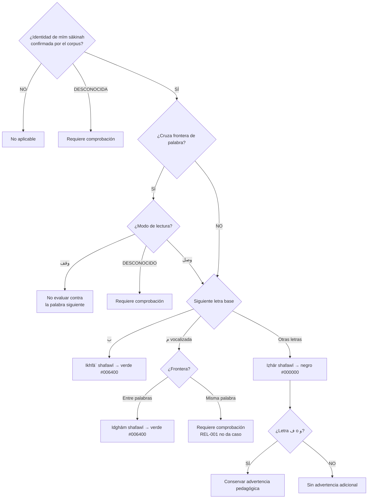
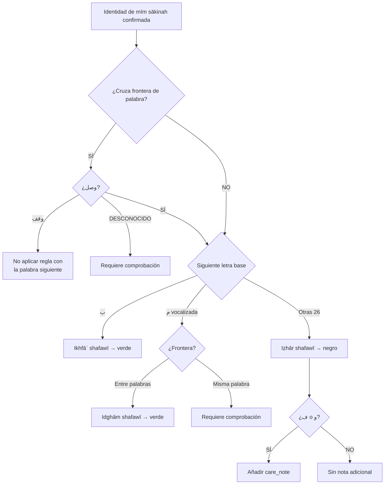
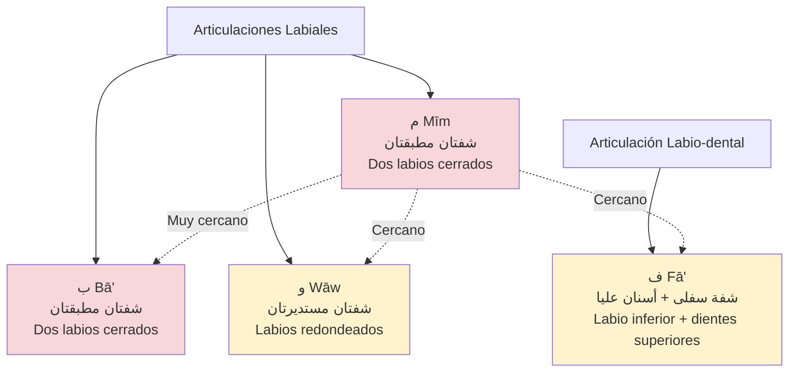
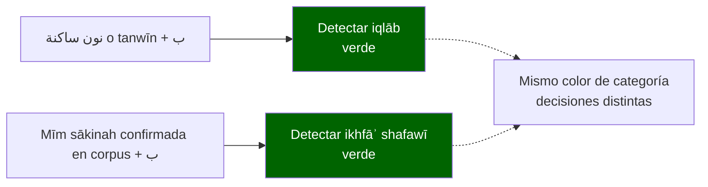

# LÓGICA DE DECISIÓN: أحكام الميم الساكنة
## Diagrama de Condiciones, Excepciones e Intersecciones

> **Comentario de revisión e-tajweed (2026-09-21):** este archivo fue copiado íntegramente desde `Mesa de Trabajo3/analisis_tajweed_warsh/DECISION_LOGIC_MEEM_SAKINAH.md` y se verificó antes de editarlo (`SHA-256 3de93a57b05db1c56bf0e35233a96de8f82f3e1361de4ccdf17efb75f8f26e67`). Las modificaciones se realizan en esta misma copia y cada grupo lleva su explicación.

> **Comentario de alcance e-tajweed:** la aplicación no evalúa pronunciación. Las explicaciones fonéticas sólo ayudan a identificar la regla; la salida requerida es detectar el intervalo exacto y asignarle el color definido por `PALETA_COLORES_WARSH.md`.

---

## 📋 DEFINICIÓN TÉCNICA

### الميم الساكنة (Mīm Sakinah):
- **Condición:** Mīm sākinah demostrada por la convención del corpus; U+0652 puede ser una señal, pero no es obligatorio en todas las ediciones
- **Definición libro:** "الميم الخالية من الحركة" (Mīm sin harakat)
- **Ejemplos:** لَمْ, كَمْ
- **Ubicación:** La relación con la siguiente letra puede ser interna o cruzar una frontera de palabra; la frontera se registra explícitamente
- **Contexto:** Si la relación cruza palabras, sólo se evalúa al continuar en waṣl

### Terminología "شفوي" (Shafawī):
- **Significado:** "Labial" (de الشفاه - los labios)
- **Razón 1:** Porque م es حرف شفوي
- **Razón 2:** Para diferenciar de أحكام النون الساكنة

> **Comentario de revisión e-tajweed:** se elimina la dependencia universal de la secuencia literal `مْ`. El corpus heredado omite U+0652 precisamente en ejemplos de ikhfāʾ e idghām. También se hace explícito que waqf corta la relación con la palabra siguiente.

## 🎨 SALIDAS DE COLORACIÓN PARA ESTE DOCUMENTO

| Decisión detectada | Entrada de la paleta | Color |
|--------------------|-----------------------|-------|
| Ikhfāʾ shafawī | Verde / ghunnah | `#006400` |
| Idghām shafawī | Verde / ghunnah | `#006400` |
| Iẓhār shafawī | Negro / lectura clara | `#000000` |

> **Comentario de revisión e-tajweed:** ikhfāʾ e idghām comparten verde, pero siguen siendo decisiones distintas con evidencia y condiciones diferentes. La advertencia ante fāʾ/wāw permanece como metadato de iẓhār y no crea una cuarta regla ni cambia el negro.

---

## 🎯 DIAGRAMA PRINCIPAL: ÁRBOL DE DECISIÓN



> **Comentario de revisión e-tajweed:** el árbol deja de exigir U+0652, incorpora frontera y waṣl/waqf, corrige `تَرْمِيهِم بِحِجَارَةٍ` como relación entre dos palabras y devuelve incertidumbre para `مْ + م` dentro de una palabra en vez de ejecutar una hipótesis.

---

## 📊 TABLA DE CONDICIONES EXACTAS

### REGLA 1: الإخفاء الشفوي (Ikhfā' Shafawī)

| Condición | Valor |
|-----------|-------|
| **Entrada** | Mīm sākinah confirmada por el corpus; no sólo coincidencia literal `مْ` |
| **Letra siguiente** | ب (1 letra SOLO) |
| **Posición مْ** | Los ejemplos de REL-001 cruzan una frontera de palabra |
| **Intersección** | Iqlāb puede tener una realización explicada mediante mīm, pero no crea automáticamente esta segunda detección |
| **Excepción** | No se menciona una excepción en esta sección de REL-001 |
| **Dependencia** | Frontera y modo waṣl confirmados cuando corresponda |
| **Coloración** | Verde `#006400` |

**Ejemplos del libro (Página 75):**
- كلمتين: أَم بِهِ
- كلمتين: تَرْمِيهِم بِحِجَارَةٍ
- كلمتين: إِنَّ رَبَّهُم بِهِم

**⚠️ INTERSECCIÓN CON الإقلاب:**

Esta es una relación **explicativa**, no una segunda detección normativa:

```
Caso 1: نْ/tanwīn + ب → الإقلاب (permanece una sola decisión de iqlāb)
Caso 2: مْ + ب → الإخفاء الشفوي (directo)
```

**Resultado:** ambos se colorean en verde, pero conservan identidades distintas: `iqlab` frente a `ikhfa_shafawi`.

**Diferencia:**
- En Caso 1: puede existir ۢ U+06E2 como señal editorial de iqlāb
- En Caso 2: la identidad es una mīm sākinah del corpus; no se presupone una codificación visual única

**Algoritmo de distinción:**
```
SI (identidad_actual == nūn_sākinah_o_tanwīn AND letra_siguiente == ب):
    Aplicar solamente: الإقلاب → verde
SINO SI (identidad_actual == mīm_sākinah AND letra_siguiente == ب):
    Aplicar solamente: الإخفاء الشفوي → verde
FIN SI
```

> **Comentario de revisión e-tajweed:** se corrige la etiqueta de `تَرْمِيهِم بِحِجَارَةٍ`: contiene dos palabras. También se elimina la doble anotación iqlāb → ikhfāʾ shafawī; compartir color verde no convierte dos decisiones religiosas distintas en una secuencia obligatoria.

---

### REGLA 2: الإدغام الشفوي (Idghām Shafawī)

| Condición | Valor |
|-----------|-------|
| **Entrada** | Mīm sākinah confirmada por el corpus |
| **Letra siguiente** | م متحركة (1 letra SOLO) |
| **Posición مْ** | Libro solo menciona كلمتين |
| **Conversión** | Anotación de idghām; nunca sustitución del texto fuente |
| **Marca visual** | U+0651 puede ser señal esperada del corpus, no prueba universal |
| **Intersección** | No documentada exhaustivamente en REL-001 |
| **Excepción** | No se menciona una excepción en esta sección de REL-001 |
| **Dependencia** | Siguiente mīm vocalizada y waṣl confirmados |
| **Coloración** | Verde `#006400` |

**Ejemplos del libro (Página 75):**
- لَهُم مَّغْفِرَةٌ
- لَهُم مَّا يَشَاءُونَ

**📌 OBSERVACIÓN:**
El libro (Página 75-76) NO menciona casos de مْ + م en كلمة واحدة.

**Pregunta técnica:** ¿Existen palabras en el Corán con مْ + م en كلمة واحدة?
- Si existen: ¿Se aplica الإدغام o الإظهار?
- El libro no responde esto explícitamente

**Estado de la entrada interna:** `requires_review` hasta encontrar evidencia precisa en el corpus y la fuente adoptados.

> **Comentario de revisión e-tajweed:** se elimina la hipótesis “probablemente también se aplica”. La ausencia de respuesta en el libro no autoriza a ejecutar idghām dentro de palabra.

---

### REGLA 3: الإظهار الشفوي (Iẓhār Shafawī)

| Condición | Valor |
|-----------|-------|
| **Entrada** | Mīm sākinah confirmada por el corpus |
| **Letra siguiente** | 26 letras (todas excepto ب y م) |
| **Posición مْ** | Dentro de palabra o a través de frontera en waṣl, según el corpus |
| **Letras** | ء ت ث ج ح خ د ذ ر ز س ش ص ض ط ظ ع غ ف ق ك ل ن ه و ي |
| **Intersección** | No documentada exhaustivamente en REL-001 |
| **Excepción** | ف y و no son excepciones; continúan siendo iẓhār |
| **Dependencia** | Guardar una advertencia pedagógica si la letra es ف o و |
| **Coloración** | Negro `#000000` |

**Ejemplos del libro (Página 75):**
- أَلَمْ تَعْلَمْ
- لَمْ يَكُنْ

**⚠️ ADVERTENCIA ESPECIAL (Página 76):**

> "يجب على الطالب أن يعتني بإظهار الميم الساكنة عند حرفين [ الفاء، الواو ]، لكي لا يسبق اللسان إلى الإخفاء، وذلك لقرب المخرجين"

**Traducción:**
"El estudiante debe cuidar de pronunciar claramente la Mīm Sakinah con dos letras [Fā', Wāw], para que la lengua no se adelante al Ikhfā', debido a la cercanía de los dos puntos de articulación"

**Razón técnica:**
- م se pronuncia con los labios cerrados (شفتان)
- ف se pronuncia con labio inferior + dientes superiores (شفة سفلى + أسنان عليا)
- و se pronuncia con labios redondeados (شفتان مستديرتان)
- **Resultado:** Los tres son articulaciones labiales muy cercanas
- **Riesgo:** El hablante puede hacer إخفاء involuntario

**Ejemplos críticos (Página 76):**
- هُمْ فِيهَا (مْ + ف - CUIDADO)
- عَلَيْهِمْ وَلَا الضَّالِّينَ (مْ + و - CUIDADO)

**Algoritmo:**
```
SI (مْ + ف O مْ + و):
    Aplicar: الإظهار الشفوي
    Advertencia: "Pronunciar مْ con CLARIDAD, evitar إخفاء involuntario"
    Razón: "قرب المخرجين - cercanía de puntos de articulación"
SINO:
    Aplicar: الإظهار الشفوي (sin advertencia especial)
FIN SI
```

> **Comentario de revisión e-tajweed:** la advertencia de fāʾ/wāw no cambia la detección ni el color. La app registra `care_note: makhraj_proximity`, pero el resultado sigue siendo `izhar_shafawi` negro.

---

## 🔗 MATRIZ DE INTERSECCIONES

| Regla | Intersección con | Tipo | Descripción |
|-------|------------------|------|-------------|
| الإخفاء الشفوي | Iqlāb | Relación explicativa | Ambos pueden ser verdes, pero nūn/tanwīn + bāʾ sigue siendo sólo iqlāb |
| الإدغام الشفوي | No documentada exhaustivamente | - | REL-001 sólo aporta ejemplos entre palabras |
| الإظهار الشفوي | Advertencia ف/و | Metadato interno | Continúa siendo iẓhār negro; no es excepción |

> **Comentario de revisión e-tajweed:** se elimina la secuencia normativa de dos reglas tras iqlāb y se evita declarar ausencia absoluta de intersecciones sin evidencia exhaustiva.

---

## 🎯 TABLA DE VERIFICACIÓN DE DEPENDENCIAS



> **Comentario de revisión e-tajweed:** el diagrama ya no convierte iqlāb en ikhfāʾ shafawī, no aplica la hipótesis interna de idghām y modela explícitamente frontera y modo de lectura.

---

## 📋 RESUMEN: CONDICIONES POSICIONALES

| Regla | Relación dentro de palabra | Relación entre palabras en waṣl |
|-------|-----------------------------|----------------------------------|
| **الإخفاء الشفوي** | No demostrada por los ejemplos citados | ✅ أَم بِهِ، تَرْمِيهِم بِحِجَارَةٍ، رَبُّهُم بِهِمْ |
| **الإدغام الشفوي** | `requires_review`: la fuente no aporta un caso interno | ✅ لَهُم مَّغْفِرَةٌ، لَهُم مَّا يَشَاءُونَ |
| **الإظهار الشفوي** | No prohibida, pero no demostrada por los ejemplos citados | ✅ أَلَمْ تَعْلَمْ، لَمْ يَكُنْ |

> **Comentario de revisión e-tajweed:** todos los ejemplos aportados por las páginas 75–76 relacionan el final de una palabra con el inicio de la siguiente. Se corrige `تَرْمِيهِم بِحِجَارَةٍ`, que antes estaba clasificado erróneamente como una sola palabra. La posibilidad interna no se convierte en regla sin evidencia de la fuente.

---

## 🧮 COMPROBACIÓN NOMINAL DE COBERTURA DE LETRAS

**Total de letras del alfabeto árabe:** 28

**Distribución por reglas:**
- الإخفاء الشفوي: 1 letra (ب)
- الإدغام الشفوي: 1 letra (م)
- الإظهار الشفوي: 26 letras (todas las demás)

**Suma:** 1 + 1 + 26 = **28 ✓**

**Sub-clasificación en الإظهار:**
- Letras con advertencia: 2 (ف, و)
- Letras sin advertencia: 24

**Suma:** 2 + 24 = **26 ✓**

> **Comentario de revisión e-tajweed:** estas sumas comprueban que las 28 letras quedan nominalmente repartidas, pero no validan el algoritmo, las fronteras, el modo waṣl/waqf, los grafemas Unicode ni los casos reales del corpus.

---

## 📚 NOTAS Y CASOS CITADOS EN EL LIBRO

### 1. Advertencia ف/و en الإظهار الشفوي
- **Página:** 76
- **Tipo:** NO es excepción, es advertencia de pronunciación
- **Condición:** مْ + ف o مْ + و
- **Razón:** "قرب المخرجين" (cercanía de puntos de articulación)
- **Acción:** Pronunciar مْ con CLARIDAD, evitar إخفاء involuntario
- **Ejemplos:** هُمْ فِيهَا, عَلَيْهِمْ وَلَا

### 2. Nota sobre la regla independiente (Página 76)
- **Cita:** "إنّ الميم الساكنة ليس لها حكم مستقل إلا إذا وقع بعدها حرف الباء"
- **Significado:** Mīm Sakinah solo tiene regla independiente con ب
- **Interpretación:**
  - Con ب → الإخفاء الشفوي (regla única de مْ)
  - Con م → الإدغام (regla general de letras idénticas)
  - Con otras 26 → الإظهار (regla por defecto)

**Implicación técnica:**
- Esta es una nota **conceptual**, NO una excepción técnica
- NO cambia las reglas de verificación
- Solo explica que مْ es más simple que نْ

---

## ✅ ALGORITMO CORREGIDO DE DETECCIÓN Y COLORACIÓN

```
FUNCIÓN detectar_meem_sakinah(unidad_actual, siguiente_unidad, frontera, modo, corpus):

    # PASO 1: confirmar la identidad sin exigir una codificación única
    identidad = corpus.confirmar_meem_sakinah(unidad_actual)
    SI (identidad == NO):
        RETORNAR { estado: "not_applicable" }
    SI (identidad == DESCONOCIDA):
        RETORNAR { estado: "requires_review", motivo: "identidad_no_confirmada" }

    # PASO 2: resolver la relación entre palabras
    SI (frontera == DESCONOCIDA):
        RETORNAR { estado: "requires_review", motivo: "frontera_no_confirmada" }
    SI (frontera == ENTRE_PALABRAS):
        SI (modo == DESCONOCIDO):
            RETORNAR { estado: "requires_review", motivo: "modo_no_confirmado" }
        SI (modo == WAQF):
            RETORNAR { estado: "not_applicable", motivo: "waqf_corta_relación" }

    # PASO 3: obtener la siguiente letra base sin confundir marcas combinantes
    letra = siguiente_unidad.letra_base_arabe
    SI (letra == DESCONOCIDA):
        RETORNAR { estado: "requires_review", motivo: "siguiente_letra_no_resuelta" }

    # REGLA 1: الإخفاء الشفوي
    SI (letra == ب):
        RETORNAR {
            estado: "detected",
            regla: "ikhfa_shafawi",
            color: "#006400",
            modificar_texto: FALSO
        }

    # REGLA 2: الإدغام الشفوي
    SI (letra == م):
        vocalizacion = siguiente_unidad.estado_vocalizacion
        SI (vocalizacion != VOCALIZADA):
            RETORNAR { estado: "requires_review", motivo: "vocalizacion_de_meem_no_confirmada" }
        SI (frontera == DENTRO_DE_PALABRA):
            RETORNAR { estado: "requires_review", motivo: "caso_interno_no_definido_por_fuente" }
        RETORNAR {
            estado: "detected",
            regla: "idgham_shafawi",
            color: "#006400",
            modificar_texto: FALSO
        }

    # REGLA 3: الإظهار الشفوي
    SI (letra ∈ letras_base_arabes AND letra ∉ {ب, م}):
        nota = (letra ∈ {ف, و}) ? "makhraj_proximity" : NINGUNA
        RETORNAR {
            estado: "detected",
            regla: "izhar_shafawi",
            color: "#000000",
            care_note: nota,
            modificar_texto: FALSO
        }

    RETORNAR { estado: "requires_review", motivo: "entrada_no_clasificada" }

FIN FUNCIÓN
```

> **Comentario de revisión e-tajweed:** el algoritmo pasa a detectar y colorear sin transformar el texto. La identidad se confirma con el corpus, la letra siguiente se obtiene por grafemas, waqf corta una relación entre palabras y cualquier estado no resuelto queda para revisión; no se inventa una decisión doctrinal ni se devuelve un falso error.

---

## 🔄 COMPARACIÓN CON أحكام النون الساكنة

| Aspecto | نْ | مْ |
|---------|-----|-----|
| **Número de reglas** | 4 | 3 |
| **Regla con 1 letra** | الإقلاب (ب) | الإخفاء (ب), الإدغام (م) |
| **Regla con 2 letras** | الإدغام التام (ل ر) | - |
| **Regla con 4 letras** | الإدغام الناقص (ي ن م و) | - |
| **Regla con 6 letras** | الإظهار (ء ه ع ح غ خ) | - |
| **Regla con 15 letras** | الإخفاء (15 letras) | - |
| **Regla con 26 letras** | - | الإظهار (26 letras) |
| **Excepciones** | إظهار شاذ (4 palabras) | No se afirma exhaustividad en esta revisión |
| **Intersecciones** | النقل (con ء) | الإقلاب es una relación explicativa; no genera una segunda detección |
| **Advertencias** | تفخيم/ترقيق en الإخفاء | ف/و en الإظهار |
| **Casos especiales** | يس, ن (Warsh) | مْ + م dentro de palabra queda en `requires_review` |

**Conclusión:** مْ es más simple que نْ

> **Comentario de revisión e-tajweed:** esta comparación es descriptiva y no demuestra por sí sola la ausencia de excepciones o casos especiales. La implementación se limita a lo establecido en las páginas 75–76 y conserva como incertidumbre cualquier caso no definido.

---

## 📊 TABLA DE UNICODE

| Símbolo | Nombre | Unicode | Uso permitido en la detección |
|---------|--------|---------|----------------------------------|
| ْ | Sukūn | U+0652 | Evidencia posible de sukūn; no requisito universal para identificar mīm sākinah |
| ّ | Tashdīd | U+0651 | Evidencia editorial posible en la mīm resultante; no prueba autónoma de idghām |
| ۢ | Mīm pequeña | U+06E2 | Señal editorial relacionada con iqlāb; no convierte el texto en una mīm léxica ni activa ikhfāʾ shafawī |

> **Comentario de revisión e-tajweed:** los code points son señales del corpus, no sustituyen el análisis de grafemas ni autorizan a insertar, eliminar o reordenar marcas. El detector debe conservar exactamente la secuencia Unicode original.

---

## 🎯 DIAGRAMA HEREDADO DE MAKHĀRIJ — NO USAR COMO CONDICIÓN

> **Comentario de revisión e-tajweed:** las páginas 75–76 solo citan la cercanía de los puntos de articulación para advertir sobre fāʾ y wāw. No fundamentan este diagrama detallado ni la afirmación causal sobre cada regla. Se conserva como explicación histórica pendiente de una fuente específica, fuera de la lógica de detección.



**Explicación heredada, no normativa:**
1. **م + ب:** relación articulatoria indicada por el documento anterior; pendiente de fuente específica.
2. **م + و:** cercanía usada como explicación de la advertencia de la página 76.
3. **م + ف:** cercanía usada como explicación de la advertencia de la página 76.

---

## 📖 CITAS EXACTAS DEL LIBRO

### Página 75 - Definición:
> "تعريف الميم الساكنة: هي الميم الخالية من الحركة، مثل: لَمْ، كَمْ"

### Página 75 - Razón del nombre "شفوي":
> "وسميت شفوية لأمرين:
> - لأن الميم حرف شفوي.
> - ليفرق بينها و بين أحكام النون الساكنة."

### Página 76 - Advertencia ف/و:
> "يجب على الطالب أن يعتني بإظهار الميم الساكنة عند حرفين [ الفاء، الواو ]، لكي لا يسبق اللسان إلى الإخفاء، وذلك لقرب المخرجين"

### Página 76 - Nota sobre regla independiente:
> "يمكن أن نقول: إنّ الميم الساكنة ليس لها حكم مستقل إلا إذا وقع بعدها حرف الباء، وفيما عدا ذلك فلا فرق بينها، وبين غيرها من الحروف."

---

## 🔍 DECISIONES OPERATIVAS Y PUNTOS PENDIENTES

1. **¿Existen casos de مْ + م en كلمة واحدة en el Corán?**
   - El libro solo menciona casos en كلمتين
   - Estado del detector: `requires_review`
   - No se asignará الإدغام ni الإظهار hasta verificar el corpus y una fuente aplicable

2. **¿Hay casos de مْ al final de palabra seguida de وقف?**
   - Decisión operacional: en waqf no se inspecciona la palabra siguiente
   - Por tanto, una regla dependiente de esa relación queda `not_applicable`

3. **¿Por qué solo ف y و tienen advertencia?**
   - Libro explica: "قرب المخرجين" (cercanía de articulación)
   - ف y و siguen clasificándose como الإظهار الشفوي
   - La advertencia se guarda como metadato; no crea una cuarta regla ni cambia el color negro

> **Comentario de revisión e-tajweed:** se separan las decisiones necesarias para operar el detector de las preguntas que exigen evidencia adicional. Ninguna ausencia de información se completa por conjetura.

---

## 🔗 DEPENDENCIAS CON OTRAS REGLAS

### Relación explicativa con الإقلاب (de أحكام النون):



**Implicación técnica:**
- Nūn sākinah o tanwīn ante ب produce una decisión de `iqlab`.
- Una mīm sākinah realmente presente ante ب produce una decisión de `ikhfa_shafawi`.
- Ambas decisiones usan verde `#006400`, pero no se encadenan ni se duplican sobre el mismo intervalo.
- La marca ۢ puede ayudar a interpretar la codificación editorial de iqlāb, pero el motor no transforma el texto.

> **Comentario de revisión e-tajweed:** se elimina la secuencia heredada «iqlāb → conversión del texto → ikhfāʾ shafawī». La app colorea la regla detectada y mantiene intacto el texto coránico.

---

## ✅ TABLA DE DECISIÓN RÁPIDA

| Entrada confirmada por el corpus | Letra siguiente | Frontera/modo | Resultado | Color | Metadato |
|----------------------------------|-----------------|---------------|-----------|-------|----------|
| Mīm sākinah | ب | Válida; waṣl si cruza palabra | `ikhfa_shafawi` | `#006400` verde | - |
| Mīm sākinah | م | Entre palabras, waṣl | `idgham_shafawi` | `#006400` verde | - |
| Mīm sākinah | م | Dentro de palabra | `requires_review` | Sin color | Caso no definido por la fuente |
| Mīm sākinah | ف o و | Válida; waṣl si cruza palabra | `izhar_shafawi` | `#000000` negro | `care_note: makhraj_proximity` |
| Mīm sākinah | Otras 24 letras | Válida; waṣl si cruza palabra | `izhar_shafawi` | `#000000` negro | - |

> **Comentario de revisión e-tajweed:** la tabla rápida ya no exige la secuencia literal `مْ`, no mezcla iqlāb con mīm sākinah y hace visibles frontera, modo, estado y color.

---

## 🔍 FUENTES

- **Libro Parte 7** (Páginas 75–76)
- Definición: Página 75
- الإخفاء الشفوي: Página 75
- الإدغام الشفوي: Página 75
- الإظهار الشفوي: Página 75
- Advertencia ف/و: Página 76
- Nota conceptual: Página 76

> **Comentario de revisión e-tajweed:** esta corrección queda cerrada contra la fuente primaria indicada para esta fase. Durante la implementación, los resultados se validarán manualmente contra un muṣḥaf de Warsh ʿan Nāfiʿ por ṭarīq al-Azraq coloreado y certificado; la revisión final por un especialista cualificado queda prevista para cuando esté disponible.
