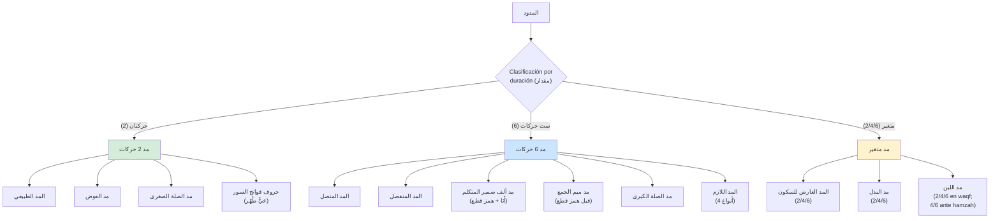
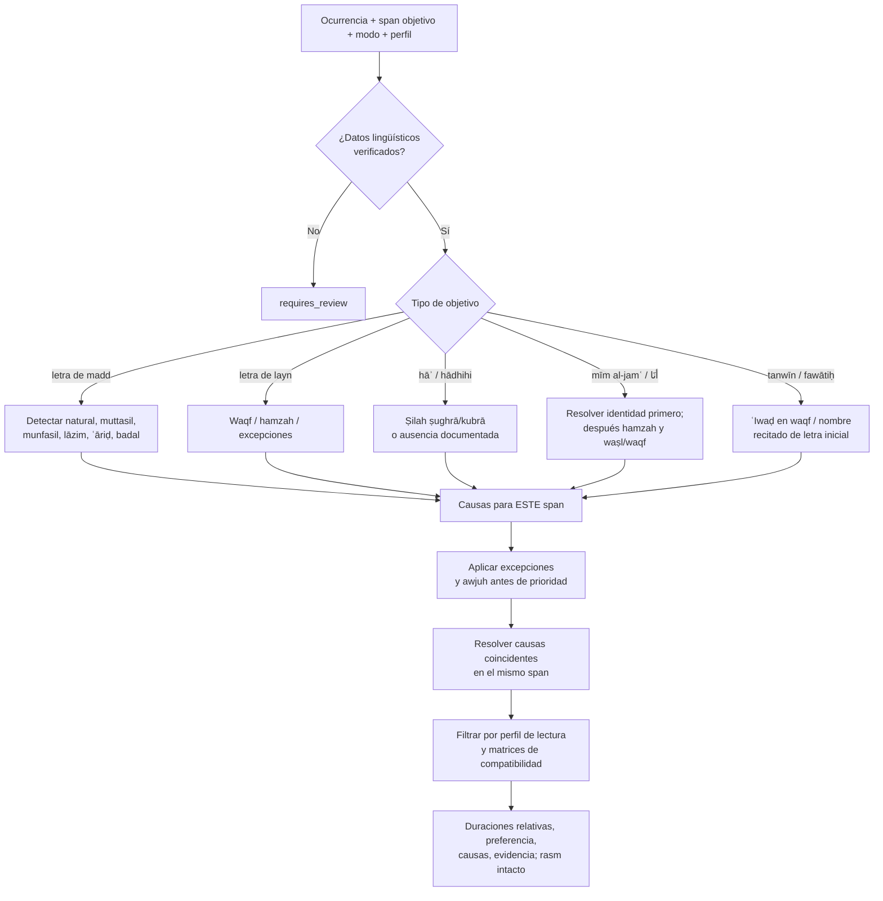

# LÓGICA DE DECISIÓN: المدود (Mudūd)
## Diagrama de Condiciones, Excepciones e Intersecciones

> **Comentario de revisión e-tajweed (Parte 11, pp. 105–114):** Este archivo se copió íntegro del legado antes de corregirse. Su cometido es **detectar y anotar** reglas de madd para Warsh ʿan Nāfiʿ por ṭarīq al-Azraq, no evaluar la pronunciación del lector. Cada decisión afecta a una **ocurrencia y un intervalo objetivo** del texto, no a una palabra entera; las transformaciones de waṣl/waqf son de realización, nunca ediciones del corpus. Los ejemplos del libro no constituyen un catálogo exhaustivo de ocurrencias. La comprobación manual del usuario contra el muṣḥaf certificado acompaña la implementación y el aval final de un especialista queda pendiente.
>
> **Comentario de revisión e-tajweed (ḥarakāt):** 2, 4 y 6 son duraciones **relativas** de recitación, no milisegundos fijos. Los awjuh permitidos, su preferencia y sus restricciones de compatibilidad deben conservarse como datos separados. Si falta una clasificación contextual, el motor devuelve `requires_review` y no inventa un madd natural.

---

## 📋 DEFINICIONES TÉCNICAS

### المد (Madd):
- **Definición lingüística (p.105):** "المطّ، والتطويل، والزيادة"
- **Significado:** Estirar, alargar, aumentar
- **Definición técnica (p.105):** "إطالة الصوت بأحد حروف المدّ"
- **Significado:** Alargar el sonido con una de las letras de madd

### حروف المد (Letras de Madd):

1. **الألف الساكنة المفتوح ما قبلها** - Alif sākinah con fatḥah antes
2. **الواو الساكنة المضموم ما قبلها** - Wāw sākinah con ḍammah antes
3. **الياء الساكنة المكسور ما قبلها** - Yā' sākinah con kasrah antes

**Mnemónico:** نُوحِيهَا

---

## 🎯 CLASIFICACIÓN GENERAL DE المدود (por duración en Warsh)

> **Comentario de revisión e-tajweed:** Este esquema es un índice pedagógico de la fuente, **no un árbol de prioridad ejecutable**. La letra ʿayn de fawātiḥ conserva 4/6 (p. 109); layn ante hamzah conserva 4/6 (p. 111). No caben sin matiz en una etiqueta genérica «2/4/6».



---

## 📊 DIAGRAMA PRINCIPAL: ÁRBOL DE DECISIÓN

> **Comentario de revisión e-tajweed (pp. 105–114):** El diagrama heredado iniciaba siempre por una letra de madd y hacía inalcanzables ṣilah, mīm al-jamʿ, ʿiwaḍ y parte de `أَنَا`. Se sustituye por un flujo por **tipo de objetivo y span**. Las causas coincidentes se resuelven sólo dentro del mismo span; las causas de otro span siguen vivas (p. 114, `ءَآمِّينَ`).



---

## 📊 TABLA 1: مد 2 حركات

> **Comentario de revisión e-tajweed (pp. 105–106):** Estos cuatro grupos no comparten necesariamente el mismo detector ni el mismo color. `مد العوض` y `مد طبيعي` permanecen sin marcado especial según la paleta; `صلة صغرى` es amarillo `#D4A017`. Para los fawātiḥ de dos ḥarakāt la paleta no da una asignación específica: no extrapolar el amarillo.

### 1.1 المد الطبيعي (الأصلي)

| Tipo | Descripción | Condiciones | Ejemplos |
|------|-------------|-------------|----------|
| **Definición** | Lo esencial del حرف, sin سبب (همز/سكون) | حرف مد + letra normal | نُوحِيهَا |
| **Duración** | 2 حركات | - | - |

> En `غَفُورًا → غَفُورَا` la flecha describe **sólo la realización de waqf**. El tanwīn y el rasm original permanecen byte por byte inalterados.

### 1.2 مد العوض

| Tipo | Descripción | Condiciones | Ejemplos |
|------|-------------|-------------|----------|
| **Definición** | Reemplazo de تنوين نصب en وقف por ألف | Solo en وقف | غَفُورًا → غَفُورَا |
| **Duración** | 2 حركات | - | - |

### 1.3 مد الصلة الصغرى

| Tipo | Descripción | Condiciones | Ejemplos |
|------|-------------|-------------|----------|
| **Definición** | هاء ضمير (غائب مفرد مذكر) | متحركة (ضم/كسر) + بين متحركين | مِن دُونِهِۦ مُلْتَحَدًا<br/>بِعِبَادِهِۦ خَبِيرٌ<br/>لَهُۥ صَاحِبُهُۥ |
| **Excepción** | يَرْضَهُ لَكُمْ (الزمر: 7) | لا تمد | - |
| **Duración** | 2 حركات | - | - |

**⚠️ NOTA:** Se incluye también هاء de هَٰذِهِ (اسم إشارة مؤنثة) entre متحركين:
- **Ejemplos:** هَٰذِهِۦ مِنْ عِندِ اللَّهِ، هَٰذِهِۦ نَاقَةُ اللَّهِ
- **6 حركات si después hay همز قطع:** هَٰذِهِۦٓ أَنْعَامٌ (الأنعام: 138)
- **Se elimina si después hay ساكن:** هَٰذِهِ الْأَنْهَارُ (الزخرف: 51)

> «Se elimina» se refiere exclusivamente a la **ṣilah en la realización de waṣl**. La hāʾ y los signos del corpus no se borran. `هَٰذِهِ` se incluye por extensión expresamente citada en p. 106, no porque sea un pronombre masculino.

**NO se aplica الصلة si:**
- Hay ساكن ANTES de هاء: وَيَرْزُقْهُ مِنْ حَيْثُ
- Hay ساكن DESPUÉS de هاء: وَتُسَبِّحُوهُ بُكْرَةً، وَبِيَدِهِ الْأَرْضُ

### 1.4 حروف فواتح السور

| Letras | Mnemónico | Ejemplos | Duración |
|--------|-----------|----------|----------|
| **حَيٌّ طُهْر** | ح ي ط هـ ر | الر، طسم، كهيعص، حم، المر | 2 حركات |

**Intersecciones:** هَٰذِهِ intersecta con همز قطع (→ 6 حركات)
**Excepciones:** يَرْضَهُ لَكُمْ, casos sin الصلة
**Dependencias:** Verificar contexto (متحركين, ساكن)

> Para los fawātiḥ se requiere sura, posición y nombre **recitado** de la letra. El carácter aislado no basta para detectar ni delimitar el madd.

---

## 📊 TABLA 2: مد 6 حركات فقط

> **Comentario de revisión e-tajweed (pp. 106–109):** Las categorías generales de seis ḥarakāt admiten excepciones condicionadas por modo u ocurrencia: `أَنَا`, mīm al-jamʿ, `الٓمٓ` y ʿayn no deben ser absorbidas por una regla genérica de munfaṣil/lāzim. La hamzah debe clasificarse como qaṭʿ o waṣl y con su vocal **según la lectura**, no por un único code point.

### 2.1 المد المتصل

| Tipo | Descripción | Condiciones | Ejemplos |
|------|-------------|-------------|----------|
| **Definición** | حرف مد + همز en MISMA كلمة | - | شَآءَ، سِيٓئَتْ، سُوٓءَ، تَبُوٓءَ، جِيٓءَ |
| **Duración** | 6 حركات | - | - |

### 2.2 المد المنفصل

| Tipo | Descripción | Condiciones | Ejemplos |
|------|-------------|-------------|----------|
| **Definición** | حرف مد final de كلمة + همز قطع inicial de siguiente كلمة | - | ادْعُونِيٓ أَسْتَجِبْ<br/>تُوبُوٓا إِلَى اللَّهِ<br/>إِنَّآ أَعْطَيْنَاكَ |
| **Duración** | 6 حركات | - | - |

### 2.3 مد ألف ضمير المتكلم (أَنَا)

> **Comentario de revisión e-tajweed (p. 107):** Resolver desde la identidad del pronombre `أَنَا`, tanto si la unidad siguiente es hamzat al-qaṭʿ abierta/redondeada como si es qaṭʿ kasrada, waṣl o no-hamzah. Si se entra sólo por «munfaṣil ante qaṭʿ», tres ramas serán inalcanzables. El alif no se elimina del texto fuente cuando no se realiza en waṣl.

| Contexto después de أَنَا | الوصل | الوقف | Ejemplos |
|---------------------------|-------|-------|----------|
| **همز قطع مفتوح** | 6 حركات | 2 حركات | أَنَا۠ أَوَّلُ الْمُسْلِمِينَ |
| **همز قطع مضموم** | 6 حركات | 2 حركات | أَنَا۠ أُحْيِي وَأُمِيتُ |
| **همز قطع مكسور** | لا مد | 2 حركات | إِنْ أَنَا۠ إِلَّا نَذِيرٌ |
| **همز وصل** | لا مد | 2 حركات | أَنَا۠ اخْتَرْتُكَ |
| **غير همز** | لا مد | 2 حركات | أَنَا۠ خَيْرٌ مِّنْهُ، أَنَا۠ رَبُّكُمُ |

### 2.4 مد ميم الجمع

> **Comentario de revisión e-tajweed (pp. 107–108):** Hamzat al-waṣl es una rama **hermana** de hamzat al-qaṭʿ, nunca una subrama de esta. En waṣl ante waṣl hay ḍamm de mīm pero la fuente no prescribe allí madd de seis; en waqf hay iskān.

| Contexto después de ميم | الوصل | الوقف | Ejemplos |
|-------------------------|-------|-------|----------|
| **همز قطع** | 6 حركات (ضم + مد) | إسكان ميم | إِنَّهُمْ ءَمَنُوا<br/>لِبُيُوتِهِمْ أَبْوَابًا |
| **همز وصل** | ضم الميم (sin مد طويل) | إسكان ميم | الْفُلْكَ، انقَلَبُوا، النَّشْأَةَ |

### 2.5 مد الصلة الكبرى

> Se aplican las condiciones de ṣilah citadas para hāʾ de kināyah y la extensión expresa de `هَٰذِهِ` (p. 106), con hamzat al-qaṭʿ posterior. No basta un glifo ه seguido visualmente por ء.

| Tipo | Descripción | Condiciones | Ejemplos |
|------|-------------|-------------|----------|
| **Definición** | هاء ضمير + همز قطع después | Mismas condiciones الصلة الصغرى | وَلَا يُشْرِكُ فِي حُكْمِهِۦٓ أَحَدًا |
| **Duración** | 6 حركات | - | - |

### 2.6 المد اللازم

> **Comentario de revisión e-tajweed (pp. 108–110):** «Sukūn lāzim» significa estructural, persistente en waṣl y waqf; la mera presencia de shaddah o U+0652 no demuestra la causa. Para fawātiḥ se analiza el **nombre recitado** de cada letra, sus tres segmentos y la posible asimilación al siguiente nombre.

#### 2.6.1 لازم كلمي مثقل

| Tipo | Descripción | Ejemplos |
|------|-------------|----------|
| **حرف مد + حرف مشدد** | - | الصَّآخَّةُ، الطَّآمَّةُ، دَآبَّةٍ |
| **Duración** | 6 حركات | - |

#### 2.6.2 لازم كلمي مخفف

| Tipo | Descripción | Ejemplos |
|------|-------------|----------|
| **حرف مد + ساكن غير مشدد** | Única palabra en Corán | ءَآلْـَٔانَ (يونس: 91) |
| **Duración** | 6 حركات | - |

#### 2.6.3 لازم حرفي مثقل

| Tipo | Descripción | Letras | Ejemplos |
|------|-------------|--------|----------|
| **Letra de فواتح con مد + مدغم en siguiente** | س، ل | الٓمٓ (لام)، طسمٓ |
| **Duración** | 6 حركات | - | - |

#### 2.6.4 لازم حرفي مخفف

| Tipo | Descripción | Ejemplos |
|------|-------------|----------|
| **Letra de فواتح con مد + NO مدغم** | الٓمٓ (ميم) |
| **Duración** | 6 حركات (excepto عين) | - |

**⚠️ CASO ESPECIAL - حرف العين:**
- **وجهان:** 4 o 6 حركات
- **مقدم:** 6 حركات
- **Ejemplos:** كهيعص، حم عسق

**⚠️ CASO ESPECIAL - الٓمٓ al enlazar la apertura con lo siguiente:**

| Sura | Contexto | Lo que establece la Parte 11 | Estado |
|------|----------|--------------------------------|--------|
| **آل عمران** | الٓمٓ اللَّهُ | En waṣl: dos awjuh para mīm, 6 o 2; fatḥ de mīm por iltiqāʾ. | Expreso en pp. 109–110. |
| **العنكبوت** | الٓمٓ أَحَسِبَ | Se cita fatḥ de mīm al enlazar. | **No** trasladar automáticamente los dos awjuh de Āl ʿImrān; la duración específica requiere otra evidencia y revisión. |

> **Comentario de revisión e-tajweed:** El legado atribuyó 6/2 a las dos suras. En pp. 109–110 el libro menciona ambas al hablar de fatḥ de mīm, pero presenta explícitamente los **dos awjuh de duración** sólo para la apertura de Āl ʿImrān con el nombre divino. Conservamos esta diferencia y no hacemos una inferencia doctrinal por analogía.

**Mnemónico letras لازم حرفي:** نَقَصَ عَسَلُكُمْ

**Intersecciones:**
- أَنَا intersecta con tipo de همز
- ميم الجمع intersecta con tipo de همز
- الٓمٓ intersecta con التقاء ساكنين

**Excepciones:**
- يَرْضَهُ لَكُمْ (no الصلة)
- عين tiene وجهان
- الٓمٓ con التقاء ساكنين

**Dependencias:**
- Para أَنَا: tipo de همز (قطع vs وصل, harakat)
- Para ميم: tipo de همز
- Para لازم حرفي: identificar إدغام

---

## 📊 TABLA 3: مد متغير (2/4/6 حركات)

> **Comentario de revisión e-tajweed (pp. 110–113):** «Variable» no significa escoger una duración independientemente en cada token. Las matrices restringen un **perfil de lectura coherente**. Cada conjunto de awjuh va asociado a su causa, modo, span y fuente; una preferencia no borra otros awjuh permitidos.

### 3.1 المد العارض للسكون

| Tipo | Descripción | الوصل | الوقف | Ejemplos |
|------|-------------|-------|-------|----------|
| **Definición** | حرف مد antes de letra final que se تسكن en وقف | حسب tipo de مد | 2/4/6 | تُرْجَعُونَ، الْعَلِيمُ، الْغَفُورُ |

**Intersección con البدل:**

> Los pares de la tabla son **compatibilidades entre elecciones de badal y ʿāriḍ**, no una llamada que sustituya cualquier ʿāriḍ por un único valor ni una prueba de que ambos fenómenos ocupen el mismo span (p. 110).

| البدل | العارض permitido |
|-------|------------------|
| **2** | 2, 4, 6 |
| **4** | 4, 6 |
| **6** | 6 |

### 3.2 مد البدل

| Tipo | Descripción | Condiciones | Ejemplos |
|------|-------------|-------------|----------|
| **Definición** | همز ANTES de حرف مد en misma كلمة | همز ثابتة o متغيرة (تسهيل/نقل/إبدال) | ءَامَنَ<br/>مِنَ َٔامَنَ (نقل)<br/>ءَأَلِهَتُنَا (تسهيل)<br/>هَٰٓؤُلَآءِ ءَالِهَةً (إبدال) |
| **Duración general** | 2/4/6 | - | - |

#### Excepciones (solo 2 حركات):

> **Comentario de revisión e-tajweed (p. 111):** Estas son seis **clases de excepción**, no seis tokens. Se evalúan **antes** de conceder el conjunto general 2/4/6. Las condiciones de waṣl, waqf e ibtidāʾ pertenecen a la regla y no pueden perderse al resolver prioridades. En los ejemplos `إِسْرَائِيلَ` y palabras con sākin ṣaḥīḥ previo, el waqf puede crear un ʿāriḍ de 2/4/6 en el span pertinente; no debe etiquetarse como «badal general» por ese motivo.


| # | Palabra/Caso | Condición | Nota |
|---|--------------|-----------|------|
| 1 | **يُؤَاخِذُ** | Todas las formas | يُؤَاخِذُكُمُ، تُؤَاخِذْنَا، يُؤَاخِذُ، يُؤَاخِذْنِي |
| 2 | **عَادًا الْأُولَىٰ** | النجم | Se lee: عَادًا لُّولَىٰ |
| 3 | **إِسْرَائِيلَ** | الوصل solamente | الوقف: 2/4/6 (عارض) |
| 4 | **ألف العوض** | تنوين نصب en وقف | هُزُؤًا، دُعَاءً، مَاءً |
| 5 | **ساكن صحيح قبل همز** | الوصل | الْقُرْءَانَ، مَسْـُٔولًا، الظَّمْـَٔانُ، مَذْءُومًا<br/>الوقف: 2/4/6 (عارض) |
| 6 | **همز وصل + مد** | الابتداء | ائْذَن، اؤْتُمِنَ، ائْتِ |

### 3.3 مد اللين

| Tipo | Descripción | Condiciones | Ejemplos |
|------|-------------|-------------|----------|
| **Definición** | و/ي ساكنة مفتوح ما قبلها | بعدها حرف متحرك تسكن للوقف | قُرَيْش، خَوْف، بَيْت |
| **Duración** | 2/4/6 en وقف | - | - |

#### اللين + همز:

| Contexto | الوصل/الوقف | Duración | Ejemplos |
|----------|--------------|----------|----------|
| **اللين + همز después** | وصلا/وقفا | 4/6 | شَيْءٍ، هَيْئَةً، سَوْءَةٍ، اسْتَيْأَسُوا |

**⚠️ Nota:** NO es necesario que همز sea ساكنة

#### Excepciones اللين + همز:

| # | Ocurrencia citada | Sura | Regla documentada |
|---|-------------------|------|--------------------|
| 1 | **الْمَوْءُودَةُ** | التكوير: 8 | No se prolonga el layn por hamzah. |
| 2 | **مَوْئِلًا** | الكهف: 58 | No se prolonga el layn por hamzah. |
| 3 | **سَوْءَاتِهِمَا** | الأعراف: 20 | Hay desacuerdo transmitido; el libro desarrolla después un perfil de cuatro awjuh para `سَوْءَاتٍ`. No reducirlo a «sin madd» ni a 4/6 libre. |

### 3.4 سَوْءَاتٍ - CASO ESPECIAL COMPLEJO

**Intersección de اللين + بدل:**

Según ابن الجزري (المحقق), solo 4 وجوه permitidos:

| الواو (اللين) | الهمزة (البدل) | Nota |
|---------------|-----------------|------|
| **قصر (sin mد)** | 2 | - |
| **قصر (sin مد)** | 4 | - |
| **قصر (sin مد)** | 6 | - |
| **توسط (4)** | 4 | - |

**Dentro del perfil de cuatro awjuh atribuido a Ibn al-Jazarī:** no aparecen (wāw=4, badal=2) ni (wāw=4, badal=6). La prohibición no se extiende sin fuente a otros perfiles transmitidos.

> **Comentario de revisión e-tajweed (pp. 112–113):** El texto enumera expresamente (wāw=4, badal=4), pero una frase posterior sobre `توسط الواو مع مد البدل` parece contradecirla si se lee aisladamente. Conservamos los cuatro awjuh **enumerados y tabulados** por el mismo libro, registramos la ambigüedad editorial y requerimos contraste con la edición impresa/el muṣḥaf de referencia antes de codificar una exclusión general. `قصر` de la wāw aquí significa **ninguna prolongación adicional**, no dos ḥarakāt de layn.

**Verso de ابن الجزري (p.113):**
> وَسَوْءَاتٍ قَصْرُ الْوَاوِ وَالْهَمْزِ ثَلِّثَا *** وَوَسِّطْهُمَا فَالْكُلُّ أَرْبَعَةٌ فَادْرِ

**Intersecciones:**
- العارض intersecta con البدل (matriz 3 × 3 reducida)
- سَوْءَاتٍ: intersección compleja اللين+بدل (4 وجوه)

**Excepciones:**
- 6 clases de badal con qaṣr exclusivo en el contexto especificado.
- 2 ocurrencias de layn ante hamzah sin prolongación; la tercera (`سَوْءَاتٍ`) requiere tratamiento de awjuh y autoridad.

**Dependencias:**
- Para العارض: elegir duración de البدل primero
- Para سَوْءَاتٍ: seguir matriz de 4 وجوه de ابن الجزري

---

## 🔗 MATRIZ DE INTERSECCIONES

> **Comentario de revisión e-tajweed:** La matriz conserva causas que concurren; sólo compiten las que afectan al **mismo span**, y las demás quedan como anotaciones independientes. Las compatibilidades badal/ʿāriḍ y layn/badal se aplican al perfil completo, aunque las causas se encuentren en spans diferentes.

| Regla | Intersección con | Tipo | Condición/Resultado |
|-------|------------------|------|---------------------|
| **الصلة الصغرى** | همز قطع | Simple → كبرى | 2 → 6 حركات |
| **هَٰذِهِ** | همز قطع | Simple | 2 → 6 حركات |
| **هَٰذِهِ** | ساكن después | Elimina الصلة | لا مد |
| **أَنَا** | Tipo de همز | Compleja | 3 tipos: 6, لا مد وصلا, لا مد وصلا |
| **ميم الجمع** | Tipo de همز | Simple | همز قطع: 6, همز وصل: ضم |
| **عين (لازم حرفي)** | - | وجهان | 4 o 6 (6 مقدم) |
| **الٓمٓ de Āl ʿImrān ante اللَّهُ** | التقاء ساكنين | وجهان expresos | 6 (نظر للأصل) o 2 (اعتداد بالعارض); no extrapolar a al-ʿAnkabūt |
| **العارض** | البدل | Matriz | بدل 2 → عارض 2/4/6<br/>بدل 4 → عارض 4/6<br/>بدل 6 → عارض 6 |
| **اللين** | hamzah posterior | Condicionado | 4/6 salvo excepciones y el perfil de `سَوْءَاتٍ` |
| **سَوْءَاتٍ** | اللين + بدل | Compleja ابن الجزري | 4 وجوه únicos |
| **المتصل** | العارض | Simple | المتصل أقوى → 6 |
| **اللازم** | العارض | Simple | اللازم أقوى → 6 |
| **المتصل** | البدل + عارض | Simple | المتصل أقوى → 6 |
| **اللازم** | البدل + عارض | Simple | اللازم أقوى → 6 |

---

## 🎯 PRIORIDAD DE MUDŪD (الأقوى)

> **Comentario de revisión e-tajweed (pp. 113–114):** La prioridad del libro resuelve causas sobre **el mismo alargamiento**. No se hace una clasificación única para toda la palabra; `ءَآمِّينَ` ilustra madd lāzim en una posición y ʿāriḍ potencial en otra. La salida debe conservar las causas desplazadas para explicación y pruebas.

**Orden de fuerza (cuando se combinan varios مدود):**

1. **اللازم** (más fuerte)
2. **المتصل**
3. **العارض للسكون**
4. **المنفصل**
5. **البدل** (más débil)

**Regla:** Cuando se combinan varias causas sobre un mismo span, la más fuerte determina su duración según los ejemplos del libro. Las demás causas se conservan como evidencia; otros spans se resuelven por separado y las elecciones del perfil siguen correlacionadas.

### Ejemplos de combinación:

| Palabra | مدود presentes | الأقوى | Duración |
|---------|----------------|--------|----------|
| **خَاسِئِينَ** (وقف) | بدل + عارض | عارض | 2/4/6 |
| **يَشَاءُ** (وقف) | متصل + عارض | متصل | 6 |
| **رِئَآءَ** (وقف) | بدل + متصل + عارض | متصل | 6 |
| **حَآجَّ** (وقف) | لازم + عارض | لازم | 6 |
| **ءَآمِّينَ** (وقف) | بدل (inicio) + لازم; ʿāriḍ en otro span final | لازم en el primer span | 6 en el primer span; 2/4/6 en el último sujeto a compatibilidad de perfil |

---

## 🎯 CONTRATO DE DECISIÓN: المدود POR OCURRENCIA Y SPAN

> **Comentario de revisión e-tajweed (pp. 105–114):** Se reemplazan las cuatro funciones heredadas: descartaban ṣilah/ʿiwaḍ/fawātiḥ al exigir una letra de madd de entrada, hacían inalcanzables ramas de `أَنَا` y mīm, perdían badal excepcional, ʿayn=4 y layn, y aplicaban prioridad a toda la palabra. Este contrato no es código ejecutable ni certificación religiosa; define qué debe comprobar la implementación y cuándo debe abstenerse.

**Entrada mínima:** identificador de edición y ocurrencia (sura, āyah, token), `target_span` de grafemas originales, unidad lingüística (`letra_madd`, `letra_layn`, `hāʾ_kināyah`, `hāʾ_hādhihi`, `mīm_jamʿ`, `alif_ana`, `tanwīn_naṣb`, `fawātiḥ`), modo (`wasl`, `waqf`, `ibtidāʾ`), vecino **recitado** anterior/siguiente, clasificación verificada de hamzah (qaṭʿ/waṣl, vocal, estable o transformada por tashīl/naql/ibdāl), sukūn (estructural o contextual), shaddah, límites de palabra, nombre recitado de fawātiḥ, catálogo de excepciones con fuente y perfil de lectura de Warsh/al-Azraq. `desconocido` es un valor explícito, no `false`.

**Salida por span:** `not_applicable`, `requires_review(motivo)` o `resolved {target_span, causas_detectadas, causa_resolutiva, awjuh:[{duración_relativa, restricciones_de_perfil, autoridad}], preferencia?, evidencia:[página, ocurrencia], anotación_visual?, rasm_unchanged:true}`. Puede haber **varias salidas por palabra**. `sin_madd_adicional` distingue ausencia de prolongación en layn de un madd de dos ḥarakāt. Ningún estado modifica el texto fuente.

```text
FUNCIÓN detectar_mudud(ocurrencia, spans_objetivo, modo, perfil):
    SI edición, identidad, modo o perfil son desconocidos:
        RETORNAR requires_review("contexto insuficiente")
    resultados = []
    PARA CADA span EN spans_objetivo_verificados:
        SI faltan datos requeridos para ese tipo de unidad:
            AGREGAR requires_review(span, "clasificación no verificada")
            CONTINUAR

        SEGÚN span.tipo_unidad:
            alif_ana: candidato = resolver_ana(span, modo, siguiente_unidad)
            mim_jam: candidato = resolver_mim_jam(span, modo, siguiente_unidad)
            haa_kinayah, haa_hadhihi:
                candidato = resolver_silah(span, modo, vecinos, excepciones)
            tanwin_nasb: candidato = resolver_iwad(span, modo)
            fawatih: candidato = resolver_nombre_recitado(span, modo, excepciones)
            letra_layn: candidato = resolver_layn(span, modo, siguiente_unidad, excepciones)
            letra_madd: candidato = resolver_letra_madd(span, modo, causas, excepciones)
            otro: candidato = not_applicable

        SI candidato == datos_insuficientes:
            AGREGAR requires_review(span, "no convertir desconocido en natural")
            CONTINUAR
        SI candidato == not_applicable:
            AGREGAR not_applicable(span)
            CONTINUAR

        # Las excepciones y los awjuh se han resuelto ANTES de esta fase.
        candidato = resolver_causas_coincidentes_en_este_span(candidato,
                    orden=[lazim, muttasil, arid, munfasil, badal])
        # La causa más fuerte decide la duración del span, no borra las demás causas.
        candidato = filtrar_awjuh_por_perfil_y_matrices(candidato, perfil,
                    badal_arid, sawat_layn_badal)
        SI filtro produce vacío o requiere autoridad no fijada:
            AGREGAR requires_review(span, "perfil incompatible o autoridad pendiente")
        SINO:
            AGREGAR resolved(candidato, evidencia, rasm_unchanged=true)
    RETORNAR resultados
FIN FUNCIÓN

FUNCIÓN resolver_ana(span, modo, siguiente):
    SI modo == waqf: RETORNAR {duración=2, causa=alif_ana}
    SI modo != wasl O siguiente == desconocido: RETORNAR datos_insuficientes
    SI siguiente == qata_fath O siguiente == qata_damm:
        RETORNAR {duración=6, causa=alif_ana_asimilado_a_munfasil}
    SI siguiente ∈ {qata_kasr, wasl, no_hamzah}:
        RETORNAR {sin_madd_en_wasl; alif_escrito_intacto=true}
    RETORNAR datos_insuficientes
FIN FUNCIÓN

FUNCIÓN resolver_mim_jam(span, modo, siguiente):
    SI modo == waqf: RETORNAR {mim_sakin; sin_silah}
    SI modo != wasl O siguiente == desconocido: RETORNAR datos_insuficientes
    SI siguiente == hamzat_qata: RETORNAR {damm_y_silah=6}
    SI siguiente == hamzat_wasl: RETORNAR {damm_mim; sin_madd_largo}
    RETORNAR not_applicable
FIN FUNCIÓN

FUNCIÓN resolver_silah(span, modo, vecinos, excepciones):
    SI modo == waqf: RETORNAR {sin_silah_en_waqf}
    SI modo != wasl O vecinos == desconocidos: RETORNAR datos_insuficientes
    SI span.es_yardahu_de_39_7: RETORNAR {sin_silah}
    SI NO (hāʾ habilitada Y vocalizada Y entre_unidades_mutaharrikah):
        RETORNAR {sin_silah}
    SI siguiente == hamzat_qata: RETORNAR {silah_kubra=6}
    SI siguiente == sakin: RETORNAR {sin_silah}
    SI siguiente == mutaharrik: RETORNAR {silah_sughra=2}
    RETORNAR datos_insuficientes
FIN FUNCIÓN

FUNCIÓN resolver_iwad(span, modo):
    SI modo == waqf Y tanwin_nasb_verificado: RETORNAR {iwad=2}
    SI modo == wasl: RETORNAR {sin_iwad}
    RETORNAR datos_insuficientes
FIN FUNCIÓN

FUNCIÓN resolver_letra_madd(span, modo, causas, excepciones):
    SI letra_madd_y_vocal_previa_no_verificadas: RETORNAR datos_insuficientes
    causas = detectar_lazim_muttasil_munfasil_arid_badal_por_span(...)
    SI causa_lazim_estructural_verificada: asignar {6} a esa causa
    SI causa_muttasil_verificada: asignar {6} a esa causa
    SI causa_munfasil_en_wasl_verificada: asignar {6} a esa causa
    SI causa_arid_en_waqf_verificada: asignar {2,4,6} a esa causa
    SI causa_badal_verificada: asignar {2,4,6} a esa causa
    SI excepcion_badal_verificada:
        restringir causa badal a {2} en su modo específico
    SI inicio_con_hamzat_wasl_y_letra_madd_verificado:
        restringir la causa pertinente a {2} en ibtidāʾ
    SI causas == vacío Y ausencia_de_hamzah_y_sukun_verificada:
        RETORNAR {tabii=2}
    SI causas == vacío: RETORNAR datos_insuficientes
    RETORNAR causas_y_awjuh_sin_colapsar
FIN FUNCIÓN

FUNCIÓN resolver_nombre_recitado(span, modo, excepciones):
    SI nombre_recitado, sura, posición o segmentos son desconocidos:
        RETORNAR datos_insuficientes
    SI span.es_ayn_fawati_verificada: RETORNAR {4,6; preferido=6}
    SI span.es_mim_de_alm_ali_imran_ante_allah_en_wasl:
        RETORNAR {2,6; fatḥ_de_mim_por_iltiqa}
    SI span.es_mim_de_alm_al_ankabut_en_wasl:
        RETORNAR datos_insuficientes  # fatḥ de mīm citado, awjuh de duración no fijados aquí
    SI span.es_fawati_de_dos_harakat_verificada: RETORNAR {2}
    SI span.es_lazim_harfi_verificado: RETORNAR {6}
    RETORNAR datos_insuficientes
FIN FUNCIÓN

FUNCIÓN resolver_layn(span, modo, siguiente, excepciones):
    SI NO (waw_o_yaa_sakin_y_fath_previa_verificados): RETORNAR datos_insuficientes
    SI span.es_al_mawudah_81_8 O span.es_mawila_18_58:
        RETORNAR {sin_madd_adicional_por_hamzah}
    SI span.es_sawat_en_alcance_del_perfil_verificada:
        RETORNAR cuatro_awjuh_correlacionados_del_perfil_Ibn_al_Jazari
    SI siguiente == hamzah_verificada:
        RETORNAR {4,6}
    SI modo == waqf Y siguiente_carácter_recitado_queda_sakin_por_waqf:
        RETORNAR {2,4,6}
    SI modo == wasl: RETORNAR {sin_layn_de_waqf}
    RETORNAR datos_insuficientes
FIN FUNCIÓN

MATRIZ badal_arid:
    badal=2 -> arid ∈ {2,4,6}
    badal=4 -> arid ∈ {4,6}
    badal=6 -> arid = 6

MATRIZ sawat_layn_badal (perfil de cuatro awjuh de pp. 112–113):
    (waw=sin_madd_adicional, badal=2)
    (waw=sin_madd_adicional, badal=4)
    (waw=sin_madd_adicional, badal=6)
    (waw=4, badal=4)
```

> **Comentario de revisión e-tajweed:** `resolver_nombre_recitado` exige inventario por sura/letra, no un `if` sobre caracteres. En particular, los fawātiḥ de dos ḥarakāt, las modalidades de lāzim ḥarfī, ʿayn=4/6 y la apertura de Āl ʿImrān se anotan como unidades diferentes. Ninguna excepción se identifica sólo por igualdad de cadenas vocalizadas: se usa lema/ocurrencia revisados y se preserva el rasm con todos sus code points.

### Casos mínimos para comprobar el contrato durante la implementación

> No son golden tests aprobados: son decisiones que deberán localizarse en el corpus, comprobarse contra el muṣḥaf certificado y vincularse con su página del libro.

- `يُؤَاخِذُ` y cada forma pertinente: la excepción de badal conserva sólo qaṣr (p. 111), sin retorno posterior a 2/4/6.
- ʿAyn en `كهيعص`/`حم عسق`: conserva 4 y 6 con preferencia por 6 (p. 109).
- `شَيْءٍ` y `هَيْئَةً`: layn ante hamzah conserva 4/6; `الْمَوْءُودَةُ` y `مَوْئِلًا` no heredan esos awjuh (pp. 111–112).
- `أَنَا` ante qaṭʿ kasrada, waṣl y no-hamzah: sin madd de su alif en waṣl y dos en waqf; ninguna rama se confunde con munfaṣil general (p. 107).
- Mīm al-jamʿ ante hamzat al-waṣl: ḍamm en waṣl, no seis; ante qaṭʿ: seis; en waqf: iskān (pp. 107–108).
- `هَٰذِهِ` ante hamzah, letra móvil y sākin: respectivamente ṣilah kubrā, ṣughrā y ninguna ṣilah en los contextos citados (p. 106).
- `الٓمٓ اللَّهُ` en Āl ʿImrān: dos awjuh 2/6; `الٓمٓ أَحَسِبَ` en al-ʿAnkabūt no recibe automáticamente esa matriz (pp. 109–110).
- `سَوْءَاتٍ`: cuatro pares permitidos **dentro del perfil citado**, no el producto cartesiano de 2/4/6 para cada span (pp. 112–113).
- `ءَآمِّينَ` al detenerse: el madd inicial y el tramo final se resuelven como spans distintos; ninguno borra el otro (p. 114).
- En todos los casos: concatenar los tramos sin anotaciones debe reproducir exactamente los code points de entrada.

---

## 📋 INVENTARIO DE EXCEPCIONES Y CASOS CITADOS EN LA PARTE 11

> **Comentario de revisión e-tajweed:** «Lista completa» y los ejemplos por grafía podían confundirse con un catálogo de todas las ocurrencias. Son **clases y ejemplos citados en pp. 106–113**; cada ocurrencia deberá localizarse y verificarse en el corpus Warsh. Ninguna coincidencia por string vocalizado autoriza una decisión automática.

### بدل - Solo 2 حركات:

1. **يُؤَاخِذُ** - todas las formas
2. **عَادًا الْأُولَىٰ** (النجم) - se lee عَادًا لُّولَىٰ
3. **إِسْرَائِيلَ** - solo وصلا
4. **Alf العوض** - تنوين نصب en وقف
5. **ساكن صحيح antes de همز** - الْقُرْءَانَ, مَسْـُٔولًا, الظَّمْـَٔانُ, مَذْءُومًا
6. **همز وصل + مد al inicio** - ائْذَن, اؤْتُمِنَ, ائْتِ

### الصلة - Sin مد:

1. **يَرْضَهُ لَكُمْ** (الزمر: 7)
2. **ساكن antes de هاء** - وَيَرْزُقْهُ مِنْ حَيْثُ
3. **ساكن después de هاء** - وَتُسَبِّحُوهُ بُكْرَةً, وَبِيَدِهِ الْأَرْضُ

### اللين ante hamzah - ausencia o desacuerdo:

1. **الْمَوْءُودَةُ** (التكوير: 8)
2. **مَوْئِلًا** (الكهف: 58)
3. **سَوْءَاتِهِمَا** (الأعراف: 20) - **no** es una tercera prohibición simple: hay desacuerdo transmitido y el libro adopta después cuatro awjuh correlacionados para `سَوْءَاتٍ` bajo la autoridad indicada; comprobar el alcance exacto de las formas.

### وجهان:

1. **حرف عين** (لازم حرفي مخفف) - 4 o 6 (6 مقدم)
2. **الٓمٓ de Āl ʿImrān ante اللَّهُ en waṣl** - 6 (طول) o 2 (قصر). No extender estos awjuh a al-ʿAnkabūt desde este libro.

### Casos complejos:

1. **سَوْءَاتٍ** - 4 وجوه dentro del perfil atribuido a Ibn al-Jazarī; otros pareceres quedan registrados como desacuerdo, no como salidas libremente combinables.
2. **أَنَا** - distinguir qaṭʿ con fatḥ/ḍamm, qaṭʿ con kasrah, waṣl y no-hamzah; además waṣl/waqf.
3. **ميم الجمع** - diferente según همز قطع vs وصل

---

## 🧮 RECUENTO PEDAGÓGICO, NO VERIFICACIÓN DE COBERTURA

> **Comentario de revisión e-tajweed:** Contar tipos o letras no prueba que una excepción sea alcanzable, que cada span esté cubierto ni que los awjuh formen un perfil compatible. La verificación real necesita positivos, negativos, waṣl/waqf/ibtidāʾ, ocurrencias del muṣḥaf, invariancia del texto y revisión visual humana.

### Clasificación por duración:

**2 حركات:**
- المد الطبيعي
- مد العوض
- مد الصلة الصغرى
- حروف فواتح (حَيٌّ طُهْر)

**6 حركات:**
- المد المتصل
- المد المنفصل
- مد ألف أَنَا (con همز قطع مفتوح/مضموم)
- مد ميم الجمع (con همز قطع)
- مد الصلة الكبرى
- المد اللازم (4 tipos)

**Salvedades del grupo:** ʿayn de fawātiḥ conserva 4/6; la mīm de Āl ʿImrān en el contexto citado conserva 2/6. No reducirlas a seis.

**2/4/6 حركات:**
- المد العارض للسكون
- مد البدل (excepto 6 casos)
- مد اللين al detenerse; ante hamzah 4/6 salvo dos ausencias expresas y el tratamiento correlacionado de `سَوْءَاتٍ`.

**Sin total normativo:** las clases se solapan y el número de filas no valida el motor.

### حروف المد اللازم الحرفي:

**Mnemónico:** نَقَصَ عَسَلُكُمْ
- ن ق ص ع س ل ك م

**Recuento del mnemónico del libro:** 8 letras; cada nombre recitado, contexto y excepción se verifica por separado.

---

## 🎨 CORRESPONDENCIA CON LA PALETA ACEPTADA

> **Comentario de revisión e-tajweed:** Esta correspondencia no altera `PALETA_COLORES_WARSH.md`. El color es una capa de presentación sobre la detección y nunca sustituye causa, duración, wajh ni texto fuente. Una categoría no enumerada expresamente en la paleta queda `requiere_decisión_visual`.

- Rojo magenta `#D9004C`: los madd de seis que la paleta **nombra** (lāzim, muttaṣil, munfaṣil, ṣilah kubrā), respetando las excepciones y el span preciso.
- Naranja `#E85E00`: badal, ʿāriḍ y layn, que la paleta nombra como clases variables; el conjunto real puede ser 2/4/6, 4/6 o restringido por excepción/perfil.
- Amarillo `#D4A017`: ṣilah ṣughrā, nombrada expresamente.
- Negro normal: madd ṭabīʿī y ʿiwaḍ, nombrados sin marcado especial.
- `requiere_decisión_visual`: fawātiḥ de dos ḥarakāt, ʿayn=4/6, el wajh 2/6 de mīm en Āl ʿImrān y los casos especiales no asignados claramente por la paleta. No se inventa un nuevo color ni se colorea como rojo una alternativa de cuatro sólo por pertenecer a una familia lāzim.

Si dos causas recaen sobre el mismo span, se conserva toda la explicación y se aplica la precedencia visual de la paleta **sólo después** de resolver la duración religiosa. Si recaen en spans distintos, se anotan por separado.

---

## 🔍 FUENTES

- **Libro Parte 11** (Páginas 105-114)
- Definiciones: Página 105
- مد 2 حركات: Páginas 105-106
- مد 6 حركات: Páginas 106-109
- مد متغير: Páginas 110-113
- Prioridad de مدود: Páginas 113-114

Fuente local: `docs/libro/parte 11.md`, conservada sin cambios. Referencia visual: `PALETA_COLORES_WARSH.md`. Antes de implementación normativa se contrastarán las ocurrencias con el muṣḥaf certificado de Warsh y el alcance editorial de la frase sobre `سَوْءَاتٍ` en pp. 112–113; la validación final del especialista continúa pendiente.
