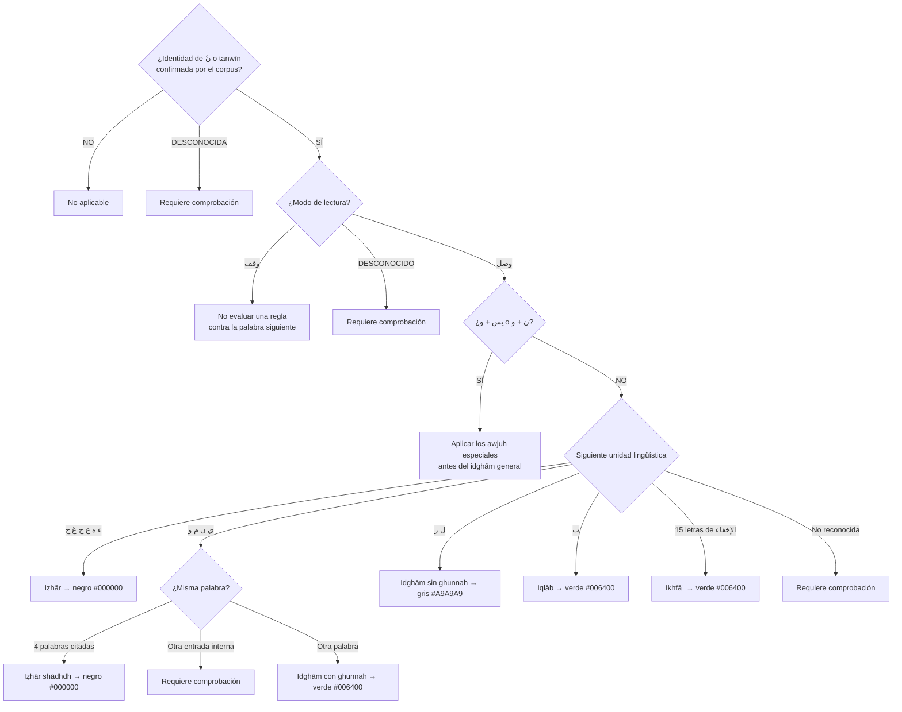
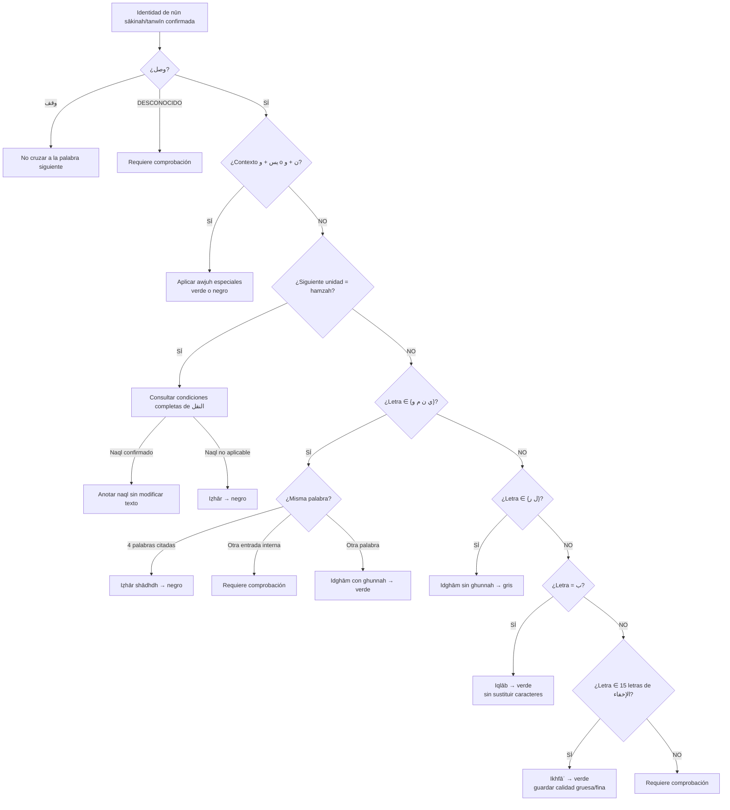

# LÓGICA DE DECISIÓN: أحكام النون الساكنة والتنوين
## Diagrama de Condiciones, Excepciones e Intersecciones

> **Comentario de revisión e-tajweed (2026-09-21):** este archivo fue copiado íntegramente desde `Mesa de Trabajo3/analisis_tajweed_warsh/DECISION_LOGIC_NUUN_TANWEEN.md` y se verificó antes de editarlo (`SHA-256 d1f38e4c8629a8ddd65e007b5bbf2cc7ecafc5fdaac0f0d9742575efc791727e`). Las modificaciones se realizan en esta misma copia y cada grupo lleva su explicación.

> **Comentario de alcance e-tajweed:** la aplicación no evalúa pronunciación. Las descripciones fonéticas ayudan a decidir la regla, pero la salida requerida es detectar el intervalo correcto y asignarlo a una de las nueve categorías de `PALETA_COLORES_WARSH.md`.

---

## 📋 DEFINICIONES TÉCNICAS

### النون الساكنة (Nuun Sakinah):
- **Condición:** Nuun (ن) + Sukūn (ْ) = نْ
- **Ubicación:** Presente en اللفظ (pronunciación) y الرسم (escritura)
- **Contexto:** La nūn sākinah existe en الوصل y الوقف; las reglas que dependen de una letra posterior sólo se evalúan si continúa la lectura
- **Posición:** Puede estar en كلمة واحدة (una palabra) o كلمتين (dos palabras)

### التنوين (Tanween):
- **Condición:** Nuun sakinah زائدة (adicional) al final de اسم (nombre)
- **Marcas:** ٌ (Ḍammatayn), ٍ (Kasratayn), ً (Fatḥatayn)
- **Ubicación:** Solo en اللفظ, NO en الرسم
- **Contexto:** Solo en الوصل, NO en الوقف
- **Posición:** El tanwīn pertenece al final de un nombre; la aplicación contextual con la letra siguiente cruza una frontera de palabra durante waṣl

> **Comentario de revisión e-tajweed:** se corrige “tanwīn siempre en dos palabras”. El signo está en la primera palabra; lo que ocurre entre dos palabras es la relación con la siguiente unidad cuando hay waṣl. También se hace explícito que waqf corta esa relación contextual.

## 🎨 SALIDAS DE COLORACIÓN PARA ESTE DOCUMENTO

| Decisión detectada | Entrada de la paleta | Color |
|--------------------|-----------------------|-------|
| Iẓhār y iẓhār shādhdh | Negro / lectura clara | `#000000` |
| Idghām con ghunnah | Verde / ghunnah | `#006400` |
| Idghām sin ghunnah | Gris / asimilación completa | `#A9A9A9` |
| Iqlāb | Verde / ghunnah | `#006400` |
| Ikhfāʾ | Verde / ghunnah | `#006400` |

> **Comentario de revisión e-tajweed:** ésta es la complejidad de la categoría verde: agrupa varias decisiones distintas, pero no las sustituye. El motor conserva `idgham_with_ghunnah`, `iqlab` o `ikhfa` como resultado semántico y después las mapea al mismo verde. Cuando la letra posterior tenga tafkhīm, su posible azul oscuro pertenece a un intervalo y detector propios; no reemplaza el verde de la nūn o del tanwīn.

---

## 🎯 DIAGRAMA PRINCIPAL: ÁRBOL DE DECISIÓN



> **Comentario de revisión e-tajweed:** el árbol deja de exigir signos literales como única entrada, recibe waṣl/waqf explícito y comprueba `يس`/`ن` antes de consumir la wāw en la rama general. U+06E2 se usa como evidencia editorial de iqlāb, no como requisito universal. Para ikhfāʾ, las cinco letras relevantes de istiʿlāʾ son `ص ض ط ق ظ`; `خ` y `غ` pertenecen a iẓhār.

---

## 📊 TABLA DE CONDICIONES EXACTAS

### REGLA 1: الإظهار (Iẓhār)

| Condición | Valor |
|-----------|-------|
| **Entrada** | Nūn sākinah o tanwīn confirmados por el corpus; no sólo coincidencia literal de signos |
| **Letra siguiente** | ء ه ع ح غ خ (6 حروف حلقية) |
| **Posición نْ** | كلمة واحدة o كلمتين |
| **Posición Tanween** | Al final del primer nombre; la regla usa la siguiente palabra en waṣl |
| **Mnemónico** | أَخِي هَاكَ عِلْمًا حَازَهُ غَيْرُ خَاسِرٍ |
| **Intersección** | Si la siguiente unidad es hamzah, consultar el módulo completo de naql |
| **Excepción** | No se afirma exhaustividad con REL-001 solamente |
| **Dependencia** | Naql sólo prevalece cuando sus propias condiciones estén confirmadas |
| **Coloración** | Negro `#000000` |

**Ejemplos:**
- نْ en كلمة واحدة: يَنْهَوْنَ
- نْ en كلمتين: إِنْ هُوَ, مَنْ حَادَّ, مَنْ عَمِلَ
- Tanween en كلمتين: عَلِيمٌ حَكِيمٌ

**⚠️ INTERSECCIÓN CON النقل:**
- Si detectas: نْ + ء o ً ٍ ٌ + ء
- **ANTES** de aplicar الإظهار, verificar si se aplica النقل
- النقل: Mover harakat de ء a la نْ → elimina el sukūn → NO se aplica ninguna regla de نْ

**Ejemplo de النقل:**
- مِنْ إِلَٰهٍ → مِنِلَٰهٍ (se movió kasrah a la نْ, ya no es sakinah)
- مَنْ ءَامَنَ → مَنَامَنَ (se movió fatḥah a la نْ, ya no es sakinah)

> **Comentario de revisión e-tajweed:** la Parte 7 menciona naql, pero no contiene todas sus condiciones. Por eso una hamzah posterior activa una consulta al módulo de naql y no una prioridad automática. Las grafías transformadas son explicaciones del libro: nunca sustituyen el texto coránico almacenado.

---

### CASOS ESPECIALES WARSH QUE SE COMPRUEBAN ANTES DEL IDGHĀM GENERAL (فواتح السور)

**Palabra: يس (Sura 36)**
- Contexto: يس وَالْقُرْآنِ الْحَكِيمِ
- Regla: Idghām OBLIGATORIO (وجه واحد)
- Condición: Solo en الوصل
- En الوقف: Iẓhār
- Coloración en waṣl: verde `#006400`; en waqf: negro `#000000`

**Palabra: ن (Sura 68)**
- Contexto: ن وَالْقَلَمِ
- Regla: Idghām O Iẓhār (وجهان)
- Condición: Solo en الوصل
- En الوقف: Iẓhār SOLO
- Coloración en waṣl: verde `#006400` para idghām o negro `#000000` para iẓhār; en waqf: negro

**Algoritmo:**
```
SI (contexto_especial ∈ {"يس وَالْقُرْآنِ", "ن وَالْقَلَمِ"}) ENTONCES:
    SI (palabra == "يس" Y contexto == "يس وَالْقُرْآنِ") ENTONCES:
        SI (الوصل) ENTONCES: Idghām obligatorio
        SI (الوقف) ENTONCES: Iẓhār obligatorio
    SINO SI (palabra == "ن" Y contexto == "ن وَالْقَلَمِ") ENTONCES:
        SI (الوصل) ENTONCES: Idghām o Iẓhār (ambos válidos)
        SI (الوقف) ENTONCES: Iẓhār obligatorio
    FIN SI
FIN SI
```

> **Comentario de revisión e-tajweed:** este bloque se mueve antes de las ramas generales porque ambos casos involucran wāw. Así no quedan ocultos dentro de `ينمو`. Los awjuh se conservan como los presenta la página 70 y se validarán manualmente en el muṣḥaf certificado.

---

### REGLA 2: الإدغام الناقص (Idghām Nāqiṣ - con Ghunnah)

| Condición | Valor |
|-----------|-------|
| **Entrada** | Nūn sākinah o tanwīn confirmados por el corpus |
| **Letra siguiente** | ي ن م و (4 letras) |
| **Posición نْ** | ⚠️ SOLO كلمتين (verificar excepción) |
| **Posición Tanween** | Al final del primer nombre + siguiente palabra en waṣl |
| **Mnemónico** | يَنْمُو |
| **Intersección** | Casos especiales `يس + و` y `ن + و` se comprueban antes de la regla general |
| **Excepción** | ⚠️ SI نْ + حرف en كلمة واحدة → إظهار شاذ |
| **Dependencia** | Verificar que NO sea una de las 4 palabras excepcionales |
| **Coloración** | Verde `#006400` por ghunnah; las cuatro palabras excepcionales usan negro `#000000` |

**4 PALABRAS EXCEPCIONALES (إظهار شاذ):**
1. **دُنْيَا** - nun + yā' en una palabra → NO Idghām, SÍ Iẓhār
2. **صِنْوَانٌ** - nun + wāw en una palabra → NO Idghām, SÍ Iẓhār
3. **قِنْوَانٌ** - nun + wāw en una palabra → NO Idghām, SÍ Iẓhār
4. **بُنْيَانٌ** - nun + yā' en una palabra → NO Idghām, SÍ Iẓhār

**Algoritmo de verificación:**
```
SI (نْ + [ي ن م و]) ENTONCES:
    SI (نْ y letra están en كلمة واحدة) ENTONCES:
        SI (palabra == دُنْيَا OR صِنْوَانٌ OR قِنْوَانٌ OR بُنْيَانٌ) ENTONCES:
            Aplicar: إظهار شاذ (NO Idghām)
        SINO:
            Resultado: REQUIERE_COMPROBACIÓN
        FIN SI
    SINO:
        Aplicar: الإدغام الناقص
    FIN SI
FIN SI
```

> **Comentario de revisión e-tajweed:** se sustituye el error doctrinal “no debería ocurrir” por revisión explícita. Una entrada externa, incompleta o no reconocida no autoriza al motor a declarar que el Corán contiene un error.

**Ejemplos válidos (كلمتين):**
- مَن يَقُولُ
- مِن وَلِيٍّ
- مِن مَّاءٍ
- مِن نَّذِيرٍ
- خَيْرًا يَرَهُ
- يَوْمَئِذٍ نَاعِمَةٌ

---

### REGLA 3: الإدغام التام (Idghām Tām - sin Ghunnah)

| Condición | Valor |
|-----------|-------|
| **Entrada** | Nūn sākinah o tanwīn confirmados por el corpus |
| **Letra siguiente** | ل ر (2 letras) |
| **Posición نْ** | كلمتين SOLO |
| **Posición Tanween** | Al final del primer nombre + siguiente palabra en waṣl |
| **Mnemónico** | - |
| **Intersección** | No documentada de forma exhaustiva en REL-001 |
| **Excepción** | No documentada de forma exhaustiva en REL-001 |
| **Dependencia** | Modo waṣl confirmado |
| **Coloración** | Gris `#A9A9A9` por asimilación completa sin ghunnah |

**Ejemplos:**
- مِن رَّبِّ
- مِن لَّدُنْهُ
- يَوْمَئِذٍ لَّخَبِيرٌ
- رَءُوفٌ رَّحِيمٌ

---

### REGLA 4: الإقلاب (Iqlāb)

| Condición | Valor |
|-----------|-------|
| **Entrada** | Nūn sākinah o tanwīn confirmados por el corpus |
| **Letra siguiente** | ب (1 letra SOLO) |
| **Posición نْ** | كلمة واحدة o كلمتين |
| **Posición Tanween** | Al final del primer nombre + siguiente palabra en waṣl |
| **Marca visual** | ۢ U+06E2 es evidencia editorial posible, no requisito universal |
| **Conversión** | Anotación de iqlāb; nunca sustitución de نْ/tanwīn en el texto fuente |
| **Intersección** | No documentada de forma exhaustiva en REL-001 |
| **Excepción** | No documentada de forma exhaustiva en REL-001 |
| **Dependencia** | Modo waṣl y siguiente bāʾ confirmados |
| **Coloración** | Verde `#006400` |

**Ejemplos:**
- نْ en كلمة واحدة: أَنۢبِئْهُم, لَيُنۢبَذَنَّ
- نْ en كلمتين: أَنۢ بُورِكَ, مِنۢ بَعْدِ
- Tanween en كلمتين: سَمِيعٌۢ بَصِيرٌ, عَذَابًۢا بِئْسَ

**Nota sobre la marca ۢ:**
- Unicode: U+06E2 (ARABIC SMALL HIGH MEEM ISOLATED FORM)
- Función: Indicador visual de Iqlāb en المصحف
- No todas las ediciones la incluyen

> **Comentario de revisión e-tajweed:** se elimina la conversión interna de caracteres. Iqlāb produce una anotación verde sobre un intervalo estable; retirar la anotación debe reconstruir exactamente el texto de entrada. La pequeña mīm ayuda a validar una edición concreta, pero su ausencia no niega automáticamente la regla.

---

### REGLA 5: الإخفاء (Ikhfā')

| Condición | Valor |
|-----------|-------|
| **Entrada** | Nūn sākinah o tanwīn confirmados por el corpus |
| **Letra siguiente** | ص ذ ث ك ج ش ق س د ط ز ف ت ض ظ (15 letras) |
| **Posición نْ** | كلمة واحدة o كلمتين |
| **Posición Tanween** | Al final del primer nombre + siguiente palabra en waṣl |
| **Mnemónico** | صِفْ ذَا ثَنَا كَمْ جَادَ شَخْصٌ قَدْ سَمَا<br/>دُمْ طَيِّبًا زِدْ فِي تُقًى ضَعْ ظَالِمًا |
| **Intersección** | ⚠️ Sub-regla interna: تفخيم vs ترقيق |
| **Excepción** | No documentada de forma exhaustiva en REL-001 |
| **Dependencia** | Determinar si letra es استعلاء o استفال |
| **Coloración** | Verde `#006400` sobre la nūn/tanwīn detectada |

**SUB-CONDICIÓN INTERNA: تفخيم (Tafkhīm) vs ترقيق (Tarqīq)**

Esta NO es una regla separada, sino una **condición de calidad** dentro de الإخفاء.

**Letras استعلاء (causan تفخيم):**
- **Lista:** خ ص ض غ ط ق ظ (7 letras)
- **⚠️ CORRECCIÓN según libro:** Solo 5 letras en Ikhfā' porque خ y غ están en Iẓhār
- **Letras correctas en Ikhfā':** ص ض ط ق ظ (5 letras)

**Letras استفال (causan ترقيق):**
- **Lista:** ذ ث ك ج ش س د ز ف ت (10 letras)

**Algoritmo:**
```
SI (نْ o ً ٍ ٌ + letra de الإخفاء) ENTONCES:
    Aplicar: الإخفاء

    SI (letra ∈ {ص, ض, ط, ق, ظ}) ENTONCES:
        Condición adicional: تفخيم
    SINO:
        Condición adicional: ترقيق
    FIN SI
FIN SI
```

> **Comentario de revisión e-tajweed:** tanto ikhfāʾ con ghunnah gruesa como fina pertenece a la salida verde. La cualidad tafkhīm/tarqīq se conserva como metadato; si otra regla colorea la letra siguiente, se resolverá por intervalos y no mediante una prioridad global de colores.

**Ejemplos:**
- تفخيم: أَن صَدُّوكُمْ, مِن قَبْلُ
- ترقيق: مَن ذَا الَّذِي, مِن ثَمَرَةٍ, مِن شَرِّ

---

## 🔗 MATRIZ DE INTERSECCIONES

| Regla | Intersección con | Prioridad | Condición de intersección |
|-------|------------------|-----------|---------------------------|
| الإظهار | النقل | Consultar naql; no asumir prioridad sólo por encontrar hamzah | Si la siguiente unidad lingüística es una forma admitida de hamzah |
| الإدغام الناقص | إظهار شاذ | إظهار شاذ tiene prioridad | Si نْ + حرف en كلمة واحدة |
| الإدغام con و | Casos especiales Warsh | Comprobar antes del idghām general | `يس وَالْقُرْآنِ` o `ن وَالْقَلَمِ` |
| الإدغام التام | No documentada exhaustivamente | - | ل o ر en waṣl |
| الإقلاب | No documentada exhaustivamente | - | ب en waṣl |
| الإخفاء | تفخيم/ترقيق | Condición interna, no intersección | Determinar según حروف استعلاء |

> **Comentario de revisión e-tajweed:** se corrige la ubicación de los casos especiales con wāw y se evita declarar “ninguna intersección” sin prueba de exhaustividad. La prioridad se basa en condiciones religiosas y contexto, nunca en el color.

---

## 🎯 TABLA DE VERIFICACIÓN DE DEPENDENCIAS



> **Comentario de revisión e-tajweed:** el diagrama corrige la rama inalcanzable de `يس/ن`, incorpora el modo de lectura, elimina transformaciones textuales y sustituye errores absolutos por estados de revisión.

---

## 📋 RESUMEN: CONDICIONES POSICIONALES

| Elemento | نْ dentro de palabra | نْ ante palabra siguiente en waṣl | Tanwīn + siguiente letra dentro de la misma palabra | Tanwīn al final + palabra siguiente en waṣl |
|----------|----------------------|------------------------------------|-----------------------------------------------|----------------------------------------------|
| **الإظهار** | ✅ Válido | ✅ Válido | ❌ No corresponde | ✅ Válido |
| **الإدغام الناقص** | ⚠️ Cuatro palabras citadas usan iẓhār shādhdh | ✅ Válido | ❌ No corresponde | ✅ Válido |
| **الإدغام التام** | ❌ No se aplica dentro de palabra según REL-001 | ✅ Válido | ❌ No corresponde | ✅ Válido |
| **الإقلاب** | ✅ Válido | ✅ Válido | ❌ No corresponde | ✅ Válido |
| **الإخفاء** | ✅ Válido | ✅ Válido | ❌ No corresponde | ✅ Válido |

**Nota:** el tanwīn está en el final del primer nombre. “Dos palabras” describe la relación contextual con la letra siguiente, no la ubicación física del tanwīn.

> **Comentario de revisión e-tajweed:** se corrigen los encabezados para distinguir dónde está el signo y dónde se encuentra la letra que determina la regla. En waqf no se cruza la frontera hacia la palabra siguiente.

---

## 🧮 COMPROBACIÓN NOMINAL DE COBERTURA DE LETRAS

**Total de letras del alfabeto árabe:** 28

**Distribución por reglas:**
- الإظهار: 6 letras (ء ه ع ح غ خ)
- الإدغام الناقص: 4 letras (ي ن م و)
- الإدغام التام: 2 letras (ل ر)
- الإقلاب: 1 letra (ب)
- الإخفاء: 15 letras (ص ذ ث ك ج ش ق س د ط ز ف ت ض ظ)

**Suma:** 6 + 4 + 2 + 1 + 15 = **28 ✓**

**Sub-distribución en الإخفاء:**
- تفخيم: 5 letras (ص ض ط ق ظ)
- ترقيق: 10 letras (ذ ث ك ج ش س د ز ف ت)

**Suma:** 5 + 10 = **15 ✓**

> **Comentario de revisión e-tajweed:** que las clases sumen 28 letras sólo comprueba la partición nominal de la letra siguiente. No valida waṣl/waqf, excepciones, Unicode, intervalos ni el control de flujo.

---

## 📚 CASOS Y EXCEPCIONES CITADOS EN EL LIBRO

> **Comentario de revisión e-tajweed:** se elimina la palabra “completas”. REL-001 permite registrar estos casos, pero por sí solo no demuestra que la lista sea exhaustiva para toda la riwāyah y todas las convenciones editoriales.

### 1. النقل (Naql) - Intersección con الإظهار
- **Página:** 68
- **Condición:** Cualquier ساكن + ء (no solo نْ)
- **Acción:** Mover harakat de ء al ساكن anterior
- **Resultado analítico:** el sukūn deja de realizarse como tal; el texto original permanece intacto
- **Ejemplos:** مِنْ إِلَٰهٍ → مِنِلَٰهٍ, قُلْ أَعُوذُ → قُلَعُوذُ

### 2. إظهار شاذ (Iẓhār Shādh) - Excepción de الإدغام الناقص
- **Página:** 70
- **Condición:** نْ + حرف إدغام (ي ن م و) en كلمة واحدة
- **Acción:** NO aplicar Idghām, aplicar Iẓhār en su lugar
- **4 palabras en Corán:**
  1. دُنْيَا (dunya)
  2. صِنْوَانٌ (ṣinwān)
  3. قِنْوَانٌ (qinwān)
  4. بُنْيَانٌ (bunyān)

### 3. Caso especial يس - الإدغام التام
- **Página:** 70
- **Contexto:** يس وَالْقُرْآنِ الْحَكِيمِ (Sura 36:1-2)
- **Regla:** Idghām OBLIGATORIO en الوصل, Iẓhār en الوقف
- **Wujūh:** وجه واحد (una sola opción)

### 4. Caso especial ن - الإدغام التام
- **Página:** 70
- **Contexto:** ن وَالْقَلَمِ (Sura 68:1)
- **Regla:** Idghām O Iẓhār en الوصل (ambos válidos), Iẓhār SOLO en الوقف
- **Wujūh:** وجهان (dos opciones)

### 5. Sub-condición تفخيم/ترقيق en الإخفاء
- **Página:** 72
- **NO es excepción**, es condición interna
- **Letras استعلاء en الإخفاء:** ص ض ط ق ظ (5 letras) → تفخيم
- **Letras استفال en الإخفاء:** ذ ث ك ج ش س د ز ف ت (10 letras) → ترقيق
- **Nota:** خ y غ NO están en esta lista porque están en الإظهار

---

## ✅ ALGORITMO CORREGIDO DE DETECCIÓN Y COLORACIÓN

```
FUNCIÓN detectar_nuun_tanween(unidad_actual, siguiente_unidad, modo, contexto):

    # PASO 1: Confirmar identidad lingüística sin depender de un único signo.
    identidad = analizar_identidad(unidad_actual, convencion_del_corpus)
    SI (identidad == no_nuun_ni_tanween):
        RETORNAR {estado: "not_applicable"}
    SI (identidad == desconocida):
        RETORNAR {estado: "requires_review", razon: "identidad no demostrada"}

    # PASO 2: La relación con la siguiente palabra sólo existe en waṣl.
    SI (modo == unknown):
        RETORNAR {estado: "requires_review", razon: "modo de lectura desconocido"}
    SI (modo == waqf Y siguiente_unidad cruza frontera de palabra):
        RETORNAR {estado: "not_applicable", razon: "waqf corta el contexto siguiente"}

    # PASO 3: Resolver antes los casos especiales con wāw.
    SI (contexto == "يس وَالْقُرْآنِ"):
        SI (modo == wasl):
            RETORNAR resultado("idgham_special", "green", "#006400", obligatorio)
        SINO:
            RETORNAR resultado("izhar", "black", "#000000", obligatorio)

    SI (contexto == "ن وَالْقَلَمِ"):
        SI (modo == wasl):
            RETORNAR opciones([
                resultado("idgham_special", "green", "#006400"),
                resultado("izhar", "black", "#000000")
            ])
        SINO:
            RETORNAR resultado("izhar", "black", "#000000", obligatorio)

    letra = siguiente_unidad.letra_base
    SI (letra no puede determinarse):
        RETORNAR {estado: "requires_review", razon: "siguiente unidad desconocida"}

    # PASO 4: Delegar naql sólo cuando su regla completa lo confirme.
    SI (letra es una forma admitida de hamzah Y se_aplica_naql(contexto) == true):
        RETORNAR {
            estado: "defer_to_naql",
            intervalo: unidad_actual.intervalo_original,
            modificar_texto: false
        }

    # REGLA 1: Iẓhār.
    SI (letra ∈ {ء, ه, ع, ح, غ, خ}):
        RETORNAR resultado("izhar", "black", "#000000")

    # REGLA 2: Idghām con ghunnah e iẓhār shādhdh.
    SI (letra ∈ {ي, ن, م, و}):
        SI (misma_palabra(unidad_actual, siguiente_unidad)):
            SI (palabra_actual ∈ {دُنْيَا, صِنْوَانٌ, قِنْوَانٌ, بُنْيَانٌ}):
                RETORNAR resultado("izhar_shadhdh", "black", "#000000")
            SINO:
                RETORNAR {estado: "requires_review", razon: "entrada interna no reconocida"}
        SINO:
            RETORNAR resultado("idgham_with_ghunnah", "green", "#006400")

    # REGLA 3: Idghām sin ghunnah.
    SI (letra ∈ {ل, ر}):
        RETORNAR resultado("idgham_without_ghunnah", "gray", "#A9A9A9")

    # REGLA 4: Iqlāb. Sólo anotación; nunca convertir caracteres.
    SI (letra == ب):
        RETORNAR resultado("iqlab", "green", "#006400", modificar_texto=false)

    # REGLA 5: Ikhfāʾ.
    SI (letra ∈ {ص, ذ, ث, ك, ج, ش, ق, س, د, ط, ز, ف, ت, ض, ظ}):
        calidad = "thick" SI letra ∈ {ص, ض, ط, ق, ظ}; SINO "thin"
        RETORNAR resultado("ikhfa", "green", "#006400", {ghunnah_quality: calidad})

    RETORNAR {estado: "requires_review", razon: "entrada no clasificada"}

FIN FUNCIÓN
```

> **Comentario de revisión e-tajweed:** se elimina la etiqueta “algoritmo completo” y se corrigen el orden de ramas, waṣl/waqf, incertidumbre, mapeo de colores y preservación del texto. `siguiente_unidad` significa una unidad lingüística obtenida sobre grafemas y fronteras, nunca el siguiente code unit de JavaScript.

---

## 📊 TABLA DE UNICODE

| Símbolo | Nombre | Unicode | Uso seguro en el detector |
|---------|--------|---------|---------------------------|
| ْ | Sukūn | U+0652 | Evidencia de sukūn explícito en una convención identificada |
| ً | Fatḥatayn | U+064B | Una representación posible de tanwīn fatḥah |
| ٍ | Kasratayn | U+064D | Una representación posible de tanwīn kasrah |
| ٌ | Ḍammatayn | U+064C | Una representación posible de tanwīn ḍammah |
| ۢ | Mīm pequeña | U+06E2 | Evidencia editorial posible de iqlāb; no requisito universal |
| ّ | Tashdīd | U+0651 | Marca combinante que puede acompañar idghām; no lo demuestra por sí sola |

> **Comentario de revisión e-tajweed:** los code points se conservan como señales del corpus, no como definiciones universales. El detector debe recorrer grafemas y preservar el orden de todas las marcas combinantes. En algunas convenciones Warsh, el tanwīn o iqlāb puede representarse con combinaciones diferentes.

---

## 🔍 FUENTES

- **Libro Parte 7** (Páginas 65-72)
- Definiciones: Página 67
- الإظهار: Página 67
- الإدغام: Páginas 68-70
- الإقلاب: Página 71
- الإخفاء: Páginas 71-72

> **Comentario de cierre e-tajweed:** la comparación y corrección documental contra REL-001 queda cerrada. Durante la implementación se validarán casos positivos, negativos, waṣl, waqf, las cuatro palabras, `يس`, `ن`, U+06E2 y las tres salidas de color contra el muṣḥaf certificado. La revisión del especialista permanece como control final futuro.
