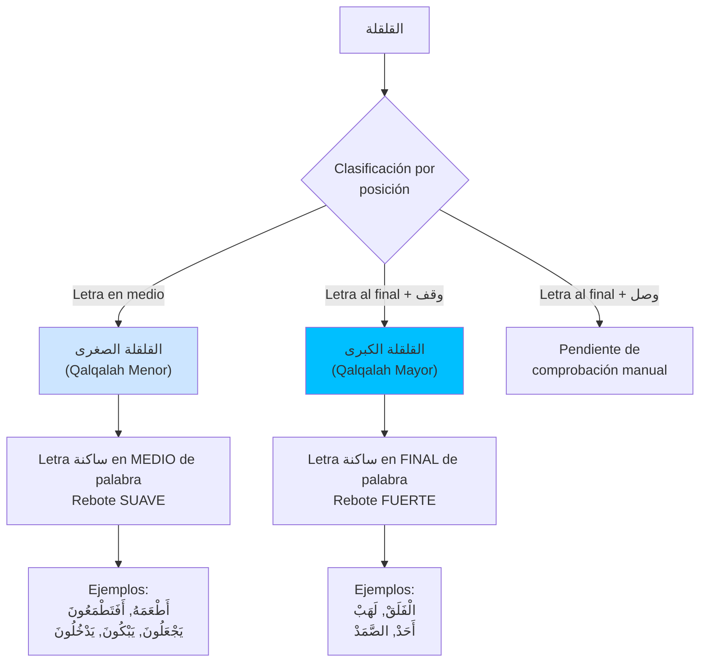
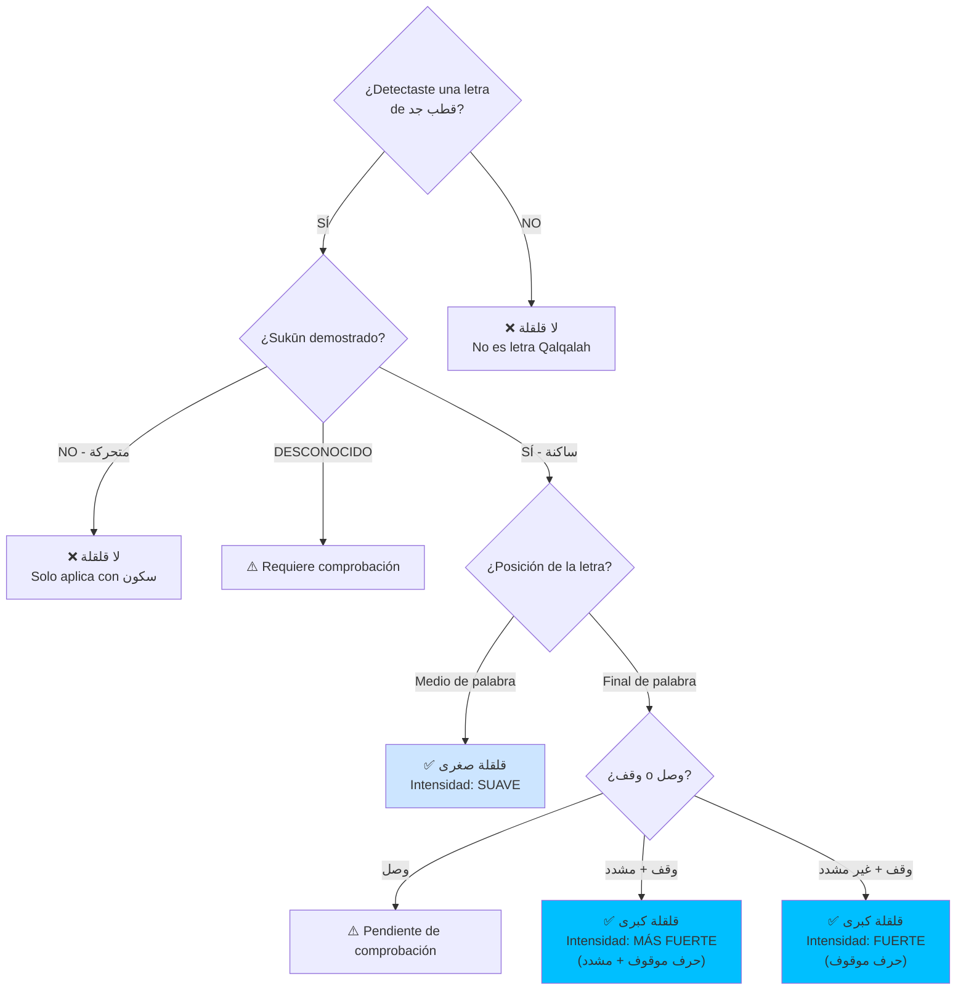
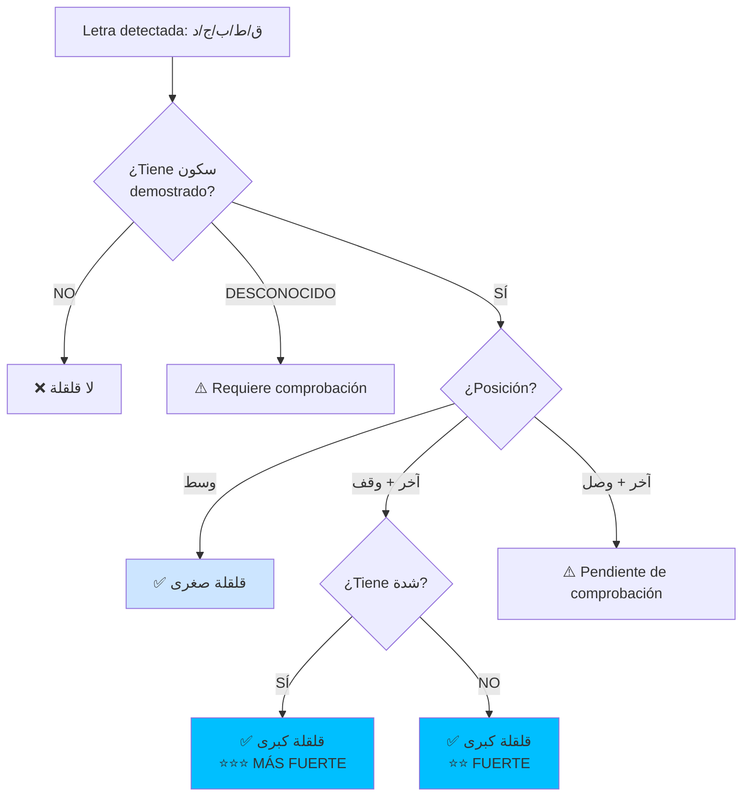

# LÓGICA DE DECISIÓN: القلقلة (Qalqalah)
## Diagrama de Condiciones, Excepciones e Intersecciones

> **Comentario de revisión e-tajweed (2026-09-21):** este archivo fue copiado íntegramente desde `Mesa de Trabajo3/analisis_tajweed_warsh/DECISION_LOGIC_QALQALAH.md` y se verificó la copia antes de editarla (`SHA-256 76410c10d1a3c21f249a49eeb4e1b00686700c69619eaa0b7ddb33c950b05537`). Después se corrigió en este mismo archivo. Cada cambio aparece acompañado de su explicación. La validación visual se realizará durante el desarrollo contra el muṣḥaf coloreado y certificado de Warsh ʿan Nāfiʿ por ṭarīq al-Azraq; la revisión del especialista queda como control final de la aplicación.

> **Comentario de alcance e-tajweed:** la aplicación no evalúa pronunciación. En este documento, las descripciones de sonido explican la regla; el resultado requerido es detectar exactamente su intervalo y colorearlo en azul claro `#00BFFF`, una de las nueve salidas de la paleta válida.

---

## 📋 DEFINICIONES TÉCNICAS

### القلقلة (Qalqalah):
- **Definición lingüística (p.61):** "التحرك والاضطراب" - Movimiento y agitación
- **Definición técnica (p.61):** "هي اضطراب المخرج عند النطق بالحرف الساكن حتى يسمع له نبرة قوية"
- **Significado:** Vibración del punto de articulación al pronunciar una letra sakinah hasta que se escuche una pulsación fuerte
- **Característica:** Es una صفة قوة (cualidad de fuerza)

> **Comentario de revisión e-tajweed:** se corrige `p.62` a `p.61`. En REL-001 la definición, las letras y la causa aparecen en la página 61; la clasificación y los grados continúan en la página 62.

### Causa de la Qalqalah:
**Razón técnica (p.61):** اجتماع صفة الشدة مع صفة الجهر في الحرف
- **الشدة (Shiddah):** Impide el flujo del sonido
- **الجهر (Jahr):** Impide el flujo de la respiración
- **Resultado:** La letra solo puede pronunciarse con esta vibración/pulsación

### حروف القلقلة (Letras de Qalqalah):
**5 letras:** مجموعة في قوله: **قطب جد**

> **Comentario de revisión e-tajweed:** las frecuencias siguientes se conservan como dato heredado, pero no están verificadas contra un corpus identificado y versionado. No se utilizarán para detectar qalqalah.

| Letra | Nombre | Unicode | Frecuencia heredada no validada |
|-------|--------|---------|---------------------|
| ق | Qāf | U+0642 | 7034 veces |
| ط | Ṭā' | U+0637 | 1273 veces |
| ب | Bā' | U+0628 | 11485 veces |
| ج | Jīm | U+062C | 3317 veces |
| د | Dāl | U+062F | 5992 veces |

**Mnemónico:** قطب جد (Quṭb Jadd)

**⚠️ CONDICIÓN OBLIGATORIA:** La letra DEBE estar ساكنة (sakinah) para aplicar Qalqalah

---

## 🎯 CLASIFICACIÓN DE القلقلة



> **Comentario de revisión e-tajweed:** se añade el modo de lectura. La posición final por sí sola no prueba que exista waqf; REL-001 tampoco cierra expresamente el caso final sākinah durante waṣl.

---

## 📊 DIAGRAMA PRINCIPAL: ÁRBOL DE DECISIÓN



> **Comentario de revisión e-tajweed:** el árbol ya no infiere sukūn por ausencia de vocal ni waqf por posición. También separa la semántica de la regla de su color de presentación.

---

## 📊 TABLA DE CONDICIONES EXACTAS

### REGLA 1: القلقلة الصغرى (Qalqalah Menor)

| Condición | Valor |
|-----------|-------|
| **Entrada** | Una de las letras: ق ط ب ج د |
| **Harakat** | ساكنة con sukūn demostrado; la ausencia de vocal visible produce estado desconocido |
| **Posición** | وسط الكلمة (medio de palabra) |
| **Contexto** | posición interna confirmada; no se deduce por “no final de āyah” |
| **Coloración de referencia** | #00BFFF (Azul Claro); se aplica después de detectar qalqalah |
| **Intensidad** | SUAVE / MENOR |
| **Intersección** | No documentada de forma exhaustiva en REL-001 |
| **Excepción** | No documentada de forma exhaustiva en REL-001 |
| **Dependencia** | Verificar que letra esté ساكنة |

> **Comentario de revisión e-tajweed:** se elimina “sin harakat vocal = sākinah”. Un texto incompletamente vocalizado también puede carecer de marca visible. El sukūn debe ser explícito o estar confirmado por el corpus adoptado. También se sustituyen las afirmaciones absolutas “ninguna intersección/excepción”, porque el resumen del libro no demuestra exhaustividad.

**Ejemplos del libro (Página 62):**
- أَطْعَمَهُ (ط ساكنة en medio)
- أَفَتَطْمَعُونَ (ط ساكنة en medio)
- يَجْعَلُونَ (ج ساكنة en medio)
- يَبْكُونَ (ب ساكنة en medio)
- يَدْخُلُونَ (د ساكنة en medio)

**Algoritmo:**
```
SI (letra EN {ق، ط، ب، ج، د}) ENTONCES:
    SI (sukun_demostrado) ENTONCES:
        SI (posición == وسط_الكلمة) ENTONCES:
            Aplicar: قلقلة صغرى
            Nota: "Rebote suave"
        FIN SI
    SINO SI (estado_sukun == desconocido) ENTONCES:
        Resultado: REQUIERE_COMPROBACIÓN
    FIN SI
FIN SI
```

> **Comentario de revisión e-tajweed:** el color se retira del algoritmo porque pertenece a la presentación. También se añade un resultado explícito de incertidumbre para evitar inventar un sukūn.

---

### REGLA 2: القلقلة الكبرى (Qalqalah Mayor)

| Condición | Valor |
|-----------|-------|
| **Entrada** | Una de las letras: ق ط ب ج د |
| **Harakat** | ساكنة (con sukūn ْ por وقف) |
| **Posición** | آخر الكلمة (final de palabra) |
| **Contexto** | وقف (pausa al final de aya o palabra) |
| **Coloración de referencia** | #00BFFF (Azul Claro); se aplica después de detectar qalqalah |
| **Intensidad** | FUERTE / MAYOR |
| **Intersección** | Con تشديد (puede tener tashdīd) |
| **Excepción** | No documentada de forma exhaustiva en REL-001 |
| **Dependencia** | Verificar contexto de وقف |

> **Comentario de revisión e-tajweed:** el waqf debe ser el modo efectivo de lectura, no una conclusión automática basada únicamente en la posición final, una marca próxima o el fin de āyah. El caso de una letra ya sākinah al final de palabra durante waṣl queda pendiente de comprobación manual porque REL-001 no lo describe con precisión suficiente.

**Ejemplos del libro (Página 62):**
- الْفَلَقْ (ق en final con وقف)
- لَهَبْ (ب en final con وقف)
- أَحَدْ (د en final con وقف)
- الصَّمَدْ (د en final con وقف)

**Algoritmo:**
```
SI (letra EN {ق، ط، ب، ج، د}) ENTONCES:
    SI (letra_tiene_sukun_por_waqf) ENTONCES:
        SI (posición == آخر_الكلمة) ENTONCES:
            SI (letra_tiene_tashdid) ENTONCES:
                Aplicar: قلقلة كبرى
                Intensidad: MÁS FUERTE
                Nota: "Rebote fuerte + مشدد"
            SINO:
                Aplicar: قلقلة كبرى
                Intensidad: FUERTE
                Nota: "Rebote fuerte"
            FIN SI
        FIN SI
    FIN SI
FIN SI
```

> **Comentario de revisión e-tajweed:** se retira el color del pseudocódigo. La regla devuelve significado religioso; la interfaz decide después cómo representarlo.

---

## 📊 TABLA DE GRADOS DE INTENSIDAD

| Grado | Condiciones | Intensidad | Ejemplo |
|-------|-------------|------------|---------|
| **1 - MÁS FUERTE** | حرف قلقلة + موقوف عليه + مشدد | ⭐⭐⭐ | بِالْحَقّْ (وقف على قاف مشددة) |
| **2 - FUERTE** | حرف قلقلة + موقوف عليه + غير مشدد | ⭐⭐ | مُحِيطْ (وقف على طاء) |
| **3 - SUAVE** | حرف قلقلة + وسط الكلمة | ⭐ | وَخَلَقْنَاكُمْ (قاف en medio) |

**⚠️ NOTA IMPORTANTE:** La Qalqalah SOLO ocurre cuando la letra está ساكنة.

> **Comentario de revisión e-tajweed:** REL-001 conserva en la página 62 la frase `مثل الوقف على القاف في (وخلقناكم)`, aunque la qāf está dentro de la palabra. Se mantiene el ejemplo interno, pero no se adopta la palabra `الوقف` como lógica hasta comprobarla durante la validación manual.

---

## 🔗 MATRIZ DE INTERSECCIONES

| Letra Qalqalah | Con تشديد | Sin تشديد | Posición | Tipo |
|----------------|-----------|-----------|----------|------|
| ق ط ب ج د | ✅ Sí | - | Final + وقف | قلقلة كبرى (MÁS FUERTE) |
| ق ط ب ج د | - | ✅ Sí | Final + وقف | قلقلة كبرى (FUERTE) |
| ق ط ب ج د | - | ✅ Sí | Medio | قلقلة صغرى (SUAVE) |
| ق ط ب ج د | متحركة | - | Cualquiera | ❌ لا قلقلة |

---

## 🎯 TABLA DE VERIFICACIÓN TÉCNICA

### Para cada letra de قطب جد:



> **Comentario de revisión e-tajweed:** el diagrama técnico incorpora incertidumbre y el caso final en waṣl. Los estilos del propio diagrama son ilustrativos y no forman parte de la salida del detector.

---

## 📝 NOTAS PARA IMPLEMENTACIÓN

### Detección de سكون:
1. **Sukūn explícito:** ْ (U+0652)
2. **Sukūn confirmado:** Información lingüística procedente del corpus adoptado.
3. **Sukūn por وقف:** Producido por una pausa efectivamente seleccionada.
4. **Estado desconocido:** Ausencia de información suficiente; no se interpreta como sukūn.

> **Comentario de revisión e-tajweed:** se elimina la regla heredada “letra sin fatḥah/ḍammah/kasrah = sukūn” porque confunde ausencia de marca con información fonética confirmada.

### Detección de وقف:
- El modo `waqf` o `waṣl` debe proporcionarse explícitamente al análisis.
- Cada signo coránico se interpreta individualmente según su code point y función documentada.
- El número y el final de āyah se almacenan como metadatos separados.
- La posición final de palabra no demuestra por sí sola que el lector se detenga.

> **Comentario de revisión e-tajweed:** se eliminan dos inferencias Unicode incorrectas. U+06D6–U+06ED no es un conjunto homogéneo de marcas de pausa y U+FC00–U+FC18 pertenece a Arabic Presentation Forms-A; no son marcadores Unicode estándar de fin de āyah.

### Detección de تشديد:
- Marca شدة: ّ (U+0651)
- Combina con cualquier vocal

### Colores:
- **Ambos tipos:** #00BFFF (Azul Claro)
- **Diferenciación:** Por metadata de intensidad
- **Visualización:** Mismo color, diferente tooltip/nota

> **Comentario de revisión e-tajweed:** por decisión del propietario, `PALETA_COLORES_WARSH.md` es la referencia válida para la coloración. El libro determina cuándo existe qalqalah y la paleta determina que su color es azul claro `#00BFFF`.

---

## 🔍 EJEMPLOS DE ANÁLISIS

### Ejemplo 1: وَخَلَقْنَاكُمْ
- Letra: **ق** (U+0642)
- Harakat: ْ (sukūn)
- Posición: وسط الكلمة (entre خل y نا)
- Tipo: **قلقلة صغرى**
- Coloración de referencia: #00BFFF
- Intensidad: ⭐ SUAVE

### Ejemplo 2: الْفَلَقْ
- Letra: **ق** (U+0642)
- Harakat: ْ (sukūn por وقف)
- Posición: آخر الكلمة
- Tipo: **قلقلة كبرى**
- Coloración de referencia: #00BFFF
- Intensidad: ⭐⭐ FUERTE

### Ejemplo 3: بِالْحَقّْ (con وقف)
- Letra: **ق** (U+0642)
- Harakat: ْ (sukūn) + ّ (شدة)
- Posición: آخر الكلمة
- Tipo: **قلقلة كبرى**
- Coloración de referencia: #00BFFF
- Intensidad: ⭐⭐⭐ MÁS FUERTE

> **Comentario de revisión e-tajweed:** la coloración azul claro es un resultado obligatorio de Qalqalah. Se mantiene separada de la condición religiosa para impedir que el color se utilice como evidencia de detección.

---

## ✅ CRITERIOS DE ÉXITO

### Sistema de detección y coloración debe:
1. ✅ Identificar las 5 letras de قطب جد
2. ✅ Verificar que letra esté ساكنة
3. ✅ Determinar posición (medio/final)
4. ✅ Detectar contexto وقف vs وصل
5. ✅ Identificar presencia de شدة
6. ✅ Asignar tipo correcto (صغرى/كبرى)
7. ✅ Asignar la salida visual Qalqalah y aplicar `#00BFFF` según la paleta válida
8. ✅ Registrar nivel de intensidad
9. ✅ Devolver incertidumbre cuando no pueda demostrar sukūn o contexto
10. ✅ Conservar el intervalo exacto del texto coránico sin modificarlo
11. ✅ Registrar fuente, página y modo de lectura
12. ✅ Permitir validación manual contra el muṣḥaf certificado durante el desarrollo

> **Comentario de revisión e-tajweed:** se aclara el objetivo del producto: la detección exacta y la coloración correcta son criterios de éxito conjuntos. Se mantienen como etapas separadas para proteger la lógica y el texto coránico.

---

## 📖 REFERENCIAS

- **Fuente:** Libro Parte 6 - Cualidades de las Letras (Páginas 56-64)
- **Secciones:** القلقلة (definición y causa en p.61; clasificación y grados en p.62)
- **Mnemónico:** قطب جد
- **Color asignado:** #00BFFF (Azul Claro) según PALETA_COLORES_WARSH.md

> **Comentario de revisión e-tajweed:** la referencia de páginas se corrige. REL-001 respalda la detección y la paleta válida del proyecto respalda el color azul claro.

---

**Fecha de creación:** 4 de diciembre de 2025
**Propósito:** Guía de implementación para detector de Qalqalah
