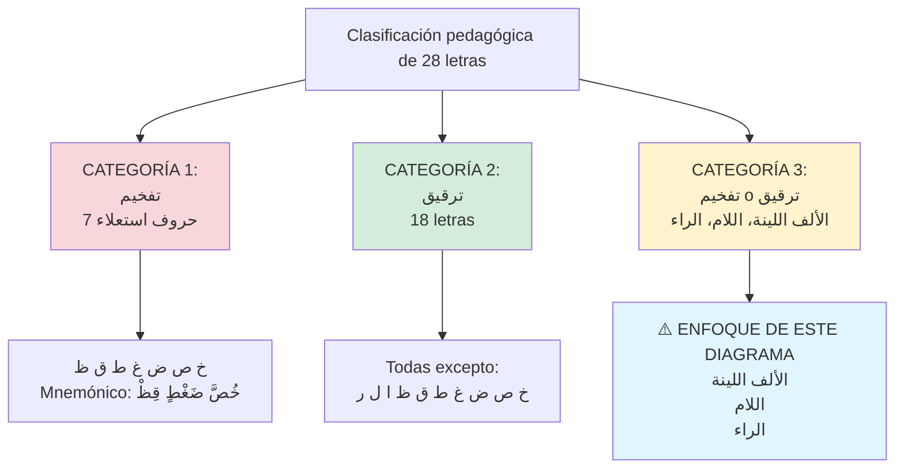
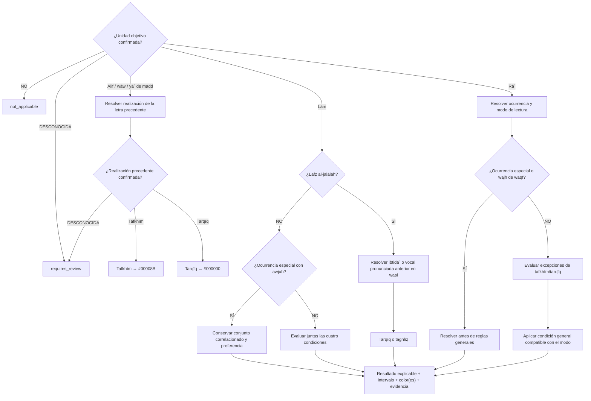

# LÓGICA DE DECISIÓN: التفخيم والترقيق
## Diagrama de Condiciones, Excepciones e Intersecciones

> **Comentario de revisión e-tajweed (2026-09-21):** este archivo fue copiado íntegramente desde `Mesa de Trabajo3/analisis_tajweed_warsh/DECISION_LOGIC_TAFKHIM_TARQIQ.md` y se verificó antes de editarlo (`SHA-256 4c28f82edce393a405cf8c6d5f02a18d18870be04eee0eaecb6d40b08c9facf1`). Las correcciones se realizan en esta misma copia y conservan la trazabilidad con la Parte 8, páginas 79–88.

> **Comentario de alcance e-tajweed:** la aplicación detecta y colorea reglas; no evalúa la pronunciación. El texto coránico permanece inmutable y toda condición no demostrada devuelve `requires_review`.

---

## 📋 DEFINICIONES TÉCNICAS

### التفخيم (Tafkhīm):
- **Definición libro (p.79):** "تسمين الحرف حتى يمتلئ الفم بصداه"
- **Significado:** Engrosar/engrosarse la letra hasta que la boca se llene con su eco
- **Sinónimo:** تغليظ (Taghlīẓ) - usado específicamente para اللام
- **Aplicación:** En راء se usa "تفخيم", en لام se usa "تغليظ"

### الترقيق (Tarqīq):
- **Definición libro (p.79):** "إنحاف ذات الحرف"
- **Significado:** Adelgazar/adelgazarse la esencia de la letra
- **Opuesto a:** تفخيم

---

## 🎯 CLASIFICACIÓN GENERAL DE LETRAS

### Salidas de coloración

| Decisión | Color de la paleta | Aplicación |
|----------|--------------------|------------|
| Tafkhīm o taghlīẓ | Azul oscuro `#00008B` | Grafema objetivo detectado |
| Tarqīq | Negro `#000000` | Grafema objetivo detectado |
| Dos awjuh | Conjunto de ambas salidas | Se conserva cada wajh; no se elige por el color |

> **Comentario de revisión e-tajweed:** taghlīẓ de lām comparte la categoría visual de tafkhīm, mientras que tarqīq usa negro. Cuando existen dos awjuh, el resultado mantiene ambos y su preferencia; la selección de una lectura determina después el color visible.



> **Comentario de revisión e-tajweed:** la partición procede de la página 79, pero es una clasificación pedagógica; no demuestra por sí sola la corrección del detector ni resuelve grados, excepciones o awjuh.

---

## 📊 DIAGRAMA PRINCIPAL: ÁRBOL DE DECISIÓN



> **Comentario de revisión e-tajweed:** el árbol anterior hacía inalcanzables numerosos awjuh de rāʾ porque comprobaba primero reglas generales. El orden corregido valida identidad y modo, resuelve ocurrencias especiales y configuraciones correlacionadas, y sólo después aplica reglas generales.

---

## 📊 TABLA 1: CONDICIONES الألف اللينة Y حروف المد

| Condición | Descripción | Regla | Ejemplos |
|-----------|-------------|-------|----------|
| **Definición** | Alif ساكنة + مفتوح قبلها | - | قَا، طَا، سَا |
| **Letra precedente con tafkhīm** | La alif sigue la realización confirmada de la letra precedente | تفخيم الألف → `#00008B` | قَالَ، طَالَ، طَابَ |
| **Letra precedente con tarqīq** | La alif sigue la realización confirmada de la letra precedente | ترقيق الألف → `#000000` | سَائِقٌ، فَاسِقٌ، سَأَلَ سَائِلٌ |
| **و ي مدية** | Wāw/yāʾ de madd siguen la realización de la letra precedente | تبع | La página 79 no proporciona ejemplos específicos |

**⚠️ Nota del libro (p.79):**
> "تلحق الواو المدية، والياء المدية بالألف المدية في التفخيم والترقيق"

**Intersecciones:** La salida depende de la decisión aplicada a la letra precedente.
**Excepciones:** No se afirma exhaustividad fuera del pasaje revisado.
**Dependencias:** Identificar la unidad de madd y la realización de la letra precedente sin modificar sus code points.

> **Comentario de revisión e-tajweed:** se elimina `قِيلَ (ترقيق)` como ejemplo aprobado: contradice la propia tabla heredada y no aparece en la página 79. También se incorporan wāw y yāʾ de madd al alcance algorítmico en vez de declararlas sin implementación.

---

## 📊 TABLA 2: CONDICIONES لام لفظ الجلالة

### ترقيق لام الجلالة

| Condición | Descripción | Ejemplos |
|-----------|-------------|----------|
| **Después de كسر أصلي** | Kasrah original antes de لفظ الجلالة | بِسْمِ اللَّهِ، آيَاتِ اللَّهِ |
| **Después de كسر عارض** | Kasrah por otras reglas | إِن يَعْلَمِ اللَّهُ |
| **ساكن + كسر antes** | Letra sakinah precedida por kasrah | أَفِي اللَّهِ شَكٌّ، يُنَجِّي اللَّهُ |
| **Después de تنوين** | Tanween conecta con لفظ الجلالة | قَوْمًا اللَّهُ، أَحَدٌ اللَّهُ |

### تغليظ لام الجلالة

| Condición | Descripción | Ejemplos |
|-----------|-------------|----------|
| **Después de فتح** | Fatḥah antes de لفظ الجلالة | قَالَ اللَّهُ، شَهِدَ اللَّهُ |
| **Después de ضم** | Ḍammah antes de لفظ الجلالة | يَعْلَمُهُ اللَّهُ |
| **ساكن + فتح/ضم antes** | Letra sakinah precedida por fatḥah/ḍammah | سَيُؤْتِينَا اللَّهُ، وَمَا اللَّهُ، وَإِذْ قَالُوا اللَّهُمَّ |
| **ابتداء** | Al comenzar con لفظ الجلالة | اللَّهُ لَا إِلَٰهَ إِلَّا هُوَ |

**Razón del تغليظ en ابتداء (p.80):** "انعدام سبب الترقيق، وقصد التعظيم لهذا الاسم"

**Coloración:** tarqīq `#000000`; taghlīẓ `#00008B`.

**Intersecciones:** Waṣl, tanwīn, hamzat al-waṣl e ibtidāʾ determinan cuál es el contexto pronunciado.
**Excepciones:** No se afirma exhaustividad fuera del pasaje revisado.
**Dependencias:** modo de lectura, frontera y vocal pronunciada anterior; no basta el code point inmediatamente anterior.

> **Comentario de revisión e-tajweed:** los casos con tanwīn y kasrah contextual sólo existen al continuar en waṣl. Si se hace waqf antes de lafẓ al-jalālah, no se evalúa una relación que no se pronuncia; un contexto desconocido queda en `requires_review`.

---

## 📊 TABLA 3: CONDICIONES لام في غير لفظ الجلالة (Warsh)

### 4 Condiciones para تغليظ (deben cumplirse TODAS):

| # | Condición | Descripción |
|---|-----------|-------------|
| 1 | **Lam مفتوحة** | Lam con fatḥah (puede ser مشددة o مخففة) |
| 2 | **Precedida por ص ط ظ** | Una de estas 3 letras SOLAMENTE |
| 3 | **ص/ط/ظ ساكنة o مفتوحة** | NO puede ser مكسورة o مضمومة |
| 4 | **Sin separador (o solo ألف)** | No puede haber otra letra entre ص/ط/ظ y لام |

**Mnemónico libro (p.81):** صَلِّ ظُهْرَكَ طَاهِرًا

**Ejemplos con 4 condiciones cumplidas:**
- الصَّلَاةَ (ص مفتوحة en su componente pronunciado + لَ مفتوحة, sin separador)
- سَيَصْلَوْنَ (ص ساكنة + لَ مفتوحة)
- ظَلَمَ (ظَ مفتوحة + لَ maftūḥah)
- مَنْ أَظْلَمُ (ظْ ساكنة + لَ maftūḥah)
- الطَّلَاقُ (طَّ مشددة مفتوحة + لَ)
- مَطْلَعِ (طْ ساكنة + لَ)

### ⚠️ CASOS ESPECIALES: وجهان

**Con ألف como separador (p.81):**

| Palabra | Contexto | Aleya | Wujūh |
|---------|----------|-------|-------|
| **طَالَ** | أَفَطَالَ عَلَيْكُمُ الْعَهْدُ | طه: 86 | تغليظ (مقدم) o ترقيق |
| **طَالَ** | حَتَّىٰ طَالَ عَلَيْهِمُ الْعُمُرُ | الأنبياء: 44 | تغليظ (مقدم) o ترقيق |
| **طَالَ** | فَطَالَ عَلَيْهِمُ الْأَمَدُ | الحديد: 16 | تغليظ (مقدم) o ترقيق |
| **فِصَالًا** | فَإِنْ أَرَادَا فِصَالًا | البقرة: 233 | تغليظ (مقدم) o ترقيق |
| **يُصْلِحَا** (lectura anotada: **يُصَالِحَا**) | أَن يُصْلِحَا بَيْنَهُمَا صُلْحًا | النساء: 128 | تغليظ (مقدم) o ترقيق |

**Nota especial para فِصَالًا (p.82):**
Si hay بدل en la misma aleya (ءَاتَيْتُم), hay interacción:
- Método de seis awjuh: tarqīq con badal corto/medio/largo y taghlīẓ con badal corto/medio/largo.
- Método de cinco awjuh: las mismas combinaciones salvo badal corto con taghlīẓ.
- Estas combinaciones son perfiles correlacionados; no se mezclan como opciones independientes.

**Lam متطرفة مغلظة en وقف (p.82-83):**

| Palabra | Aleya | Wujūh en وقف |
|---------|-------|--------------|
| أَن يُوصَلَ | البقرة: 27 | تغليظ o ترقيق |
| فَصَلَ | البقرة: 249 | تغليظ o ترقيق |
| فَصَّلَ | الأنعام: 119 | تغليظ o ترقيق |
| بَطَلَ | الأعراف: 118 | تغليظ o ترقيق |
| أَن يُوصَلَ | الرعد: 25 | تغليظ o ترقيق |
| ظَلَّ | النحل: 58 | تغليظ o ترقيق |
| فَصْلَ | ص: 20 | تغليظ o ترقيق |
| ظَلَّ | الزخرف: 17 | تغليظ o ترقيق |

**Lam + ألف ذات ياء (مقللة) (p.83):**

| Palabra | Aleya | Wujūh | Nota |
|---------|-------|-------|------|
| مُصَلًّى | البقرة: 125 (وقف) | ترقيق + تقليل o تغليظ + فتح | - |
| يَصْلَاهَا | الإسراء: 18 | ترقيق + تقليل o تغليظ + فتح | - |
| يَصْلَىٰ | الانشقاق: 12 | ترقيق + تقليل o تغليظ + فتح | - |
| يَصْلَى | الأعلى: 12 (وقف) | ترقيق + تقليل o تغليظ + فتح | - |
| تَصْلَىٰ | الغاشية: 4 | ترقيق + تقليل o تغليظ + فتح | - |
| يَصْلَاهَا | الليل: 15 | ترقيق + تقليل o تغليظ + فتح | - |
| سَيَصْلَىٰ | المسد: 3 | ترقيق + تقليل o تغليظ + فتح | - |

**⚠️ Excepción:** en رؤوس الآي de estas once suras sólo corresponde taqlīl: طه، النجم، المعارج، القيامة، النازعات، عبس، الأعلى، الشمس، الليل، الضحى، العلق. En ese contexto no se ofrece la pareja general de dos awjuh.

**Intersecciones:** Con بدل, con إمالة/تقليل
**Dependencias:** Verificar 4 condiciones en orden

**Coloración:** taghlīẓ `#00008B`; tarqīq `#000000`. En los casos de dos awjuh se conservan ambas salidas con su preferencia.

> **Comentario de revisión e-tajweed:** se distinguen lexema, forma y ocurrencia: son tres lexemas en cinco ocurrencias con alif separadora; seis formas en ocho ocurrencias de lām terminal; y seis formas en siete lugares con alif dhāt yāʾ. `يُصْلِحَا` es el texto citado y `يُصَالِحَا` una realización anotada; el motor nunca sustituye una forma por la otra.

---

## 📊 TABLA 4: CONDICIONES الراء - ترقيق

| # | Condición | Descripción | Ejemplos |
|---|-----------|-------------|----------|
| 1 | **ر مكسورة** | Kasrah أصلي o عارض | رِجَالٌ، رِزْقًا، أَرِنِي، الْغَارِمِينَ<br/>وَانْحَرِ (عارض) |
| 2 | **Después de كسر أصلي** | En كلمة واحدة, وصلا/وقفا | يَغْفِرُ، مُنذِرُ، فِرْعَوْنَ |
| 3 | **Después de ي ساكنة** | En كلمة واحدة, وصلا/وقفا | خَيْرًا، قَدِيرٌ، خَبِيرٌ |
| 4 | **Después de ساكن + كسر** | Sakinah (excepto ص ط ق) + kasrah antes | إِكْرَاهٍ، وِزْرَكَ، السِّحْرَ، الذِّكْرَ |
| 5 | **Después de حرف ممال** | Letra con إمالة antes de ر | الدَّارِ، النَّارِ، الْأَخْيَارِ |
| 6 | **Alif posterior a rāʾ con imālah** | La condición religiosa es la imālah de la alif posterior; U+06EA sólo puede servir como señal editorial de un corpus identificado | نَصَارَىٰ، سُكَارَىٰ، أُسَارَىٰ، الْكُبْرَىٰ |
| 7 | **Palabra بِشَرَرٍ** | Caso especial Corán | بِشَرَرٍ (المرسلات: 32) - ambas ر |

**⚠️ NOTA importante (p.84):** En condición 2, si kasrah es عارض (no أصلي), la ر se **tafkhim**, no tarqīq.
- Ejemplo كسر أصلي → ترقيق: فِرْعَوْنَ
- Ejemplo كسر عارض → تفخيم: بِرَبِّ، لِرَبِّكَ، بِرَسُولِهِمْ

**Intersecciones:** Con imālah y con los casos prioritarios de dos awjuh.
**Excepciones:** Las ocurrencias especiales deben resolverse antes de estas condiciones generales.
**Dependencias:** Distinguir kasrah original/contextual, grafema, palabra, ocurrencia y modo de lectura.
**Coloración:** tarqīq `#000000`.

> **Comentario de revisión e-tajweed:** se elimina U+06EA como causa automática de tarqīq. Unicode denomina ese code point como signo coránico; sólo una convención de corpus documentada puede usarlo como evidencia de la imālah exigida por la fuente.

---

## 📊 TABLA 5: CONDICIONES الراء - تفخيم

| # | Condición | Descripción | Ejemplos |
|---|-----------|-------------|----------|
| 1 | **ر مفتوحة o مضمومة** | Sin كسر أصلي o ي ساكنة antes | عُرُبًا أَتْرَابًا، رُوحُ الْقُدُسِ، لِحُكْمِ رَبِّكَ |
| 2 | **ر ساكنة + فتح/ضم antes** | - | بَرْدًا، قَرْيَةٍ، زُرْتُم |
| 3 | **Después de كسر عارض** | ر ساكنة/مفتوحة/مضمومة | ارْجِعِي، إِنِ امْرَأَةٌ، إِنِ امْرُؤٌ، لِمَنِ ارْتَضَىٰ، أَمِ ارْتَابُوا |
| 4 | **Antes de حرف استعلاء** | En كلمة واحدة, palabras específicas | قِرْطَاسٍ، فِرْقَةٍ، مِرْصَادًا/إِرْصَادًا/لَبِالْمِرْصَادِ |
| 5 | **ألف + استعلاء después** | Alif separa ر de حرف استعلاء | الْفِرَاقُ، إِعْرَاضًا، الصِّرَاطَ |
| 6 | **ر مكررة + كسر antes** | Rā' duplicada en palabra | ضِرَارًا، فِرَارًا، إِسْرَارًا، مِدْرَارًا، الْفِرَارُ |
| 7 | **4 lexemas con tafkhīm donde aparezcan** | Catálogo explícito de la página 86 | إِبْرَاهِيمَ، إِسْرَائِيلَ، عِمْرَانَ، إِرَمَ ذَاتِ الْعِمَادِ |
| 8 | **ط ق ص entre la kasrah y ر** | - | إِصْرَهُمْ، مِصْرًا، قِطْرًا، فِطْرَتَ اللَّهِ، وِقْرًا |
| 9 | **Después de لام/باء الجر** | - | بِرَسُولٍ، بِرَبِّ النَّاسِ، لِرَبِّكَ |

**Intersecciones:** Con waqf y con los casos de dos awjuh de la Tabla 6.
**Excepciones:** Tabla 6; debe evaluarse antes de retornar una sola decisión.
**Dependencias:** Identificar kasrah original/contextual mediante análisis, no igualdad de strings vocalizados.
**Coloración:** tafkhīm `#00008B`.

> **Comentario de revisión e-tajweed:** las formas citadas no se usarán como cadenas Unicode rígidas. Se enlazarán a lexemas y ocurrencias verificadas para soportar rasm, alif pequeña, flexión y marcas editoriales sin normalización destructiva.

---

## 📊 TABLA 6: CONDICIONES الراء - وجهان

| # | Palabra/Patrón | Aleya | Wujūh | Nota |
|---|----------------|-------|-------|------|
| 1 | **ذِكْرًا** | Patrón فِعْلًا | تفخيم o ترقيق | تفخيم مقدم |
| 1 | **سِتْرًا** | Patrón فِعْلًا | تفخيم o ترقيق | تفخيم مقدم |
| 1 | **إِمْرًا** | Patrón فِعْلًا | تفخيم o ترقيق | تفخيم مقدم |
| 1 | **وِزْرًا** | Patrón فِعْلًا | تفخيم o ترقيق | تفخيم مقدم |
| 1 | **حِجْرًا** | Patrón فِعْلًا | تفخيم o ترقيق | تفخيم مقدم |
| 1 | **صِهْرًا** | Patrón فِعْلًا | تفخيم o ترقيق | تفخيم مقدم |
| 2 | **حَيْرَانَ** | الأنعام: 71 | تفخيم o ترقيق | تفخيم مقدم (por analogía con عِمْرَانَ) |
| 3 | **يَسْرِ** | الفجر: 4 (وقف) | تفخيم o ترقيق | تفخيم مقدم (ر ساكنة, مكسورة وصلا, ياء محذوفة) |
| 3 | **نُذُرِ** | القمر: 16,18,21,30,37,39 (وقف) | تفخيم o ترقيق | تفخيم مقدم |
| 4 | **فِرْقٍ** | الشعراء: 63 | تفخيم o ترقيق | ترقيق مقدم |
| 5 | **الْقِطْرِ** | سبأ: 12 | تفخيم o ترقيق | ترقيق مقدم (ابن الجزري) |
| 5 | **مِصْرَ** | يوسف: 99 | تفخيم o ترقيق | تفخيم مقدم (ابن الجزري) |

**Nota especial sobre 6 palabras فِعْلًا (p.86):**
Si hay بدل en la aleya:
- El método citado ofrece cinco configuraciones: badal corto con tarqīq o tafkhīm, badal medio sólo con tafkhīm, y badal largo con tarqīq o tafkhīm.
- No se fabrican seis combinaciones mediante producto cartesiano.
- Ejemplo: { فَاذْكُرُوا اللَّهَ كَذِكْرِكُمْ آبَاءَكُمْ أَوْ أَشَدَّ ذِكْرًا } [البقرة: 200]

**Criterio ابن الجزري (p.87):**
> "لكني أختار في (مِصْرَ) التفخيم وفي (الْقِطْرِ) الترقيق نظرا للوصل، وعملا بالأصل"

**Intersecciones:** Con badal y waqf; las combinaciones deben conservarse como perfiles completos.
**Excepciones:** Este catálogo tiene prioridad sobre las reglas generales que producirían un único retorno.
**Dependencias:** Identificador de ocurrencia, modo de lectura y contexto completo de la āyah.
**Coloración:** cada wajh conserva su salida: tafkhīm `#00008B`, tarqīq `#000000`.

> **Comentario de revisión e-tajweed:** el legado hacía inalcanzables `فِرْقٍ`, `الْقِطْرِ`, `مِصْرَ`, `حَيْرَانَ`, las seis formas فِعْلًا y los casos de waqf porque retornaba antes por reglas generales. Este catálogo se evalúa primero y mantiene también la preferencia declarada.

---

## 📊 TABLA 7: CONDICIONES الراء - أحكام الوقف

### 1. الوقف بالسكون

| Condición antes de ر | Regla | Ejemplos |
|---------------------|-------|----------|
| **كسر** | ترقيق | يَغْفِرْ، يَصْبِرْ |
| **ي ساكنة** | ترقيق | خَيْرْ، ضَيْرْ، السَّيْرْ |
| **حرف ممال** | ترقيق | الدَّارْ، النَّارْ |
| **ساكن + كسر** | ترقيق | السِّحْرْ، الذِّكْرْ |
| **بِشَرَرٍ** | ترقيق | بِشَرَرْ (المرسلات: 32) |
| **Otros casos** | تفخيم | (انعدام أسباب الترقيق) |

### 2. الوقف بالإشمام

**Definición (p.88):** "أن تجعل شفتيك على صورتهما إذا نطقت بالضمة - بعد النطق بالحرف ساكنا"

**Regla:** Igual que الوقف بالسكون (porque الإشمام es después de إخلاص السكون)

**Elegibilidad:** sólo si la rāʾ era originalmente ḍammah.

### 3. الوقف بالروم

**Definición (p.88):** "إضعاف الصوت بالحركة حتى يذهب معظمها، ولا يكون إلا في الحرف المكسور، أو المضموم"

**Regla:** Igual que حالة الوصل (porque الروم tiene بعض الحركة)

**Elegibilidad:** sólo si la rāʾ era originalmente kasrah o ḍammah.

**Intersecciones:** Con los awjuh específicos de `يَسْرِ` y `نُذُرِ`, que deben resolverse antes del caso general.
**Excepciones:** `بِشَرَرٍ` conserva tarqīq; los catálogos especiales siguen teniendo prioridad.
**Dependencias:** tipo de waqf y vocal original, separados del texto ortográfico inmutable.

> **Comentario de revisión e-tajweed:** waqf cambia el estado recitado, no borra ni sustituye la vocal escrita. Ishmām y rawm no se aceptan por una simple etiqueta del llamador: se valida primero que la vocal original permita ese modo.

---

## 🔗 MATRIZ DE INTERSECCIONES

| Regla | Intersección con | Tipo | Condición |
|-------|------------------|------|-----------|
| **الألف اللينة / حروف المد** | Realización precedente | Dependencia | Heredan tafkhīm o tarqīq de la unidad anterior |
| **لام الجلالة** | Waṣl, tanwīn e ibtidāʾ | Contextual | Se usa la vocal pronunciada, no sólo el carácter anterior |
| **لام غير الجلالة** | بدل | Correlacionada | En `فِصَالًا`, conservar los perfiles de cinco o seis awjuh |
| **لام غير الجلالة** | Fatḥ/taqlīl | Correlacionada | Lām + alif dhāt yāʾ en siete lugares |
| **لام غير الجلالة** | Waqf | Contextual | Lām terminal en ocho ocurrencias |
| **الراء** | بدل | Correlacionada | Seis formas فِعْلًا cuando coinciden con badal |
| **الراء** | إمالة | Simple | ر después de حرف ممال → ترقيق |
| **الراء** | Waqf | Contextual | Sukūn, ishmām o rawm con elegibilidad y excepciones |

> **Comentario de revisión e-tajweed:** se eliminan las afirmaciones “ninguna”. Una dependencia contextual también es una intersección relevante para el detector, y los awjuh correlacionados no pueden resolverse mediante prioridades de color.

---

## 🎯 ALGORITMO CORREGIDO: الألف اللينة Y حروف المد

```
FUNCIÓN detectar_madd_dependiente(unidad_actual, unidad_anterior, analisis_corpus):
    identidad = analisis_corpus.clasificar_madd(unidad_actual)

    SI (identidad == NO_APLICABLE):
        RETORNAR { estado: "not_applicable" }
    SI (identidad == DESCONOCIDA):
        RETORNAR { estado: "requires_review", motivo: "unidad_madd_no_confirmada" }

    # Incluye alif līnah y las wāw/yāʾ de madd que la página 79 equipara.
    realizacion = analisis_corpus.realizacion_tafkhim_tarqiq(unidad_anterior)
    SI (realizacion == TAFKHIM):
        RETORNAR { estado: "detected", regla: "tafkhim_madd", color: "#00008B" }
    SI (realizacion == TARQIQ):
        RETORNAR { estado: "detected", regla: "tarqiq_madd", color: "#000000" }

    RETORNAR { estado: "requires_review", motivo: "realizacion_precedente_no_confirmada" }

FIN FUNCIÓN
```

> **Comentario de revisión e-tajweed:** la función ya no intenta deducir la regla mirando code units ni limita el alcance a alif. Consume una unidad lingüística confirmada, incluye las tres letras de madd citadas y nunca reescribe la secuencia Unicode.

---

## 🎯 ALGORITMO CORREGIDO: لام لفظ الجلالة

```
FUNCIÓN detectar_lam_allah(ocurrencia, modo, contexto_pronunciado):
    SI (ocurrencia NO es lafz_al_jalalah):
        RETORNAR { estado: "not_applicable" }

    SI (modo == DESCONOCIDO):
        RETORNAR { estado: "requires_review", motivo: "modo_no_confirmado" }

    SI (modo == IBTIDA):
        RETORNAR { estado: "detected", regla: "taghliz_lam_allah", color: "#00008B" }

    SI (modo == WAQF_ANTES_DE_LAFZ):
        RETORNAR { estado: "not_applicable", motivo: "no_hay_continuidad" }

    # En waṣl se usa el contexto pronunciado, incluido tanwīn y movimientos auxiliares.
    clase = contexto_pronunciado.clase_vocalica
    SI (clase ∈ {KASRA_ORIGINAL, KASRA_CONTEXTUAL, SAKIN_PRECEDIDO_POR_KASRA, TANWIN_EN_WASL}):
        RETORNAR { estado: "detected", regla: "tarqiq_lam_allah", color: "#000000" }

    SI (clase ∈ {FATHA, DAMMA, SAKIN_PRECEDIDO_POR_FATHA, SAKIN_PRECEDIDO_POR_DAMMA}):
        RETORNAR { estado: "detected", regla: "taghliz_lam_allah", color: "#00008B" }

    RETORNAR { estado: "requires_review", motivo: "contexto_pronunciado_no_resuelto" }

FIN FUNCIÓN
```

> **Comentario de revisión e-tajweed:** se añade una salida explícita para contexto desconocido y se modelan ibtidāʾ, waṣl y la pausa anterior. La lām no se clasifica por el carácter inmediatamente precedente, sino por el contexto realmente pronunciado que describe la fuente.

---

## 🎯 ALGORITMO CORREGIDO: لام غير لفظ الجلالة (Warsh)

```
FUNCIÓN detectar_lam_warsh(unidad_lam, ocurrencia_id, modo, analisis, perfil_metodo):
    SI (unidad_lam NO es lām fuera de lafẓ_al_jalālah):
        RETORNAR { estado: "not_applicable" }

    SI (modo == DESCONOCIDO OR ocurrencia_id == DESCONOCIDO):
        RETORNAR { estado: "requires_review", motivo: "contexto_u_ocurrencia_no_confirmados" }

    # PASO 1: catálogos de awjuh; siempre antes del caso general.
    SI (ocurrencia_id ∈ LAM_ALIF_SEPARADORA_5_OCURRENCIAS):
        awjuh = { taghliz: "#00008B", tarqiq: "#000000" }
        preferido = TAGHLIZ

        SI (ocurrencia_id == BAQARAH_2_233_FISALAN AND analisis.coincide_badal):
            SI (perfil_metodo == SEIS_AWJUH):
                RETORNAR combinar(awjuh, badal: {corto, medio, largo}, preferido)
            SI (perfil_metodo == CINCO_AWJUH):
                RETORNAR {
                    tarqiq: {badal_corto, badal_medio, badal_largo},
                    taghliz: {badal_medio, badal_largo},
                    preferido: TAGHLIZ
                }
            RETORNAR { estado: "requires_review", motivo: "metodo_de_awjuh_no_confirmado" }

        RETORNAR { estado: "detected", awjuh, preferido }

    SI (modo es WAQF AND ocurrencia_id ∈ LAM_TERMINAL_8_OCURRENCIAS):
        RETORNAR {
            estado: "detected",
            awjuh: { taghliz: "#00008B", tarqiq: "#000000" },
            preferido: TAGHLIZ
        }

    SI (ocurrencia_id ∈ LAM_ALIF_DHAT_YA_7_LUGARES):
        SI (analisis.es_cabeza_de_ayah_en_sura_de_taqlil_obligatorio):
            RETORNAR {
                estado: "detected",
                regla: "tarqiq_lam_con_taqlil_obligatorio",
                color: "#000000"
            }
        RETORNAR {
            estado: "detected",
            awjuh: {
                tarqiq_con_taqlil: "#000000",
                taghliz_con_fath: "#00008B"
            }
        }

    # PASO 2: regla general; las cuatro condiciones se evalúan como conjunto.
    condiciones = analisis.condiciones_taghliz_lam
    SI (condiciones contiene DESCONOCIDA):
        RETORNAR { estado: "requires_review", motivo: "condiciones_de_lam_incompletas" }

    SI (
        condiciones.lam_abierta
        AND condiciones.precedente ∈ {ص, ط, ظ}
        AND condiciones.movimiento_precedente ∈ {SUKUN, FATHA}
        AND condiciones.separador == NINGUNO
    ):
        RETORNAR { estado: "detected", regla: "taghliz_lam", color: "#00008B" }

    SI (condiciones.separador == ALIF AND analisis.es_candidato_no_catalogado):
        RETORNAR { estado: "requires_review", motivo: "alif_separadora_sin_ocurrencia_verificada" }

    RETORNAR { estado: "detected", regla: "tarqiq_lam", color: "#000000" }

FIN FUNCIÓN
```

> **Comentario de revisión e-tajweed:** los tres grupos especiales se resuelven mediante identificadores de ocurrencia antes de la regla general. Se elimina el fallback que convertía cualquier cadena desconocida con alif separadora en taghlīẓ y se preservan las combinaciones exactas con badal.

---

## 🎯 ALGORITMO CORREGIDO: الراء

```
FUNCIÓN detectar_ra(unidad_ra, ocurrencia_id, modo, analisis, perfil_metodo):
    SI (unidad_ra NO es rāʾ confirmada):
        RETORNAR { estado: "not_applicable" }
    SI (ocurrencia_id == DESCONOCIDO OR modo == DESCONOCIDO):
        RETORNAR { estado: "requires_review", motivo: "ocurrencia_o_modo_no_confirmados" }

    # PASO 1: awjuh específicos; tienen prioridad sobre cualquier regla general.
    SI (ocurrencia_id ∈ RA_FIALAN_6_FORMAS):
        SI (analisis.coincide_badal):
            SI (perfil_metodo != CINCO_AWJUH_DESCRITO_PAGINA_86):
                RETORNAR { estado: "requires_review", motivo: "metodo_de_badal_no_confirmado" }
            RETORNAR {
                estado: "detected",
                configuraciones: {
                    badal_corto_con_tarqiq,
                    badal_corto_con_tafkhim,
                    badal_medio_con_tafkhim,
                    badal_largo_con_tarqiq,
                    badal_largo_con_tafkhim
                },
                preferido_ra: TAFKHIM
            }
        RETORNAR dos_awjuh(preferido: TAFKHIM)

    SI (ocurrencia_id == ANAM_6_71_HAYRAN):
        RETORNAR dos_awjuh(preferido: TAFKHIM)

    SI (modo es WAQF AND ocurrencia_id ∈ {FAJR_89_4_YASR, QAMAR_NUDHUR_6_OCURRENCIAS}):
        RETORNAR dos_awjuh(preferido: TAFKHIM)

    SI (ocurrencia_id == SHUARA_26_63_FIRQ):
        RETORNAR dos_awjuh(preferido: TARQIQ)
    SI (ocurrencia_id == SABA_34_12_QITR):
        RETORNAR dos_awjuh(preferido: TARQIQ)
    SI (ocurrencia_id == YUSUF_12_99_MISR):
        RETORNAR dos_awjuh(preferido: TAFKHIM)

    # PASO 2: el modo de waqf se resuelve antes de usar las vocales de waṣl.
    SI (modo ∈ {WAQF_SUKUN, WAQF_ISHMAM, WAQF_RAWM}):
        RETORNAR detectar_ra_waqf(unidad_ra, ocurrencia_id, modo, analisis)

    # PASO 3: catálogos y condiciones prioritarias de una sola salida.
    SI (ocurrencia_id ∈ RA_BISHARAR_AMBAS_RA):
        RETORNAR tarqiq("bishararin", "#000000")

    SI (analisis.lexema ∈ {IBRAHIM, ISRAIL, IMRAN, IRAM}):
        RETORNAR tafkhim("lexema_catalogado", "#00008B")

    SI (ocurrencia_id ∈ RA_TAFKHIM_KASRA_CON_ISTILA
        OR ocurrencia_id ∈ RA_TAFKHIM_ALIF_SEPARADORA
        OR ocurrencia_id ∈ RA_REPETIDA_CATALOGADA
        OR analisis.entre_ra_y_kasra ∈ {ط, ق, ص}
        OR analisis.preposicion_anterior ∈ {LAM_JARR, BA_JARR}):
        RETORNAR tafkhim("condicion_prioritaria", "#00008B")

    # PASO 4: condiciones generales de tarqīq.
    SI (analisis.ra_kasrada
        OR analisis.kasra_original_antes_en_misma_palabra
        OR analisis.ya_sakinah_antes_en_misma_palabra
        OR analisis.sakin_antes_y_kasra_original_previa_sin_sad_ta_qaf
        OR analisis.letra_anterior_con_imala
        OR analisis.alif_posterior_con_imala):
        RETORNAR tarqiq("condicion_general", "#000000")

    # U+06EA puede corroborar el análisis del corpus, nunca sustituirlo.

    # PASO 5: condiciones generales de tafkhīm.
    SI (analisis.ra_abierta_o_dammada_sin_causa_de_tarqiq
        OR analisis.ra_sakinah_precedida_por_fatha_o_damma
        OR analisis.ra_despues_de_kasra_contextual):
        RETORNAR tafkhim("condicion_general", "#00008B")

    RETORNAR { estado: "requires_review", motivo: "caso_no_clasificado" }

FIN FUNCIÓN
```

> **Comentario de revisión e-tajweed:** todos los awjuh y preferencias se resuelven antes de las reglas generales. Se eliminan la igualdad con strings vocalizados, U+06EA como causa religiosa y el resultado `ERROR`; una entrada insuficiente nunca convierte el texto o la lectura en erróneos.

---

## 🎯 ALGORITMO CORREGIDO: الراء عند الوقف

```
FUNCIÓN detectar_ra_waqf(unidad_ra, ocurrencia_id, tipo_waqf, analisis):
    # يَسْرِ y نُذُرِ ya fueron resueltos como dos awjuh antes de entrar aquí.

    SI (tipo_waqf == WAQF_ISHMAM AND analisis.vocal_original != DAMMA):
        RETORNAR { estado: "not_applicable", motivo: "ishmam_no_elegible" }

    SI (tipo_waqf == WAQF_RAWM):
        SI (analisis.vocal_original ∉ {KASRA, DAMMA}):
            RETORNAR { estado: "not_applicable", motivo: "rawm_no_elegible" }
        RETORNAR detectar_ra_como_wasl(unidad_ra, ocurrencia_id, analisis)

    SI (tipo_waqf ∉ {WAQF_SUKUN, WAQF_ISHMAM}):
        RETORNAR { estado: "requires_review", motivo: "tipo_waqf_desconocido" }

    causas = analisis.causas_antes_de_ra_en_waqf
    SI (causas == DESCONOCIDAS):
        RETORNAR { estado: "requires_review", motivo: "contexto_de_waqf_incompleto" }

    SI (ocurrencia_id ∈ RA_BISHARAR_AMBAS_RA
        OR causas.kasra_inmediata
        OR causas.ya_sakinah
        OR causas.letra_con_imala
        OR causas.sakin_con_kasra_previa):
        RETORNAR { estado: "detected", regla: "tarqiq_ra", color: "#000000" }

    RETORNAR { estado: "detected", regla: "tafkhim_ra", color: "#00008B" }

FIN FUNCIÓN
```

> **Comentario de revisión e-tajweed:** la vocal escrita permanece intacta. El algoritmo valida la elegibilidad de ishmām y rawm, conserva los casos de dos awjuh resueltos por el catálogo y devuelve incertidumbre cuando falta el contexto de waqf.

---

## 📋 INVENTARIO DE FORMAS Y OCURRENCIAS CITADAS

> **Comentario de revisión e-tajweed:** este inventario reproduce la Parte 8; no se presenta como “lista completa” universal. La implementación deberá asignar identificadores `sura:āyah:posición` y distinguir lexema, forma escrita y ocurrencia.

### لام غير لفظ الجلالة

**وجهان con alif separadora — 3 lexemas, 5 ocurrencias:**
1. طَالَ (3 aleyas: طه: 86, الأنبياء: 44, الحديد: 16)
2. فِصَالًا (1 aleya: البقرة: 233)
3. يُصْلِحَا, con lectura anotada يُصَالِحَا (1 āyah: النساء: 128)

**وجهان en waqf — 6 formas, 8 ocurrencias:**
1. يُوصَلَ (البقرة: 27, الرعد: 25)
2. فَصَلَ (البقرة: 249)
3. فَصَّلَ (الأنعام: 119)
4. بَطَلَ (الأعراف: 118)
5. ظَلَّ (النحل: 58, الزخرف: 17)
6. فَصْلَ (ص: 20)

**وجهان con alif dhāt yāʾ — 6 formas, 7 lugares:**
1. مُصَلًّى (البقرة: 125)
2. يَصْلَاهَا (الإسراء: 18)
3. يَصْلَىٰ (الانشقاق: 12, الأعلى: 12)
4. تَصْلَىٰ (الغاشية: 4)
5. يَصْلَاهَا (الليل: 15)
6. سَيَصْلَىٰ (المسد: 3)

### الراء

**Tafkhīm donde aparezcan — 4 lexemas citados:**
1. إِبْرَاهِيمَ
2. إِسْرَائِيلَ
3. عِمْرَانَ
4. إِرَمَ ذَاتِ الْعِمَادِ

**Tafkhīm con kasrah + istiʿlāʾ — formas citadas:**
1. قِرْطَاسٍ
2. فِرْقَةٍ
3. مِرْصَادًا / إِرْصَادًا / لَبِالْمِرْصَادِ

**Rāʾ repetida con kasrah — 5 formas citadas:**
1. ضِرَارًا (التوبة: 107)
2. فِرَارًا (نوح: 6)
3. إِسْرَارًا (نوح: 9)
4. مِدْرَارًا (هود: 52, نوح: 11, الأنعام: 6)
5. الْفِرَارُ (الأحزاب: 16)

**Tarqīq especial — una forma, ambas rāʾ:**
1. بِشَرَرٍ (المرسلات: 32)

**Dos awjuh — 6 formas فِعْلًا:**
1. ذِكْرًا
2. سِتْرًا
3. إِمْرًا
4. وِزْرًا
5. حِجْرًا
6. صِهْرًا

**Dos awjuh — otras formas y ocurrencias:**
1. حَيْرَانَ (الأنعام: 71)
2. يَسْرِ (الفجر: 4)
3. نُذُرِ (القمر: 6 aleyas)
4. فِرْقٍ (الشعراء: 63)
5. الْقِطْرِ (سبأ: 12)
6. مِصْرَ (يوسف: 99)

---

## 🧮 COMPROBACIÓN NOMINAL DE LA CLASIFICACIÓN

### Clasificación de 28 letras:

**Categoría 1 (تفخيم siempre):** 7 letras
- خ ص ض غ ط ق ظ

**Categoría 2 (ترقيق siempre):** 18 letras
- ء ب ت ث ج ح د ذ ز س ش ع ف ك م ن ه ي

**Categoría 3 (تفخيم o ترقيق):** 3 letras
- ا ل ر

**Suma:** 7 + 18 + 3 = **28 ✓**

> **Comentario de revisión e-tajweed:** la suma sólo confirma la partición pedagógica de las letras. No valida prioridades, excepciones, awjuh, Unicode, ocurrencias ni resultados sobre el Corán completo.

---

## 🔍 FUENTES

- **Libro Parte 8** (reglas en páginas 79–88; portada en 77 y página 78 en blanco)
- Definiciones: Página 79
- الألف اللينة: Página 79
- لام لفظ الجلالة: Páginas 80
- لام غير لفظ الجلالة: Páginas 81-83
- الراء: Páginas 84-88

> **Comentario de revisión e-tajweed:** esta corrección queda contrastada con la fuente primaria indicada para esta fase. Durante la implementación, las ocurrencias y colores se validarán manualmente contra el muṣḥaf certificado de Warsh ʿan Nāfiʿ por ṭarīq al-Azraq; la revisión final por un especialista cualificado queda prevista para cuando esté disponible.
